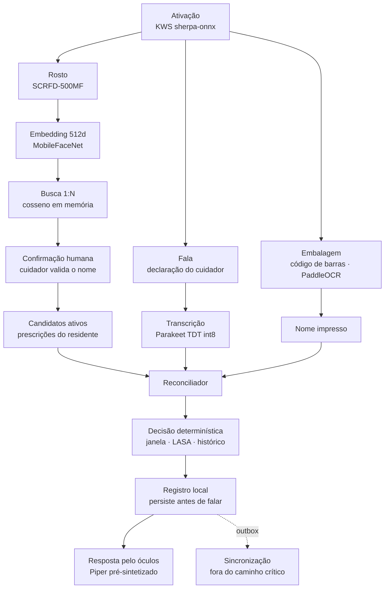
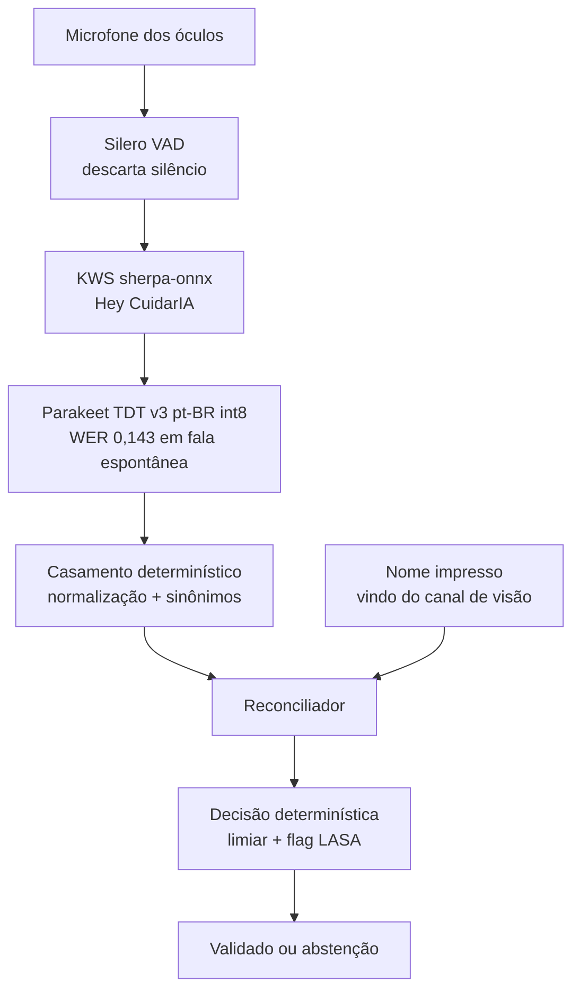
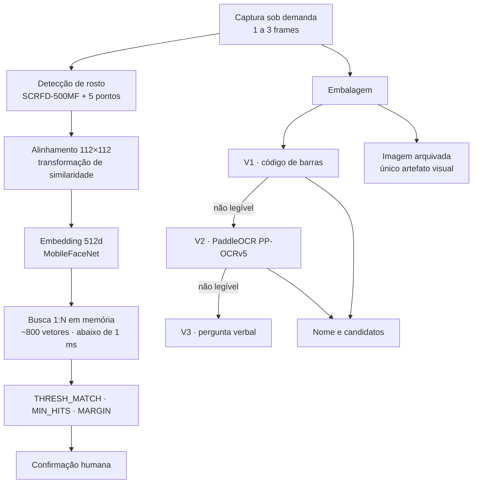
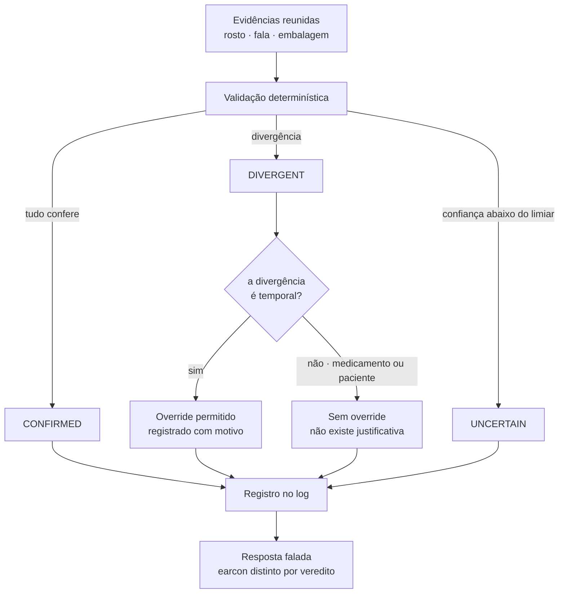
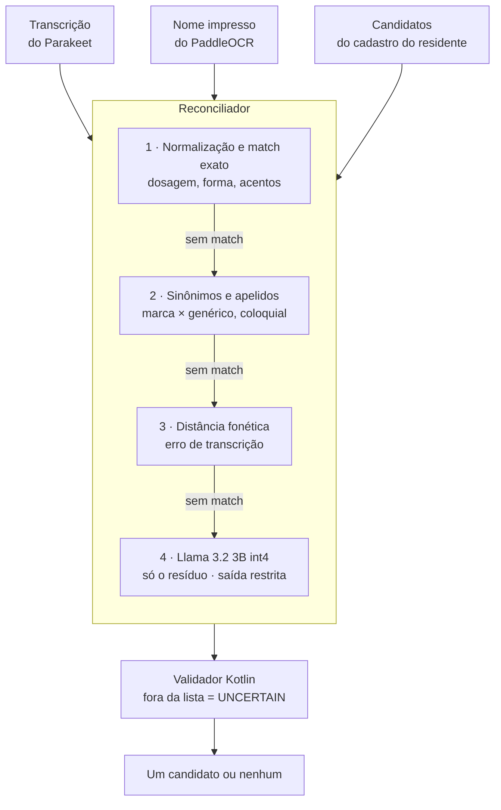
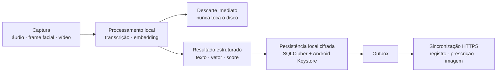
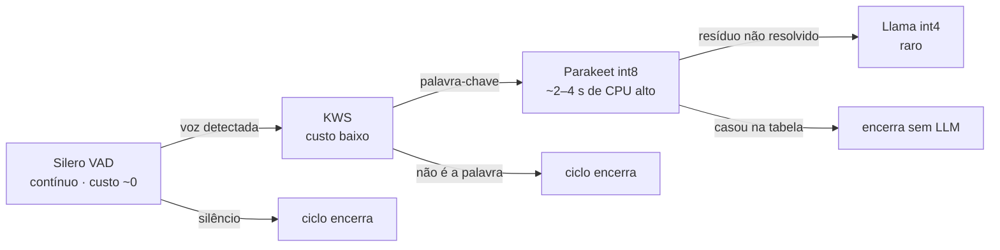

# CuidarIA — Seção A: Documento Estruturado
**Hackathon AI Glasses Brasil · CEIA/UFG/Meta**
**Equipe:** Gabriel Vidal · Pablo Henrique · Jaime Da Cruz

> Este documento cobre problema, usuário, fluxos, decisões de modelo e os cinco pilares. A arquitetura da aplicação — camadas, contratos, máquina de estados, topologia de execução e sincronização — está no documento complementar de arquitetura, que trata a IA como caixa preta atrás do `AiGateway`.

---

## A1 — O problema

Em Instituição de Longa Permanência para Idosos, um cuidador administra dezenas de doses por turno, para múltiplos residentes, cada um com esquema terapêutico próprio. O erro de medicação nesse contexto tem quatro formas:

| Erro | Descrição |
|---|---|
| **Paciente trocado** | dose correta entregue à pessoa errada |
| **Medicamento trocado** | pessoa correta recebe item errado |
| **Horário fora da janela** | dose adiantada, atrasada ou repetida |
| **Dose não administrada e registrada como administrada** | falha de registro, com valor legal |

Dois agravantes específicos do ambiente:

**A verificação depende de memória e atenção**, num turno longo, em ambiente ruidoso, com as mãos ocupadas segurando medicamento, copo e residente. Não há ponto de conferência independente entre a intenção do cuidador e o que ele tem na mão.

**Nomes de medicamento são projetados para confundir.** É o fenômeno LASA (*look-alike, sound-alike*): losartana e olmesartana, clonazepam e clobazam — mesma família, grafias próximas, doses e indicações diferentes.

O registro é feito depois, de memória, em papel ou planilha. O roteiro de inspeção da ANVISA traz como não conformidade a ausência de controle da guarda e da administração de medicamentos; em caso de erro medicamentoso, o Responsável Técnico e o dirigente da ILPI respondem cível, penal e administrativamente. Essa fragilidade jurídica ocorre justamente num contexto onde o registro tem valor probatório.

**Por que os óculos, e não o celular:** o momento da administração é mãos ocupadas e olhos no residente. Qualquer solução que exija pegar um aparelho, desbloquear e digitar é abandonada na primeira semana — ou preenchida em lote no fim do turno, o que destrói a função de verificação. Os óculos permitem que a conferência aconteça no instante e no local do ato, sem interromper o cuidado.

O diferencial defensável não é "usar óculos com IA". É ser o único ponto de verificação independente entre a intenção do cuidador e a realidade, num momento em que hoje não existe nenhum.

---

## A2 — Usuário-alvo

| Persona | Contexto | Prioridade |
|---|---|---|
| **Cuidador institucional (ILPI / home care)** | 8–20 residentes por turno, ambiente ruidoso, mãos ocupadas, rotatividade alta de equipe | **P0 — usuário primário** |
| Responsável técnico (enfermeiro) | cadastra residentes e prescrições, audita histórico, não usa os óculos no dia a dia | P0 |
| Residente / idoso | sujeito do cuidado, identificado por rosto; não opera o sistema | P0 |
| Cuidador familiar | 1 residente, sem formação clínica, alta carga emocional | P1 |
| Responsável pelo residente | recebe alertas de urgência e dose omitida em app próprio; confirma explicitamente o recebimento | P0 |

> **Legenda de prioridade.** **P0** — persona essencial ao funcionamento da V1: o sistema não cumpre sua função sem atendê-la. **P1** — persona atendida pela mesma arquitetura, sem exigir capacidade adicional, mas que não guia as decisões de projeto.

**A rotatividade da equipe é um requisito disfarçado.** Cuidador novo não conhece os residentes nem as prescrições — exatamente quem mais precisa da verificação, e exatamente quem menos consegue detectar um erro por conta própria.

---

## A3 — Walkthrough de interação (fluxo principal)

**Cenário:** Ana, cuidadora, vai administrar o Resfenol para Maria (demência leve) às 14h.

**1.** Ana diz "Hey CuidarIA" → microfone dos óculos detecta a wake word (local, custo computacional próximo a zero) → app entra em modo ativo.

**2.** Ana olha para Maria → câmera dos óculos captura o frame → detecção de rosto + pontos-chave → geração de embedding facial → busca 1:N por cosseno em memória (<1ms para até 800 vetores de uma ILPI típica) → TTS fala: "Maria Santos. Confirme."

**3.** Ana confirma verbalmente → prescrições ativas de Maria carregadas → a câmera ainda não mostrou nada sobre o medicamento. Só agora Ana declara verbalmente: "Resfenol". A voz é capturada **antes** de expor qualquer resultado da visão sobre a embalagem — para não ancorar o cuidador. A voz carrega a **intenção**; a visão carrega a **realidade**; divergência entre elas é o erro que o sistema existe para detectar.

**4.** Câmera capta a embalagem → OCR on-device lê o nome impresso em ordem de milissegundos → extrai "RESFENOL". Cascata: V1 código de barras → V2 OCR → V3 pergunta verbal.

**5.** Reconciliador cruza transcrição com leitura visual e candidatos da prescrição de Maria (normalização → sinônimos → fonética → LLM como quarta camada com saída restrita aos candidatos) → ambos apontam para "Resfenol 400mg". Decisão determinística: horário dentro da janela de 30min, validade ok, sem LASA ativo.

**6.** Registro persistido **antes** de falar — a fala confirma escrita concluída, não decisão tomada. Log append-only cifrado com timestamp, ID do cuidador, ID da residente, texto OCR, score de similaridade facial.

**7.** TTS fala: "Resfenol 400mg confirmado para Maria Santos. Pode administrar." + earcon verde.

### Diagrama 1 — Fluxo end-to-end

**Três restrições de ordem estão codificadas acima.** O ramo do paciente tem quatro nós porque *gate* todo o resto: sem residente resolvido não há lista de candidatos, e sem lista o reconciliador não tem referência. `Confirmação humana` vem antes de carregar prescrições — é o segundo fator que torna a identificação 1:N defensável. E `Registro` vem antes de `Resposta`: a fala confirma escrita concluída, não decisão tomada.

---

## A3.1 — Stack técnica utilizada

| Função | Tecnologia | Tamanho | Runtime |
|---|---|---|---|
| Wake word "Hey CuidarIA" | KWS do sherpa-onnx | ~1 MB | sherpa-onnx |
| Detecção de atividade de voz | Silero VAD | ~1 MB | ONNX Runtime |
| Reconhecimento de fala (STT) | Parakeet TDT v3 pt-BR TAGARELA int8 | ~670 MB / ~2 GB RAM | ONNX Runtime |
| Detecção facial + pontos-chave | SCRFD-500MF (buffalo_sc) | 2,52 MB | ONNX Runtime |
| Embedding facial | MobileFaceNet (buffalo_sc) | 13,6 MB | ONNX Runtime |
| OCR de embalagem | PaddleOCR PP-OCRv5 mobile | ~5 MB | Paddle Lite |
| Reconciliação LLM | Llama 3.2 3B Instruct int4 RTN | ~2 GB RAM | onnxruntime-genai |
| Síntese de voz (TTS) | Piper BRSpeech pt-BR | ~60 MB | sherpa-onnx |
| Persistência | Room + SQLCipher | ~4–6 MB (APK, arm64-v8a) | Android |

A persistência é **local-first**: a sessão grava no SQLite local dentro da mesma transação que enfileira a operação de sincronização. O envio para a infraestrutura remota acontece depois, por `WorkManager`, com chave de idempotência — fora do caminho crítico da administração.

> **Nota sobre a persistência.** O valor na tabela é o acréscimo ao APK: o Room contribui com poucas centenas de KB de bytecode e o SQLCipher com bibliotecas nativas por ABI — estimativa para build somente arm64-v8a. Em volume de dados, os templates faciais ocupam ~1,6 MB (§ Decisão 4) e o áudio pré-sintetizado fica na ordem de poucos MB, com os clipes de nome de medicamento deduplicados entre residentes. **O item dominante é a imagem da medicação, uma por administração** — na ordem de 150 KB por registro, o que torna necessária uma política de retenção antes de operação prolongada.

### Diagrama 2 — Pipeline de áudio

Sem denoiser: o mascaramento já acontece dentro do encoder do modelo, e um realce externo entregaria sinal fora da distribuição de treino.

### Diagrama 3 — Pipeline de visão

A regra de margem entre o primeiro e o segundo colocado cobre semelhança de família entre residentes, caso que o limiar isolado não distingue.

---

## A4 — Walkthrough de exceção (quando dá errado)

Todos os cenários terminam em registro — tentativa abortada é informação clínica, não lixo.

### Diagrama 4 — Veredictos e política de override

**Abstenção é resultado de sucesso.** Um sistema que chuta em medicação é pior que um que pergunta — e os três verdictos têm earcons distintos, porque se tudo soasse igual a política de abstenção seria apagada na última etapa.

**E1 — Medicamento divergente.** O cuidador diz *"dipirona pra dona Maria"*. O rosto identifica Maria, o áudio confirma o nome, ele confirma. A câmera lê `Losartana Potássica 50mg`. O reconciliador casa a fala com dipirona e a leitura com losartana — itens diferentes da mesma prescrição ativa. Earcon de atenção: *"Atenção. A caixa lida é Losartana 50 miligramas, não dipirona."* A sessão vai para `DIVERGENT` e é registrada como tentativa, não como dose.

**E2 — Paciente divergente.** O rosto identifica João. O sistema anuncia *"João Costa"*. O cuidador está diante da dona Maria e responde *"não"*. A sessão aborta antes de carregar qualquer prescrição — é o ponto exato onde a confirmação humana paga por si mesma. Registrado como `CANCELLED` com motivo de identidade.

**E3 — Incerteza de leitura.** Caixa amassada, contraluz. O código de barras não lê, o OCR devolve texto parcial, e nenhum candidato passa do limiar. Earcon de dúvida: *"Não consegui confirmar o medicamento. Diga o nome em voz alta."* Se a fala também não resolver, a sessão vai para `UNCERTAIN` e o cuidador segue por conferência manual. **Nada é aprovado.**

**E4 — Nomes LASA no mesmo residente.** A prescrição inclui clonazepam e clobazam. A flag LASA já foi marcada no cadastro. Independente da confiança da transcrição, o sistema não escolhe: *"Este residente tem dois medicamentos de nome parecido. Confirme lendo a concentração."* A confirmação passa a exigir um dado que distingue os dois.

**E5 — Ativação não detectada.** O cuidador fala e nada acontece. Sem fallback silencioso: após o timeout, áudio informa que nada foi captado e solicita nova tentativa. O pior caso é repetir, nunca prosseguir sem entrada.

**E6 — Rosto não reconhecido.** Residente novo, máscara, contraluz ou nenhum match acima do limiar. O sistema não chuta: earcon neutro, *"Não identifiquei o residente. Confirme o nome."* O cuidador declara o nome verbalmente → STT transcreve → busca no cadastro → confirmação verbal de volta. O fluxo continua com flag de identificação manual no log — o julgamento é do cuidador, o registro é do sistema.

**E7 — Horário fora da janela.** O residente e o medicamento estão certos, mas a prescrição determina 14h e o cuidador está tentando às 11h. A decisão determinística detecta: earcon de atenção, *"Atenção. Este medicamento está agendado para as 14h. São 11h agora."* A sessão vai para `DIVERGENT`. O cuidador pode confirmar com override — registrado com motivo — ou abortar.

> **Política de override.** O override existe **apenas para divergência temporal**, porque atraso ou antecipação de ronda tem justificativa clínica legítima e o cuidador tem contexto que o sistema não tem. Divergência de medicamento (E1) e de identidade (E2) **não admitem override** — nesses casos não existe justificativa que torne a administração correta, e permitir a confirmação transformaria o sistema num carimbo.

**E8 — Registro sem administração.** Este é o único dos quatro erros do A1 que o sistema **não detecta — ele previne por construção**. Não existe registro sem que a câmera tenha visto a embalagem e o rosto do residente naquele instante, e sem que a declaração falada tenha sido capturada. O preenchimento em lote no fim do turno, que é como o erro acontece hoje, torna-se impossível: as evidências só podem ser produzidas no ponto de cuidado. Quando uma sessão anterior termina em `UNCERTAIN` ou `CANCELLED`, o histórico preserva esse estado — e a dose permanece marcada como não confirmada até que uma sessão completa a confirme.

**E9 — Dose já administrada.** Troca de turno, informação perdida na passagem. Ana tenta dar o Resfenol das 14h; Carla já registrou às 14h05. Rosto e medicamento conferem — a divergência está apenas no histórico. Earcon de erro: *"Esta dose já foi registrada às 14h05 por Carla. Não administre."* A sessão vai para `DIVERGENT` e este é o **único cenário em que o sistema desaconselha ativamente**, em vez de apenas não confirmar. Sobredosagem por falha de passagem de turno é dano real em ILPI, e nenhuma verificação da embalagem a detectaria: só o registro detecta.

**E10 — Dose omitida.** A janela das 14h se encerrou sem nenhuma sessão registrada para aquela prescrição. Não há erro a corrigir no momento — há uma dose que não aconteceu. O sistema gera um evento de dose omitida, persistido localmente e sincronizado, que dispara alerta ao responsável pelo residente. O alerta exige **confirmação explícita de recebimento**: envio aceito pelo provedor de push não equivale a alguém ter lido. Sem confirmação dentro da política definida, novas tentativas são disparadas.

> Este é o único cenário do documento **não iniciado pelo cuidador** — o gatilho é a passagem do tempo, e o destinatário é o responsável, não quem opera os óculos.

---

## A5 — Decisões técnicas e trade-offs

### Decisão 1: IA 100% local no celular, arquitetura local-first

Toda a inferência e toda a decisão de validação acontecem no dispositivo, sem internet em runtime. **Nenhum áudio, frame facial ou vídeo é transmitido em momento algum.** A sessão de administração se completa integralmente sem conectividade.

O registro resultante sincroniza depois para infraestrutura própria, por HTTPS, através de uma fila de saída com chave de idempotência. **A sincronização está fora do caminho crítico:** a confirmação funcional depende da persistência local, nunca da latência ou da disponibilidade do servidor.

**Por que:** funciona em ILPIs sem Wi-Fi confiável, que é a regra e não a exceção. A captura de dado sensível — voz e imagem — não depende de rede nem de terceiros. Sem custo por requisição de inferência. O histórico central existe para auditoria e para os alertas ao responsável, não para operar a sessão.

**O que custou:** modelos maiores em RAM, latência superior à de APIs cloud, necessidade de quantização cuidadosa. Mitigamos com cascata de custo crescente (VAD → KWS → STT → LLM) que mantém a maior parte dos ciclos nos modelos leves. E o histórico central pode apresentar atraso enquanto houver itens pendentes de sincronização — estado que a interface torna visível.

---

### Decisão 2: STT — Parakeet TDT v3 pt-BR TAGARELA int8

| Avaliado | WER espontânea | Decisão |
|---|---|---|
| **Parakeet TDT v3 + TAGARELA** | **0,143** | **Escolhido** |
| ElevenLabs Scribe v2 | 0,213 | Descartado — API de nuvem, viola processamento local |
| Parakeet TDT v3 base | 0,218 | Descartado — a adaptação pt-BR rende 34% relativo |
| Whisper large-v3 | 0,234 | Descartado — pior no domínio **e** alucina em silêncio |
| Voxtral-Small 24B | 0,236 | Descartado — 24B inviável em celular, e perde |

**Justificativa:** fala espontânea é a coluna que importa — cuidador em ala não lê roteiro. Um modelo que **inventa texto plausível** num sistema de verificação de medicação é pior que um que erra visivelmente. O Whisper alucina em silêncio; isso é desqualificante aqui.

**Ensemble de dois STT — descartado.** Dois modelos transcrevendo + distância de Levenshtein foi projetado e depois removido. Ambos os candidatos disponíveis (Parakeet TDT e wav2vec2 CTC) são acústicos sem modelo de linguagem forte e podem **concordar numa grafia que não existe** — a concordância dá falsa confiança. Custo de RAM e latência dobrados sem ganho real.

**Denoiser — descartado.** Modelos modernos de STT já fazem mascaramento aprendido dentro do encoder. Um denoiser externo entrega ao modelo sinal fora da distribuição de treino. O Parakeet vai de 6,34% WER em condição limpa para 11,66% a 0 dB de SNR — degrada mas permanece utilizável.

---

### Decisão 3: PaddleOCR PP-OCRv5 mobile como OCR da cascata visual

| Avaliado | Decisão |
|---|---|
| **PaddleOCR PP-OCRv5 mobile** | **Escolhido** — ~5 MB, modelo embarcado, on-device |
| Qwen2.5-VL-3B Q4_K_M | Descartado — **50,7 s no Moto G86** contra ordem de milissegundos do OCR dedicado. 250× mais lento, inviável para uso real |

**Por que:** OCR dedicado resolve a leitura de nome impresso em embalagem com latência de ordens de grandeza menor que um VLM, no mesmo hardware. Modelo embarcado no APK, com versão fixa e comportamento idêntico em qualquer aparelho. O VLM permanece como evolução futura, quando houver aceleração GPU mobile que torne o custo aceitável.

**O que custou:** adição do Paddle Lite como runtime. É o único motor fora do ONNX Runtime na solução, confinado a um componente, cobrindo uma função que nenhum outro cobre. OCR sem contexto semântico pode errar em embalagens muito fragmentadas — coberto pelo canal de voz (V3) e pela confirmação humana obrigatória.

---

### Decisão 4: Face recognition — buffalo_sc sem banco vetorial

| Avaliado | Tamanho | Decisão |
|---|---|---|
| **buffalo_sc** (SCRFD-500MF + MobileFaceNet) | **16 MB** | **Escolhido** — mesmos pesos do buffalo_s, sem acessórios |
| buffalo_s | 159 MB | Descartado — mesmo detector e reconhecedor, mais landmarks não usados |
| buffalo_l | 326 MB | Descartado — melhor acurácia, peso incompatível com orçamento de RAM |

**Busca 1:N:** cosseno em força bruta sobre `FloatArray` em memória. Uma ILPI típica tem 20–80 residentes; com 10 templates por pessoa são ~800 vetores de 512 floats ≈ **1,6 MB em RAM**, com latência de busca abaixo de 1 ms. FAISS e similares descartados — resolvem busca aproximada em milhões de vetores, introduzem erro de aproximação sem necessidade, e no componente onde o falso positivo é o erro catastrófico qualquer erro de aproximação é indefensável. Código próprio é auditável: dá para explicar a um enfermeiro exatamente como o residente foi identificado.

**Regra de decisão:** `best_sim ≥ THRESH_MATCH` **e** `hits ≥ MIN_HITS` **e**, quando os dois primeiros colocados forem pessoas diferentes, `(sim_top1 − sim_top2) ≥ MARGIN`. Exigir múltiplas ocorrências do mesmo residente, e não apenas uma similaridade alta isolada, é a defesa contra coincidência pontual; a margem cobre o caso de semelhança de família.

---

### Decisão 5: LLM restrito ao reconciliador, fora da decisão clínica

| Avaliado | Decisão |
|---|---|
| **Llama 3.2 3B Instruct, ONNX int4 RTN** | **Escolhido** |
| Llama 3.2 1B | Reserva — cabe junto com o Parakeet, menor capacidade |
| TinyLlama 1.1B | Descartado — treino predominantemente em inglês |
| BERTimbau (encoder de similaridade) | Descartado — ver abaixo |

**BERTimbau para reconciliação — descartado por dois motivos técnicos:** (1) a tarefa não é semântica, é ortográfica e fonética — semanticamente losartana e olmesartana são próximas, e um embedding semântico **aproxima justamente os candidatos confundíveis**; (2) degradação documentada por subtoken — "Hidroclorotiazida" e "Olmesartana" viram vários pedaços num vocabulário de 30.000 unidades treinado na Wikipédia, e nomes de medicamento são o caso patológico exato desse achado.

**Runtime:** `onnxruntime-genai` escolhido sobre ExecuTorch e llama.cpp. O critério não é dependência única em absoluto — é **não duplicar motor no caminho crítico de fala**: ExecuTorch e llama.cpp fariam o mesmo trabalho que o ONNX Runtime já faz para STT, TTS e face. A garantia que importa — saída restrita aos candidatos — é obtida por máscara de tokens mais validador em Kotlin, propriedade do código, não do runtime.

**Restrição de saída, duas camadas:** máscara de tokens no loop de geração, restringindo a saída às strings dos candidatos; e validador em Kotlin que devolve `UNCERTAIN` se a string não estiver na lista. Com as duas, o pior comportamento possível do modelo é abstenção — **nunca um nome inventado**.

### Diagrama 5 — Reconciliador: uma porta, quatro camadas

As três primeiras camadas são código determinístico e resolvem o caso comum — marca contra genérico, dosagem omitida, apelido coloquial. O modelo generativo só vê o que sobrou, e a comparação é sempre **contra o cadastro**, nunca entre transcrição e OCR: se o cuidador pega a caixa errada e fala o nome da caixa errada, os dois canais concordam entre si e a validação passaria.

---

### Decisão 6: Wake word — KWS do sherpa-onnx

| Avaliado | Decisão |
|---|---|
| **KWS do sherpa-onnx** | **Escolhido** — mesmo runtime, sem treino adicional, sem dependência nova |
| livekit-wakeword (Apache-2.0) | Descartado — melhor controle sobre negativos, mas acurácia multilíngue declaradamente inferior (modelo congelado de embedding treinado predominantemente em inglês); SDK só em Python, Rust e Swift; exige pipeline de treino sintético antes de avaliar |
| Picovoice Porcupine | Descartado — licença comercial e nenhum controle sobre exemplos negativos |
| openWakeWord | Descartado — mesma lacuna de treino, cabeça de classificação mais simples |

**Justificativa:** era o único componente onde medir não resolvia o risco — seria preciso construir um pipeline de geração sintética, aumentação, treino e export só para descobrir se funciona. Adotar a solução do runtime já carregado elimina a dependência inteira e um caminho de trabalho. O prefixo "Hey" isola a colisão com o verbo "cuidaria", frase corrente numa ala de cuidados.

---

### Decisão 7: TTS — Piper BRSpeech pt-BR

| Avaliado | Decisão |
|---|---|
| **Piper (VITS) BRSpeech pt-BR** | **Escolhido** — mesmo runtime (sherpa-onnx), ~60 MB, treinado em BRSpeech |
| Matcha-TTS CML-ptbr | Viável, prosódia melhor, mas exige vocoder separado |
| Kokoro-82M | Descartado — bundles empacotados no sherpa-onnx são chinês + inglês |
| parler-tts-mini-v1.1-ptbr (0,6B) | Descartado — autorregressivo e pesado |
| XTTS-Tagarela / XTTS-CML | Descartado — 400 MB+, clonagem de voz, **licença CPML não-comercial** |
| orpheusTTS-BRSpeech (3B) | Descartado — TTS baseado em LLM, inviável em celular |

**Decisão de arquitetura que superou a de modelo:** a pré-síntese no cadastro tira o TTS do caminho crítico. Isso mudou o critério de escolha de *velocidade* para *qualidade de pronúncia* — e tornou o modelo praticamente irrelevante para latência. Com isso, manter o mesmo runtime ganhou do melhor modelo isolado.

---

## A6 — Análise competitiva

| Categoria | Exemplos | Por que não resolve |
|---|---|---|
| Organizadores físicos de comprimido | caixas semanais, dispensers domésticos | Funcionam em casa, para uma pessoa. Não verificam **quem** está recebendo, não registram nada, não escalam para dezenas de residentes |
| Sensores de ambiente IoT | Nomo Smart Care | Monitoramento passivo via sensores em caixas de remédio. Sabe que a caixa foi manipulada, não confirma se o medicamento correto foi retirado nem verifica o residente |
| Apps de lembrete de medicação | apps de celular para pacientes crônicos | Lembram o horário, não verificam o ato. Exigem mãos livres e o registro é autodeclarado |
| Sistemas de prontuário para ILPI | software de gestão institucional | Registram **depois**, a partir do que o cuidador informa. Não há conferência no ponto de cuidado |
| Plataformas de óculos AR industriais/hospitalares | Vuzix, RealWear | Hardware de US$1.000–1.500 projetado para instrução remota e checklists. Fornecem a plataforma, não o pipeline clínico: não identificam o residente nem verificam o medicamento sem uma aplicação construída por cima |
| Smartwatches | Apple Watch, Galaxy Watch | Lembrete + detecção de queda. Sem câmera — não verifica o medicamento visualmente. Confirmar ingestão é autodeclarado, ineficaz em demência |

Não identificamos concorrente comercial direto que faça verificação multimodal no ponto de cuidado, sem as mãos, com processamento local. O diferencial defensável é ser o único ponto de verificação independente entre intenção e realidade, num momento em que hoje não existe nenhum.

---

## A7 — Cinco pilares técnicos obrigatórios

### Pilar 1: Uso de IA

Oito modelos de IA, cada um onde é bom, e uma fronteira explícita onde nenhum deles entra.

**Percepção:** STT de 0,6B rodando no aparelho com WER de 0,143 em fala espontânea pt-BR — superior a Whisper large-v3, a um modelo de 24B e a API comercial de nuvem no domínio-alvo. Reconhecimento facial (buffalo_sc), OCR (PaddleOCR PP-OCRv5 mobile) e leitura de código de barras completam a entrada. **Validação no Moto G86, hardware de produção:** o OCR dedicado resolve a leitura da embalagem em ordem de milissegundos, contra **50,7 s do VLM Qwen2.5-VL-3B Q4_K_M no mesmo aparelho** — 250× mais lento.

**Decisão: nenhuma.** A regra clínica é código determinístico auditável. O modelo generativo entra apenas como quarta camada do reconciliador, com vocabulário restrito por máscara de tokens, e **ranqueia — não decide**.

Essa fronteira é o argumento central: usar IA onde ela é forte e barrá-la onde ela é perigosa demonstra critério, não entusiasmo.

**Inventário de modelos:**

| Modelo | Formato | Tamanho | Função |
|---|---|---|---|
| Silero VAD | ONNX | ~1 MB | Detecção de atividade de voz |
| KWS sherpa-onnx | ONNX | ~1 MB | Wake word "Hey CuidarIA" |
| Parakeet TDT pt-BR TAGARELA | ONNX int8 | ~670 MB / ~2 GB RAM | STT — WER 0,143 espontânea |
| SCRFD-500MF (buffalo_sc) | ONNX FP32 | 2,52 MB | Detecção facial + 5 pontos |
| MobileFaceNet (buffalo_sc) | ONNX FP32 | 13,6 MB | Embedding 512d |
| PaddleOCR PP-OCRv5 mobile | Paddle Lite | ~5 MB | Leitura de embalagem on-device |
| Llama 3.2 3B Instruct | ONNX int4 RTN | ~2 GB RAM | Reconciliação restrita |
| Piper BRSpeech | ONNX | ~60 MB | TTS pré-sintetizado |

**Runtimes:** ONNX Runtime como motor único no caminho crítico de fala e visão facial (`sherpa-onnx` para VAD, KWS, STT e TTS; `onnxruntime-genai` para o LLM; ONNX direto para os modelos de face), mais Paddle Lite confinado ao OCR. Dois motores, sem sobreposição de responsabilidade.

---

### Pilar 2: Câmera e microfone como entrada

Nenhuma entrada primária depende de toque. O rosto identifica o residente, a embalagem é lida por câmera, e a declaração falada do cuidador entra pelo microfone. A tela do celular existe apenas como fallback de acessibilidade.

Os dois canais são deliberadamente independentes: a voz carrega a **intenção**, a visão carrega a **realidade**, e a divergência entre elas é exatamente o erro que o produto existe para pegar. Se o cuidador lesse em voz alta o que a câmera está vendo, a dupla verificação viraria redundância decorativa. Por isso a declaração falada é capturada **antes** de qualquer resultado da visão ser exposto.

Captura event-driven — 1 a 3 frames por administração, jamais streaming contínuo.

---

### Pilar 3: Saída exclusivamente por áudio

Sem display, a saída sonora é a interface inteira. **Earcons distintos** precedem cada fala — em ala ruidosa o timbre comunica antes da palavra. Os três verdictos (`CONFIRMED` / `DIVERGENT` / `UNCERTAIN`) têm mensagens e earcons distintos. Se tudo soasse igual, a política de abstenção seria apagada na última etapa.

Todas as frases fixas, nomes de medicamento e nomes de residente são **pré-sintetizados no cadastro**, zerando latência de TTS em runtime e abrindo janela de revisão humana da pronúncia. Isso importa clinicamente: nome mal pronunciado que soa como outro remédio é problema de segurança, não estético.

Comando "repetir" disponível em qualquer estado. Tela do celular como fallback de acessibilidade, nunca canal primário.

---

### Pilar 4: Privacidade

A defesa não é que os dados são bem protegidos. É que **os dados sensíveis deixam de existir no instante seguinte ao uso**.

| Dado | Destino |
|---|---|
| Foto do rosto | descartada após extrair o embedding — nunca toca o disco |
| Áudio bruto | buffer em RAM, descartado após transcrição |
| Frames intermediários e buffers de vídeo | efêmeros, descartados após o processamento |
| Transcrição, score de validação, imagem do medicamento | persistidos localmente, cifrados |

**O que nunca deixa o aparelho, em nenhuma circunstância:** áudio, frames faciais e vídeo. Toda a inferência é local e todos os modelos são embarcados no APK, com versão fixa e comportamento reprodutível.

**O que sincroniza:** os dados de registro — administração, tentativa, paciente, prescrição e imagem do medicamento — vão por HTTPS para infraestrutura própria, com bucket privado, cifrado e sem acesso público. Isso configura relação de **operador** sob a LGPD, tratada explicitamente na arquitetura de persistência.

Localmente: banco cifrado com SQLCipher e chave no Android Keystore, log append-only encadeado por hash para detectar adulteração retroativa. Base legal: dado pessoal sensível (Art. 5º, II), com consentimento do representante ou tutela da saúde (Art. 11, II, "f").

**Formulação honesta do argumento biométrico:** o embedding *é* o dado pessoal sensível, mesmo com a foto descartada — descartar a imagem reduz o risco, não a classificação legal. A demonstração roda em **modo avião** justamente para provar o que importa: **a verificação e o registro se completam sem rede alguma.**

### Diagrama 6 — Ciclo de vida do dado

O ramo superior encerra no descarte: áudio, frame facial e vídeo não chegam a existir na etapa de persistência, e por isso não podem sincronizar. **A garantia é estrutural, não de política de acesso.**

> **Decisão pendente registrada:** a política de armazenamento e sincronização dos *templates* faciais de referência, e a política de retenção da imagem do medicamento, permanecem em aberto na arquitetura de persistência. São as duas decisões de privacidade que faltam fechar antes de operação prolongada.

---

### Pilar 5: Eficiência de bateria

A decisão estrutural é a assimetria: os óculos apenas captam, e o processamento inteiro fica no celular, cuja bateria é substancialmente maior.

**Preservação da bateria dos óculos:** os óculos só transmitem quando há evento — wake word detectada, frame de câmera solicitado, áudio de resposta recebido. Fora disso, o link Bluetooth fica em modo de baixo consumo. Não há streaming contínuo de vídeo nem áudio. Os Meta Ray-Ban têm autonomia de ~4–6 h em uso ativo; a arquitetura event-driven preserva essa autonomia para os momentos de cuidado, e prevemos recarga entre turnos ou durante intervalos de medicação.

**Cascata de custo crescente:** a maioria dos ciclos de CPU morre no primeiro estágio, antes de chegar nos modelos pesados:

### Diagrama 7 — Cascata de custo crescente

**A maioria dos ciclos morre no primeiro estágio.** As três saídas laterais são o mecanismo: só chega ao Parakeet o que passou pelo VAD e pelo KWS, e só chega ao Llama o resíduo que as três camadas determinísticas do reconciliador não resolveram.

*(Valores projetados a partir da arquitetura. Medição com `BatteryManager.BATTERY_PROPERTY_CHARGE_COUNTER` — baseline de ocioso e consumo por sessão em mAh — prevista antes da entrega final.)*

Em termos estimados: numa jornada com ~30 administrações, o celular passa a maior parte do tempo em `IDLE` ou VAD. STT e LLM somados rodam por poucos minutos no total.

**Thermal burst em vez de carga sustentada:** os picos de processamento pesado são curtos e infrequentes — uma administração a cada poucos minutos. O SoC opera em desempenho máximo durante o burst, processa, e retorna à frequência e temperatura normais antes do próximo evento. Esse padrão é muito mais favorável termicamente do que processamento contínuo: evita o *thermal throttling* sustentado que reduziria desempenho e aceleraria o desgaste da bateria ao longo do turno.

Captura de imagem event-driven — 1 a 3 frames por administração, jamais streaming. Os rádios voltam a `IDLE` imediatamente após o evento. O TTS não sintetiza em runtime. Os dois modelos pesados são carregados em sequência, nunca simultaneamente — sequenciais por construção, já que o LLM só roda após a transcrição terminar.
