# Arquitetura da Aplicação CuidarIA

**Status:** Arquitetura de produção definida, sujeita a refinamentos de implementação

**Versão:** 0.4

**Plataforma cliente principal:** Android

**Linguagem:** Kotlin

**UI:** Jetpack Compose

---

## 1. Objetivo do documento

Este documento descreve a arquitetura inicial da aplicação CuidarIA responsável por apoiar o cuidador durante a administração de medicamentos utilizando captura de áudio e vídeo pelos óculos, processamento por IA, validação determinística das informações e persistência do histórico de doses ministradas.

A solução de IA será tratada pela aplicação como uma **caixa preta**, conhecida por contratos de entrada e saída. A arquitetura não deve depender de como os modelos são implementados nem de onde são executados.

Da mesma forma, a integração com os óculos deve ser abstraída para que o núcleo da aplicação não dependa diretamente de um dispositivo ou SDK específico.

Este documento descreve **responsabilidades, dependências, contratos lógicos e a topologia de persistência definida para produção**. A experiência principal, a IA, a orquestração e as regras de negócio executam no aplicativo Android. Fora do aplicativo ficam apenas persistência, sincronização, entrega de notificações e seus recursos de dados remotos.

---

## 2. Fluxo principal de uso

O fluxo funcional principal é uma **sessão de administração de medicamento**.

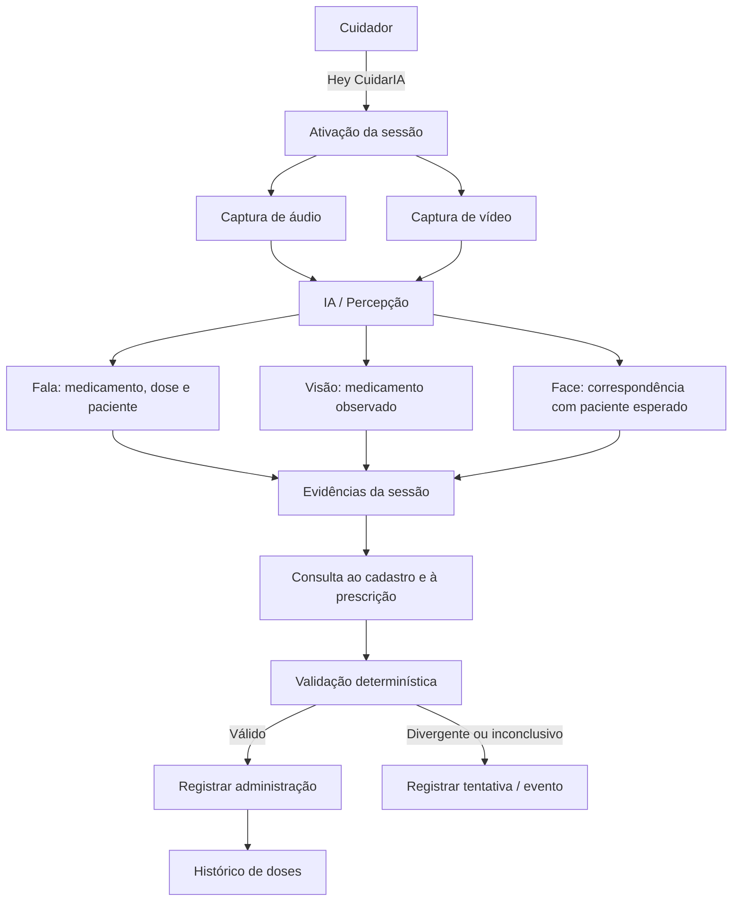
```mermaid
flowchart TD
    A[Cuidador] -->|"Hey CuidarIA"| B[Ativação da sessão]
    B --> C[Captura de áudio]
    B --> D[Captura de vídeo]
    C --> E[IA / Percepção]
    D --> E
    E --> F[Fala: medicamento, dose e paciente]
    E --> G[Visão: medicamento observado]
    E --> H[Face: correspondência com paciente esperado]
    F --> I[Evidências da sessão]
    G --> I
    H --> I
    I --> J[Consulta ao cadastro e à prescrição]
    J --> K[Validação determinística]
    K -->|Válido| L[Registrar administração]
    K -->|Divergente ou inconclusivo| M[Registrar tentativa / evento]
    L --> N[Histórico de doses]
```

Durante a sessão, o cuidador informa por voz que está ministrando determinado medicamento e dosagem a um paciente. O medicamento é mostrado à câmera dos óculos para verificação visual. A aplicação consulta a ficha e a prescrição do paciente e, por fim, utiliza reconhecimento facial baseado em embedding para confirmar a identidade do paciente.

Quando as validações necessárias são satisfeitas, a administração é registrada no histórico.

---

## 3. Princípios arquiteturais

A arquitetura parte dos seguintes princípios:

1. **A IA percebe; o domínio decide.**
2. **A unidade funcional central é a sessão de administração, não o modelo de IA.**
3. **Os óculos são uma fonte de entrada e feedback, não o núcleo da aplicação.**
4. **Regras de validação devem ser determinísticas e testáveis sem Android, IA ou hardware.**
5. **A localização de execução da IA não deve contaminar o domínio.**
6. **A UI não deve conter regra de negócio.**
7. **ViewModels não devem funcionar como orquestradores de todo o fluxo.**
8. **Integrações externas devem ficar atrás de contratos.**
9. **A aplicação deve permitir mocks para captura, IA, persistência e serviços remotos.**
10. **Dados efêmeros e persistentes devem ser explicitamente diferenciados.**
11. **Divergências, incertezas e tentativas abortadas também são eventos relevantes.**
12. **A estrutura deve privilegiar fronteiras claras sem modularização física prematura.**

---

## 4. Decisão arquitetural principal

A solução será inicialmente modelada como uma **arquitetura em camadas com organização modular**, inspirada em:

- Clean Architecture;
- Ports & Adapters;
- Dependency Inversion;
- MVVM na camada de apresentação;
- Unidirectional Data Flow (UDF) na UI.

A definição adotada neste momento é:

> **Aplicação Kotlin organizada em camadas e por responsabilidades, inspirada em Clean Architecture e Ports & Adapters, utilizando MVVM + UDF na apresentação e contratos explícitos para IA, dispositivos e serviços externos.**

Para produção, o aplicativo Android concentra apresentação, casos de uso, coordenação da sessão, validação determinística e integrações com óculos e IA. A persistência operacional é **local-first**, usando SQLite por meio do Room. A infraestrutura remota reúne WAF, reverse proxy, API HTTPS mínima e PostgreSQL autogerenciado. Imagens e backups são mantidos em armazenamento de objetos externo.

O serviço remoto não coordena a sessão e não executa os modelos de IA. Suas responsabilidades são autenticação, autorização, idempotência, validação estrutural, persistência, consulta e sincronização. O aplicativo nunca acessa diretamente o PostgreSQL nem recebe suas credenciais.

Os diagramas arquiteturais e de fluxo deste documento utilizam **Mermaid** quando a notação melhora a leitura e facilita manutenção/versionamento no próprio Markdown. Estruturas de diretórios, listas de componentes e exemplos de dados permanecem em blocos de texto quando isso for mais legível.

---

## 5. Camadas da aplicação

A visão lógica principal é:

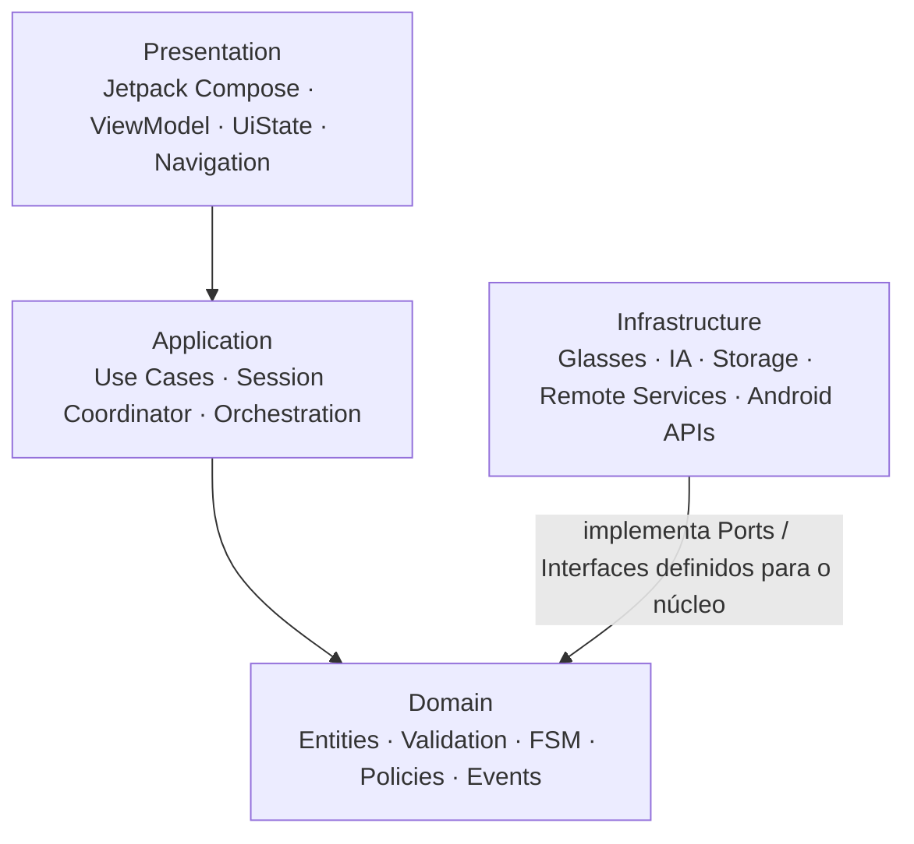
```mermaid
flowchart TD
    P["Presentation<br/>Jetpack Compose · ViewModel · UiState · Navigation"]
    A["Application<br/>Use Cases · Session Coordinator · Orchestration"]
    D["Domain<br/>Entities · Validation · FSM · Policies · Events"]
    I["Infrastructure<br/>Glasses · IA · Storage · Remote Services · Android APIs"]

    P --> A
    A --> D
    I -->|implementa Ports / Interfaces definidos para o núcleo| D
```

As setas representam dependências lógicas. O domínio não deve conhecer implementações concretas de Android, SDK da Meta, serviços de IA, banco ou APIs remotas.

---

## 6. Arquitetura funcional da sessão de administração

O componente central de orquestração da aplicação será uma sessão de administração.

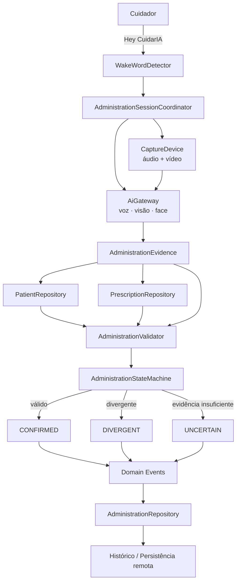
```mermaid
flowchart TD
    C[Cuidador] -->|"Hey CuidarIA"| W[WakeWordDetector]
    W --> S[AdministrationSessionCoordinator]

    S --> CD[CaptureDevice<br/>áudio + vídeo]
    S --> AI[AiGateway<br/>voz · visão · face]
    CD --> AI
    AI --> E[AdministrationEvidence]

    E --> PR[PatientRepository]
    E --> RX[PrescriptionRepository]
    PR --> V[AdministrationValidator]
    RX --> V
    E --> V

    V --> FSM[AdministrationStateMachine]
    FSM -->|válido| OK[CONFIRMED]
    FSM -->|divergente| DG[DIVERGENT]
    FSM -->|evidência insuficiente| UN[UNCERTAIN]

    OK --> EV[Domain Events]
    DG --> EV
    UN --> EV
    EV --> AR[AdministrationRepository]
    AR --> HB[Histórico / Persistência remota]
```

---

## 7. Sessão de administração como unidade central

A sessão representa uma tentativa em andamento.

Exemplo conceitual:

```kotlin
data class AdministrationSession(
    val id: SessionId,
    val startedAt: Instant,
    val status: AdministrationStatus
)
```

A sessão nasce sem `patientId`: sua criação é consequência irrevogável da wake word. O paciente é associado somente após `PatientResolved`; até esse evento, tentativas e evidências são correlacionadas exclusivamente por `SessionId`.

Durante alguns segundos, a aplicação acumula evidências relacionadas à mesma tentativa:

```text
t0  Wake word detectada
t1  fala identifica paciente
t2  fala identifica medicamento
t3  fala identifica dosagem
t4  câmera observa medicamento
t5  ficha/prescrição é consultada
t6  face do paciente é verificada
t7  conjunto de evidências é validado
t8  administração é confirmada ou rejeitada
```

Essa correlação deve ser explícita para impedir que observações de sessões diferentes sejam combinadas acidentalmente.

---

## 8. Wake word e início da sessão

O comando **"Hey CuidarIA"** inicia o fluxo.

Será previsto um contrato lógico como:

```kotlin
interface WakeWordDetector {
    fun observeWakeWords(): Flow<WakeWordEvent>
}
```

O detector possui responsabilidade restrita:

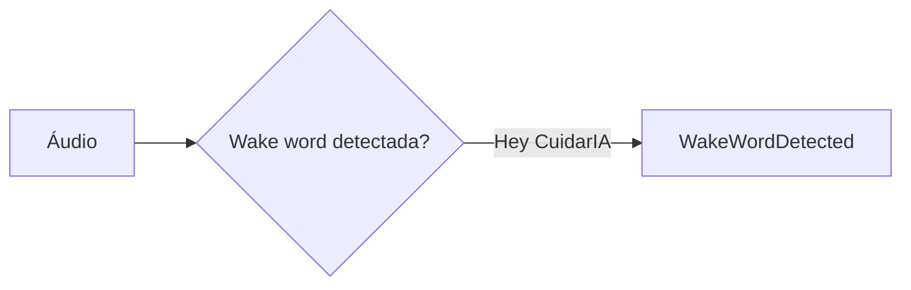
```mermaid
flowchart LR
    A[Áudio] --> B{Wake word detectada?}
    B -->|"Hey CuidarIA"| C[WakeWordDetected]
```

Ao receber o evento, a aplicação inicia uma nova `AdministrationSession` e habilita a captura necessária de áudio e vídeo.

---

## 9. Aquisição e abstração dos óculos

O núcleo da aplicação não deve conhecer diretamente o SDK dos óculos.

Será utilizada uma abstração conceitual semelhante a:

```kotlin
interface CaptureDevice {
    fun observeAudio(): Flow<AudioChunk>
    fun observeFrames(): Flow<CapturedFrame>
    fun observeEvents(): Flow<DeviceEvent>
    suspend fun sendFeedback(feedback: UserFeedback)
}
```

Possíveis implementações:

```text
MetaGlassesCaptureDevice
PhoneCaptureDevice
RecordedCaptureDevice
MockCaptureDevice
```

Isso permite prototipar a aplicação sem depender da disponibilidade final do SDK dos óculos.

---

## 10. IA como caixa preta

A aplicação conhece apenas contratos da solução de IA.

Uma fachada inicial pode ser representada por:

```kotlin
interface AiGateway {

    suspend fun processSpeech(
        audio: AudioInput
    ): SpeechObservation

    suspend fun recognizeMedication(
        image: ImageInput
    ): MedicationObservation

    suspend fun verifyPatient(
        image: ImageInput,
        reference: PatientFaceReference
    ): PatientVerification
}
```

A implementação concreta pode mudar sem alterar o domínio, mas sua execução permanece no dispositivo Android.

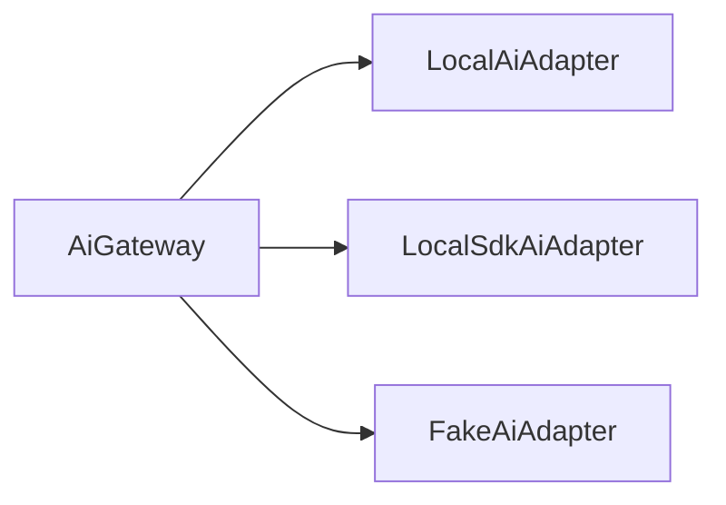
```mermaid
flowchart LR
    G[AiGateway] --> L[LocalAiAdapter]
    G --> S[LocalSdkAiAdapter]
    G --> F[FakeAiAdapter]
```

A divisão interna das capacidades pode utilizar bibliotecas ou SDKs diferentes, desde que todas sejam integradas localmente:

```text
Speech        -> local
Medication    -> local
Face matching -> local
```

O serviço remoto não recebe áudio ou frames para inferência e não implementa o `AiGateway`.

---

## 11. Limite de responsabilidade da IA

A IA pode produzir observações como:

```text
Paciente citado: João Silva
Medicamento citado: Losartana
Dosagem citada: 50 mg
Medicamento visual: Losartana 50 mg
Face compatível com: João Silva
```

Ela não deve ser responsável pela decisão final:

```text
"A administração está autorizada."
```

Essa decisão pertence ao domínio.

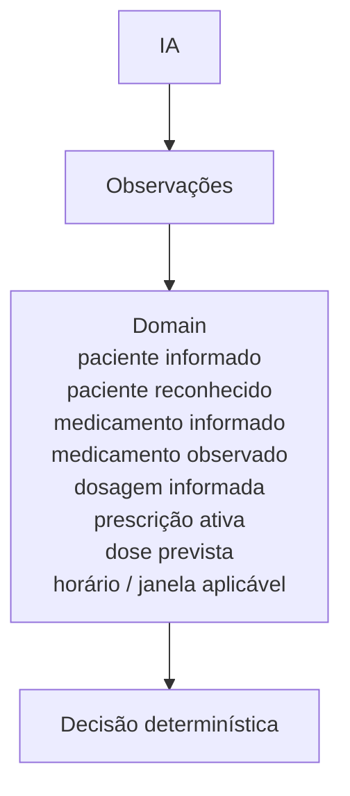
```mermaid
flowchart TD
    AI[IA] --> O[Observações]
    O --> D["Domain<br/>paciente informado<br/>paciente reconhecido<br/>medicamento informado<br/>medicamento observado<br/>dosagem informada<br/>prescrição ativa<br/>dose prevista<br/>horário / janela aplicável"]
    D --> R[Decisão determinística]
```

---

## 12. Evidências da sessão

O resultado intermediário da captura e da IA deve ser agregado como **evidência da sessão**, sem necessariamente ser persistido de forma permanente.

Exemplo conceitual:

```kotlin
data class AdministrationEvidence(
    val spokenPatient: PatientCandidate?,
    val spokenMedication: MedicationCandidate?,
    val spokenDosage: Dosage?,
    val visualMedication: MedicationCandidate?,
    val patientVerification: PatientVerification?,
    val medicationImage: MedicationImage?,
    val capturedAt: Instant
)
```

Esse objeto representa dados correlacionados daquela tentativa específica.

---

## 13. Consulta ao paciente e à prescrição

A aplicação deve obter dados do domínio por contratos, e não diretamente de banco ou API.

Exemplo:

```kotlin
interface PatientRepository {
    suspend fun findByCandidate(candidate: PatientCandidate): Patient?
}
```

```kotlin
interface PrescriptionRepository {
    suspend fun getActivePrescriptions(
        patientId: PatientId
    ): List<Prescription>
}
```

Os dados serão lidos pelo aplicativo a partir da fonte local:

```text
Room
SQLite
```

Os repositórios atualizam essa fonte por sincronização com a API remota, sem alterar os contratos usados pelo domínio e pela aplicação. A UI e o domínio não consultam a API diretamente.

---

## 14. AdministrationValidator

O `AdministrationValidator` representa uma das principais regras do domínio.

Ele recebe evidências e dados confiáveis da aplicação:

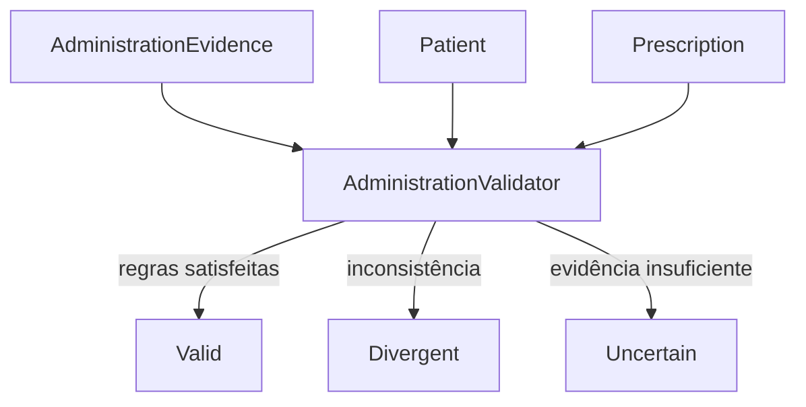
```mermaid
flowchart TD
    E[AdministrationEvidence] --> V[AdministrationValidator]
    P[Patient] --> V
    R[Prescription] --> V
    V -->|regras satisfeitas| OK[Valid]
    V -->|inconsistência| DG[Divergent]
    V -->|evidência insuficiente| UN[Uncertain]
```

As validações podem incluir:

- paciente falado corresponde ao paciente localizado;
- reconhecimento facial corresponde ao paciente esperado;
- medicamento falado corresponde ao medicamento observado;
- medicamento faz parte da prescrição ativa;
- dosagem informada corresponde à prescrita;
- horário está dentro da regra aplicável;
- evidências possuem qualidade mínima suficiente.

Essas regras devem permanecer em Kotlin puro sempre que possível.

---

## 15. Divergências explícitas

O sistema não deve "resolver" divergências utilizando apenas a maior confiança da IA.

Exemplo de divergência de identidade:

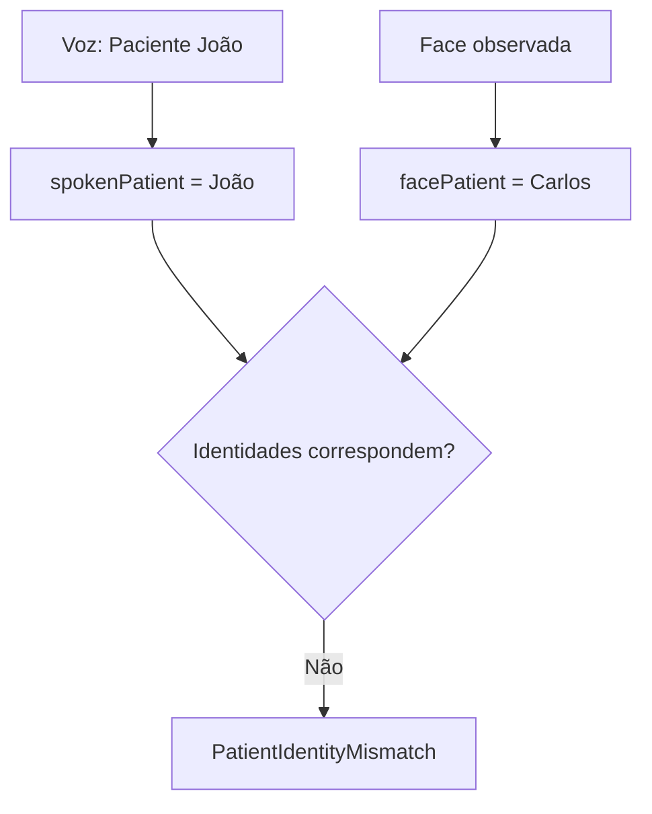
```mermaid
flowchart TD
    V["Voz: Paciente João"] --> S[spokenPatient = João]
    F[Face observada] --> R[facePatient = Carlos]
    S --> M{Identidades correspondem?}
    R --> M
    M -->|Não| E[PatientIdentityMismatch]
```

Exemplo de divergência de medicamento:

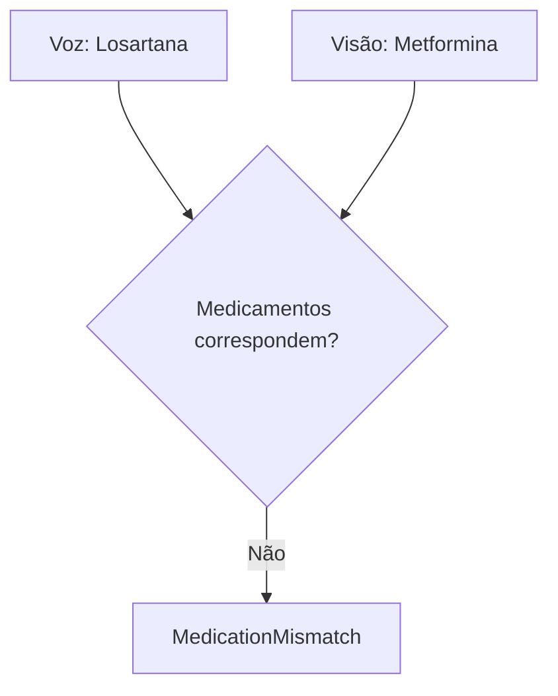
```mermaid
flowchart TD
    V["Voz: Losartana"] --> M{Medicamentos correspondem?}
    I["Visão: Metformina"] --> M
    M -->|Não| E[MedicationMismatch]
```

Divergências devem produzir estados e eventos determinísticos do domínio.

---

## 16. Máquina de estados da administração

A sessão deve possuir uma máquina de estados independente da UI.

Modelo inicial:

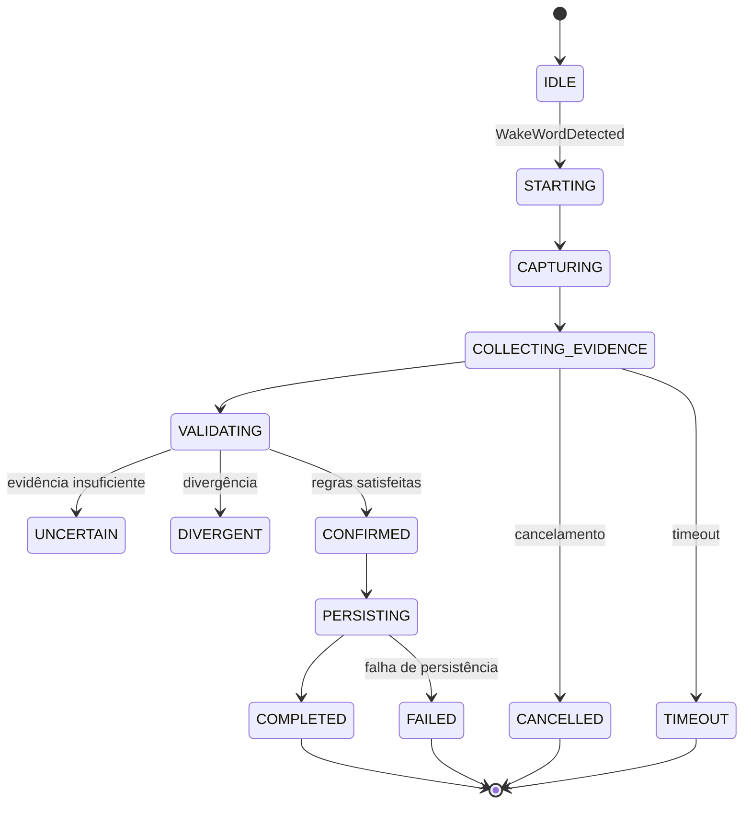
```mermaid
stateDiagram-v2
    [*] --> IDLE
    IDLE --> STARTING: WakeWordDetected
    STARTING --> CAPTURING
    CAPTURING --> COLLECTING_EVIDENCE
    COLLECTING_EVIDENCE --> VALIDATING

    VALIDATING --> UNCERTAIN: evidência insuficiente
    VALIDATING --> DIVERGENT: divergência
    VALIDATING --> CONFIRMED: regras satisfeitas

    CONFIRMED --> PERSISTING
    PERSISTING --> COMPLETED

    COLLECTING_EVIDENCE --> CANCELLED: cancelamento
    COLLECTING_EVIDENCE --> TIMEOUT: timeout
    PERSISTING --> FAILED: falha de persistência

    COMPLETED --> [*]
    CANCELLED --> [*]
    TIMEOUT --> [*]
    FAILED --> [*]
```

Também devem ser previstos estados/eventos para:

```text
CANCELLED
FAILED
TIMEOUT
```

O desenho definitivo da FSM será refinado durante a implementação.

---

## 17. Coordinator da sessão

O `AdministrationSessionCoordinator` evita que a ViewModel se transforme no cérebro da aplicação.

Responsabilidades previstas:

- iniciar e encerrar uma sessão;
- coordenar captura de áudio e vídeo;
- encaminhar entradas ao `AiGateway`;
- correlacionar as observações à sessão correta;
- consultar paciente e prescrição através de casos de uso/repositórios;
- chamar o validador;
- enviar eventos à máquina de estados;
- solicitar persistência quando apropriado;
- disponibilizar estado observável para a camada de apresentação.

Fluxo resumido:

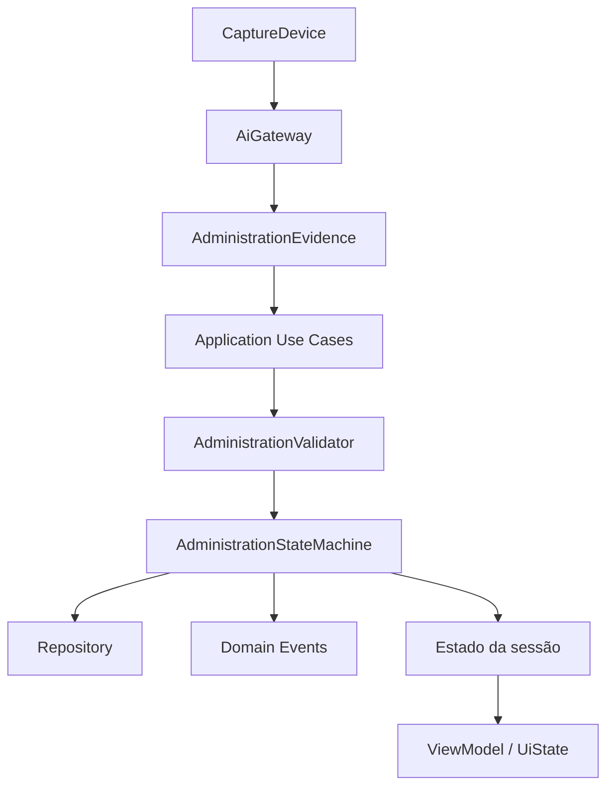
```mermaid
flowchart TD
    C[CaptureDevice] --> AI[AiGateway]
    AI --> E[AdministrationEvidence]
    E --> U[Application Use Cases]
    U --> V[AdministrationValidator]
    V --> F[AdministrationStateMachine]
    F --> R[Repository]
    F --> D[Domain Events]
    F --> S[Estado da sessão]
    S --> VM[ViewModel / UiState]
```

---

## 18. Domínio

O domínio é a parte mais estável da aplicação e deve possuir o mínimo possível de dependências externas.

Principais conceitos previstos:

```text
Patient
PatientId
PatientFaceReference
Account
Caregiver
Responsible
Medication
MedicationId
Dosage
Prescription
AdministrationSession
AdministrationEvidence
MedicationAdministration
AdministrationAttempt
AdministrationValidation
AdministrationState
DomainEvent
Emergency
ScheduledDose
Notification
NotificationDelivery
```

Não devem aparecer no domínio tipos como:

```text
Activity
Fragment
Context
Intent
Bitmap
Room
Retrofit
Meta SDK
classes específicas de provedores de IA
```

---

## 19. Administração confirmada x tentativa

É importante distinguir dois conceitos.

### AdministrationSession / AdministrationAttempt

Representa uma tentativa ou sessão em andamento, que pode resultar em:

```text
confirmada
divergente
incerta
cancelada
falha
timeout
```

### MedicationAdministration

Representa o fato confirmado e persistido de que determinada dose foi ministrada.

Exemplo conceitual:

```kotlin
data class MedicationAdministration(
    val id: AdministrationId,
    val patientId: PatientId,
    val medicationId: MedicationId,
    val dosage: Dosage,
    val administeredAt: Instant,
    val caregiverId: CaregiverId,
    val medicationImage: MedicationImage,
    val verification: VerificationSummary
)
```

Essa separação permite registrar tentativas relevantes sem tratá-las como doses efetivamente administradas.

---

## 20. Persistência e histórico

Após a confirmação, o aplicativo deve persistir o registro da administração localmente antes de informar sucesso ao cuidador. A gravação do registro e da operação pendente de sincronização ocorre na mesma transação Room/SQLite.

O histórico funcional deverá conter, obrigatoriamente:

```text
paciente
medicamento
dosagem
horário da administração
imagem do medicamento
resultado/resumo das verificações
```

Outros metadados podem ser adicionados posteriormente, por exemplo:

```text
cuidador responsável
identificador da sessão
origem da captura
versão das regras
status de sincronização
```

A imagem do medicamento é evidência obrigatória de auditoria. Uma sessão não pode produzir `MedicationAdministration` confirmada sem que a imagem tenha sido capturada, validada, persistida localmente e associada ao registro. Falha de captura ou persistência da imagem resulta em tentativa não confirmada. A sincronização do binário pode ocorrer depois, mas a cópia local permanece protegida até a confirmação do upload e da integridade pelo servidor. `AdministrationEvidence.medicationImage` continua anulável apenas enquanto as evidências estão sendo acumuladas; o validator exige seu preenchimento para confirmar a administração.

O acesso será feito através de contrato:

```kotlin
interface AdministrationRepository {
    suspend fun save(administration: MedicationAdministration)
    suspend fun saveAttempt(attempt: AdministrationAttempt)
    suspend fun getHistory(patientId: PatientId): List<MedicationAdministration>
}
```

A implementação de produção utiliza:

```text
Android                          Infraestrutura remota
Room                            WAF + reverse proxy + API HTTPS
SQLite                          PostgreSQL autogerenciado
WorkManager                     Object Storage externo
Outbox local                    Backup e restauração externos
```

Room é a biblioteca de persistência Android e SQLite é o banco embarcado no dispositivo. Room não faz parte do domínio e não é o backend. O banco PostgreSQL permanece inacessível diretamente pelo aplicativo; somente o serviço de persistência possui suas credenciais.

### 20.1 Fluxo local-first e sincronização

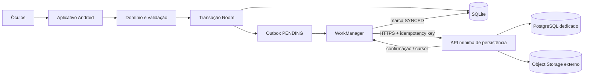
```mermaid
flowchart LR
    G[Óculos] --> APP[Aplicativo Android]
    APP --> DOM[Domínio e validação]
    DOM --> TX[Transação Room]
    TX --> SQL[(SQLite)]
    TX --> OUT[Outbox PENDING]
    OUT --> WM[WorkManager]
    WM -->|HTTPS + idempotency key| API[API mínima de persistência]
    API --> PG[(PostgreSQL dedicado)]
    API --> OBJ[(Object Storage externo)]
    API -->|confirmação / cursor| WM
    WM -->|marca SYNCED| SQL
```

Regras do fluxo:

1. a confirmação funcional depende da persistência local, não da latência da infraestrutura remota;
2. toda escrita sincronizável gera uma entrada de outbox na mesma transação do dado de negócio;
3. o WorkManager envia operações quando houver conectividade e repete falhas transitórias com backoff;
4. cada operação utiliza UUID e chave de idempotência para impedir duplicidade;
5. o servidor confirma a gravação e devolve versão/cursor de sincronização;
6. leituras da aplicação continuam vindo do SQLite, atualizado após sincronizações push/pull;
7. administrações, tentativas, emergências, prescrições e registros de auditoria são append-only; dados cadastrais do paciente podem ser atualizados, enquanto correções clínicas produzem novas versões ou eventos de retificação, nunca sobrescrita silenciosa;
8. uma prescrição persistida é imutável: qualquer alteração cria uma nova versão ligada à anterior, preservando integralmente a versão usada nas administrações já registradas.

Estados mínimos da sincronização:

```kotlin
enum class SyncStatus {
    PENDING,
    SYNCING,
    SYNCED,
    FAILED
}
```

### 20.2 Serviço mínimo de persistência e notificações

O componente remoto é um serviço consumido pelo aplicativo, e não um segundo orquestrador do fluxo de administração.

Responsabilidades:

```text
autenticar e autorizar o cuidador/dispositivo
receber DTOs versionados por HTTPS
validar esquema e invariantes de segurança
garantir idempotência
persistir e consultar dados no PostgreSQL
emitir cursores/versões para sincronização incremental
gerenciar referências e políticas do Object Storage externo
produzir logs de auditoria e métricas operacionais
criar e entregar notificações de urgência e dose omitida
registrar tentativas, entrega e confirmação do responsável
```

Fora de responsabilidade:

```text
wake word
captura de áudio e vídeo
inferência de IA
coordenação da sessão
decisão de validação da administração
máquina de estados funcional
```

Endpoints iniciais previstos:

```text
POST /v1/sync/operations
GET  /v1/sync/changes?after={cursor}
GET  /v1/patients
POST /v1/patients
GET  /v1/patients/{id}
PATCH /v1/patients/{id}
GET  /v1/patients/{id}/responsibles
POST /v1/patients/{id}/responsibles
DELETE /v1/patients/{id}/responsibles/{responsibleId}
GET  /v1/patients/{id}/prescriptions
POST /v1/patients/{id}/prescriptions
POST /v1/prescriptions/{id}/revisions
GET  /v1/medications
POST /v1/medications
GET  /v1/patients/{id}/administrations
POST /v1/administrations
POST /v1/administration-attempts
POST /v1/emergencies
PUT  /v1/device-registrations/{id}
DELETE /v1/device-registrations/{id}
POST /v1/notifications/{id}/acknowledgements
POST /v1/media/upload-requests
```

`POST /v1/sync/operations` é o endpoint genérico da outbox e aceita operações versionadas de criação/alteração. Os endpoints específicos permanecem disponíveis para fluxos síncronos e consultas explícitas.

### 20.3 Entrega de notificações

Alertas de urgência e dose omitida exigem entrega rastreável ao responsável. Persistir o alerta não equivale a entregá-lo, e o retorno do provedor push não equivale a leitura humana.

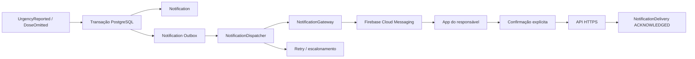
```mermaid
flowchart LR
    EV[UrgencyReported / DoseOmitted] --> NTX[Transação PostgreSQL]
    NTX --> N[Notification]
    NTX --> NO[Notification Outbox]
    NO --> DISP[NotificationDispatcher]
    DISP --> GW[NotificationGateway]
    GW --> FCM[Firebase Cloud Messaging]
    FCM --> APP[App do responsável]
    APP --> ACK[Confirmação explícita]
    ACK --> API[API HTTPS]
    API --> DEL[NotificationDelivery ACKNOWLEDGED]
    DISP --> RETRY[Retry / escalonamento]
```

Componentes:

```text
NotificationPolicy
NotificationCoordinator
NotificationOutbox
NotificationDispatcher
NotificationGateway
FcmNotificationAdapter
DeviceRegistrationRepository
NotificationRepository
```

Decisão de transporte:

- o aplicativo de produção requer dispositivo Android com Google Play Services disponível e atualizado;
- **Firebase Cloud Messaging (FCM)** é o único transporte push adotado, por oferecer conexão eficiente em segundo plano sem exigir serviço foreground e por não cobrar pelo Cloud Messaging;
- o push contém apenas identificador opaco, tipo e prioridade; detalhes de paciente/medicação são buscados na API após autenticação;
- tokens são vinculados a conta e dispositivo, rotacionados e removidos quando inválidos;
- o servidor registra `QUEUED`, `SENT`, `PROVIDER_ACCEPTED`, `DELIVERED` quando disponível, `ACKNOWLEDGED` e `FAILED`;
- alertas críticos não confirmados dentro da política geram novas tentativas e podem acionar um canal de escalonamento ainda a definir;
- nenhuma tecnologia push garante que uma pessoa viu a mensagem; somente o acknowledgement explícito cumpre essa função;
- ausência ou falha do Google Play Services impede considerar o dispositivo apto a receber alertas remotos; essa condição deve ser exibida no provisionamento e na monitoração do dispositivo.

`NotificationGateway` permanece como port do domínio/aplicação para permitir mocks, testes e isolamento do SDK Firebase, não para sustentar múltiplos provedores em produção.

### 20.4 Modelo lógico relacional

O modelo lógico abaixo orienta tanto o schema PostgreSQL quanto as entidades locais do Room. Os schemas físicos podem conter diferenças operacionais, como `sync_status` apenas no dispositivo e colunas de auditoria adicionais no servidor.

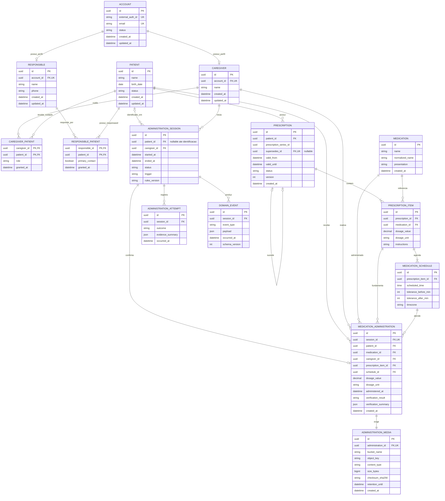
```mermaid
erDiagram
    ACCOUNT ||--o| CAREGIVER : possui_perfil
    ACCOUNT ||--o| RESPONSIBLE : possui_perfil
    CAREGIVER ||--o{ CAREGIVER_PATIENT : cuida
    PATIENT ||--o{ CAREGIVER_PATIENT : recebe_cuidado
    RESPONSIBLE ||--o{ RESPONSIBLE_PATIENT : responde_por
    PATIENT ||--|{ RESPONSIBLE_PATIENT : possui_responsavel
    PATIENT ||--o{ PRESCRIPTION : possui
    PRESCRIPTION o|--o| PRESCRIPTION : sucede
    PRESCRIPTION ||--|{ PRESCRIPTION_ITEM : contem
    MEDICATION ||--o{ PRESCRIPTION_ITEM : referencia
    PRESCRIPTION_ITEM ||--|{ MEDICATION_SCHEDULE : agenda
    PATIENT o|--o{ ADMINISTRATION_SESSION : identificado_em
    CAREGIVER ||--o{ ADMINISTRATION_SESSION : inicia
    ADMINISTRATION_SESSION ||--o{ ADMINISTRATION_ATTEMPT : registra
    ADMINISTRATION_SESSION ||--o| MEDICATION_ADMINISTRATION : confirma
    PATIENT ||--o{ MEDICATION_ADMINISTRATION : recebe
    CAREGIVER ||--o{ MEDICATION_ADMINISTRATION : realiza
    MEDICATION ||--o{ MEDICATION_ADMINISTRATION : administrado
    PRESCRIPTION_ITEM ||--o{ MEDICATION_ADMINISTRATION : fundamenta
    MEDICATION_SCHEDULE ||--o{ MEDICATION_ADMINISTRATION : atende
    ADMINISTRATION_SESSION ||--o{ DOMAIN_EVENT : produz
    MEDICATION_ADMINISTRATION ||--|| ADMINISTRATION_MEDIA : exige

    ACCOUNT {
        uuid id PK
        string external_auth_id UK
        string email UK
        string status
        datetime created_at
        datetime updated_at
    }
    CAREGIVER {
        uuid id PK
        uuid account_id FK,UK
        string name
        datetime created_at
        datetime updated_at
    }
    RESPONSIBLE {
        uuid id PK
        uuid account_id FK,UK
        string name
        string phone
        datetime created_at
        datetime updated_at
    }
    PATIENT {
        uuid id PK
        string name
        date birth_date
        string status
        datetime created_at
        datetime updated_at
    }
    CAREGIVER_PATIENT {
        uuid caregiver_id PK,FK
        uuid patient_id PK,FK
        string role
        datetime granted_at
    }
    RESPONSIBLE_PATIENT {
        uuid responsible_id PK,FK
        uuid patient_id PK,FK
        boolean primary_contact
        datetime granted_at
    }
    MEDICATION {
        uuid id PK
        string name
        string normalized_name
        string presentation
        datetime created_at
    }
    PRESCRIPTION {
        uuid id PK
        uuid patient_id FK
        uuid prescription_series_id
        uuid supersedes_id FK,UK "nullable"
        datetime valid_from
        datetime valid_until
        string status
        int version
        datetime created_at
    }
    PRESCRIPTION_ITEM {
        uuid id PK
        uuid prescription_id FK
        uuid medication_id FK
        decimal dosage_value
        string dosage_unit
        string instructions
    }
    MEDICATION_SCHEDULE {
        uuid id PK
        uuid prescription_item_id FK
        time scheduled_time
        int tolerance_before_min
        int tolerance_after_min
        string timezone
    }
    ADMINISTRATION_SESSION {
        uuid id PK
        uuid patient_id FK "nullable ate identificacao"
        uuid caregiver_id FK
        datetime started_at
        datetime ended_at
        string status
        string trigger
        string rules_version
    }
    ADMINISTRATION_ATTEMPT {
        uuid id PK
        uuid session_id FK
        string outcome
        json evidence_summary
        datetime occurred_at
    }
    MEDICATION_ADMINISTRATION {
        uuid id PK
        uuid session_id FK,UK
        uuid patient_id FK
        uuid medication_id FK
        uuid caregiver_id FK
        uuid prescription_item_id FK
        uuid schedule_id FK
        decimal dosage_value
        string dosage_unit
        datetime administered_at
        string verification_result
        json verification_summary
        datetime created_at
    }
    DOMAIN_EVENT {
        uuid id PK
        uuid session_id FK
        string event_type
        json payload
        datetime occurred_at
        int schema_version
    }
    ADMINISTRATION_MEDIA {
        uuid id PK
        uuid administration_id FK,UK
        string bucket_name
        string object_key
        string content_type
        bigint size_bytes
        string checksum_sha256
        datetime retention_until
        datetime created_at
    }
```

`ADMINISTRATION_SESSION.patient_id` é anulável porque a sessão nasce com a wake word e o paciente só é resolvido posteriormente. Já `MEDICATION_ADMINISTRATION.patient_id` é obrigatório, pois nenhuma administração pode ser confirmada sem identificação.

`MEDICATION_ADMINISTRATION` materializa diretamente os identificadores exigidos pelo domínio (`patient_id`, `medication_id` e `caregiver_id`). `prescription_item_id` e `schedule_id` permanecem como proveniência auditável da validação, mas não substituem as referências do agregado de domínio. Assim, uma consulta histórica não depende de inferir medicamento ou cuidador através de entidades intermediárias.

Uma `PRESCRIPTION` persistida é imutável. `prescription_series_id` agrupa suas versões, `version` cresce dentro da série e `supersedes_id` aponta, no máximo uma vez, para a versão imediatamente anterior. O schema físico deve aplicar `UNIQUE (prescription_series_id, version)` e impedir `UPDATE` e `DELETE` por trigger; alterações são aceitas somente como `INSERT` de uma revisão pela operação `POST /v1/prescriptions/{id}/revisions`. Itens e horários pertencentes à prescrição recebem a mesma proteção. Mudanças de estado ou correções posteriores são registradas como nova versão ou evento de retificação.

Exemplo da proteção no PostgreSQL:

```sql
CREATE UNIQUE INDEX uq_prescription_series_version
    ON prescription (prescription_series_id, version);

CREATE UNIQUE INDEX uq_prescription_supersedes
    ON prescription (supersedes_id)
    WHERE supersedes_id IS NOT NULL;

CREATE FUNCTION reject_prescription_mutation()
RETURNS trigger AS $$
BEGIN
    RAISE EXCEPTION 'prescriptions are immutable; create a revision instead';
END;
$$ LANGUAGE plpgsql;

CREATE TRIGGER prescription_immutable
BEFORE UPDATE OR DELETE ON prescription
FOR EACH ROW EXECUTE FUNCTION reject_prescription_mutation();

CREATE TRIGGER prescription_item_immutable
BEFORE UPDATE OR DELETE ON prescription_item
FOR EACH ROW EXECUTE FUNCTION reject_prescription_mutation();

CREATE TRIGGER medication_schedule_immutable
BEFORE UPDATE OR DELETE ON medication_schedule
FOR EACH ROW EXECUTE FUNCTION reject_prescription_mutation();
```

No Room/SQLite, triggers equivalentes devem ser criados por migration. Metadados operacionais de sincronização ficam na outbox ou em tabela separada, para que marcar uma operação como sincronizada não exija alterar a prescrição imutável.

`ADMINISTRATION_MEDIA` é obrigatória e possui relação um-para-um com `MEDICATION_ADMINISTRATION`. Ela não armazena o conteúdo binário; registra onde está a imagem, seu tipo, tamanho, checksum e prazo de retenção. A imagem fica em Object Storage compatível com S3 e é acessada somente por autorização temporária emitida pela API.

#### Modelo de notificações

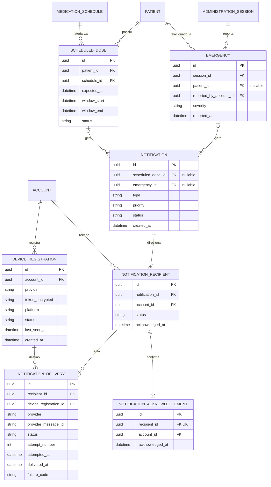
```mermaid
erDiagram
    ACCOUNT ||--o{ DEVICE_REGISTRATION : registra
    PATIENT ||--o{ SCHEDULED_DOSE : possui
    MEDICATION_SCHEDULE ||--o{ SCHEDULED_DOSE : materializa
    ADMINISTRATION_SESSION ||--o{ EMERGENCY : reporta
    PATIENT o|--o{ EMERGENCY : relacionado_a
    SCHEDULED_DOSE o|--o{ NOTIFICATION : gera
    EMERGENCY o|--o{ NOTIFICATION : gera
    NOTIFICATION ||--|{ NOTIFICATION_RECIPIENT : direciona
    ACCOUNT ||--o{ NOTIFICATION_RECIPIENT : recebe
    NOTIFICATION_RECIPIENT ||--o{ NOTIFICATION_DELIVERY : tenta
    DEVICE_REGISTRATION ||--o{ NOTIFICATION_DELIVERY : destino
    NOTIFICATION_RECIPIENT ||--o| NOTIFICATION_ACKNOWLEDGEMENT : confirma

    DEVICE_REGISTRATION {
        uuid id PK
        uuid account_id FK
        string provider
        string token_encrypted
        string platform
        string status
        datetime last_seen_at
        datetime created_at
    }
    SCHEDULED_DOSE {
        uuid id PK
        uuid patient_id FK
        uuid schedule_id FK
        datetime expected_at
        datetime window_start
        datetime window_end
        string status
    }
    EMERGENCY {
        uuid id PK
        uuid session_id FK
        uuid patient_id FK "nullable"
        uuid reported_by_account_id FK
        string severity
        datetime reported_at
    }
    NOTIFICATION {
        uuid id PK
        uuid scheduled_dose_id FK "nullable"
        uuid emergency_id FK "nullable"
        string type
        string priority
        string status
        datetime created_at
    }
    NOTIFICATION_RECIPIENT {
        uuid id PK
        uuid notification_id FK
        uuid account_id FK
        string status
        datetime acknowledged_at
    }
    NOTIFICATION_DELIVERY {
        uuid id PK
        uuid recipient_id FK
        uuid device_registration_id FK
        string provider
        string provider_message_id
        string status
        int attempt_number
        datetime attempted_at
        datetime delivered_at
        string failure_code
    }
    NOTIFICATION_ACKNOWLEDGEMENT {
        uuid id PK
        uuid recipient_id FK,UK
        uuid account_id FK
        datetime acknowledged_at
    }
```

Cada `NOTIFICATION` possui exatamente uma origem: `scheduled_dose_id` para dose omitida ou `emergency_id` para urgência. As duas relações são opcionais isoladamente porque são alternativas, mas o banco deve exigir a exclusividade com `CHECK ((scheduled_dose_id IS NOT NULL) <> (emergency_id IS NOT NULL))`. Dessa forma, uma notificação nunca fica sem origem nem aponta simultaneamente para dose e emergência.

### 20.5 Modelo local e modelo remoto

No SQLite local, cada entidade sincronizável deve conter metadados operacionais:

```text
sync_status
local_updated_at
server_version
last_sync_error
```

A tabela local `sync_outbox` mantém:

```text
id
aggregate_type
aggregate_id
operation
payload
idempotency_key
attempt_count
next_attempt_at
created_at
```

No PostgreSQL, restrições, índices e transações protegem as relações. Índices iniciais recomendados:

```text
prescription(patient_id, status, valid_from, valid_until)
medication_schedule(prescription_item_id, scheduled_time)
medication_administration(prescription_item_id, administered_at)
administration_session(patient_id, started_at)
domain_event(session_id, occurred_at)
administration_media(administration_id)
scheduled_dose(patient_id, expected_at, status)
notification_recipient(account_id, status)
notification_delivery(recipient_id, attempted_at)
device_registration(account_id, status)
```

UUIDs são gerados no dispositivo para permitir escrita offline. Horários de negócio são armazenados como instantes UTC; a agenda preserva também o fuso aplicável. Valores de dosagem usam decimal e unidade explícita, nunca ponto flutuante binário isolado. No SQLite, o decimal deve ser persistido como representação textual canônica ou inteiro escalado por regra explícita, pois o banco não possui um tipo decimal exato equivalente ao PostgreSQL.

---

## 21. Dados efêmeros e dados persistentes

A arquitetura deve distinguir explicitamente dados usados apenas durante a sessão daqueles necessários posteriormente.

### Dados potencialmente efêmeros

```text
chunks de áudio
frames intermediários
imagem facial usada para comparação
resultados intermediários dos modelos
buffers de vídeo
```

### Dados persistentes previstos atualmente

```text
registro da administração
horário
paciente
medicamento
dosagem
imagem do medicamento
status/resumo da validação
```

A imagem facial utilizada para verificação **não precisa ser automaticamente persistida**. Uma estratégia preferível, sujeita à validação dos requisitos do projeto, é:

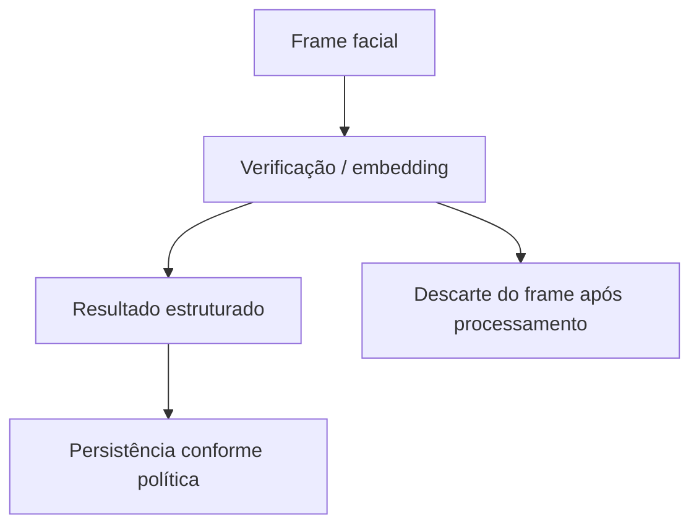
```mermaid
flowchart TD
    F[Frame facial] --> V[Verificação / embedding]
    V --> R[Resultado estruturado]
    R --> P[Persistência conforme política]
    V --> D[Descarte do frame após processamento]
```

A retenção de embeddings de referência e outros dados biométricos deverá ser tratada como decisão específica de segurança, privacidade e armazenamento.

---

## 22. Eventos de domínio e auditoria

Eventos relevantes devem ser estruturados e rastreáveis.

Exemplos:

```text
AdministrationSessionStarted
SpeechEvidenceCaptured
MedicationObserved
PatientResolved
PatientVerified
PatientIdentityMismatch
MedicationMismatch
DosageMismatch
PrescriptionNotFound
AdministrationConfirmed
AdministrationUncertain
AdministrationCancelled
AdministrationFailed
AdministrationPersisted
```

Esses eventos podem alimentar diferentes consumidores:

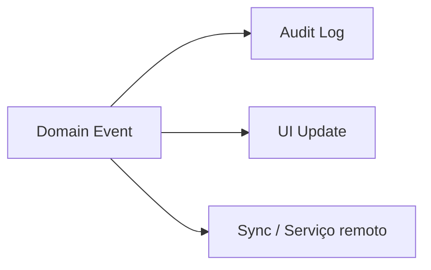
```mermaid
flowchart LR
    E[Domain Event] --> A[Audit Log]
    E --> U[UI Update]
    E --> S[Sync / Serviço remoto]
```

Nem todo evento precisa ser persistido de forma definitiva; isso dependerá da política de auditoria e retenção.

---

## 23. Presentation: MVVM + UDF

MVVM é aplicado somente à camada de apresentação.

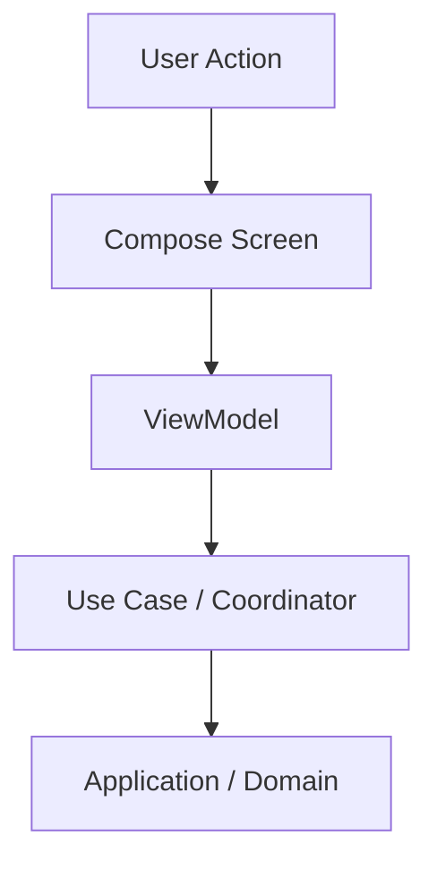
```mermaid
flowchart TD
    U[User Action] --> C[Compose Screen]
    C --> V[ViewModel]
    V --> A[Use Case / Coordinator]
    A --> D[Application / Domain]
```

O estado retorna no sentido inverso:

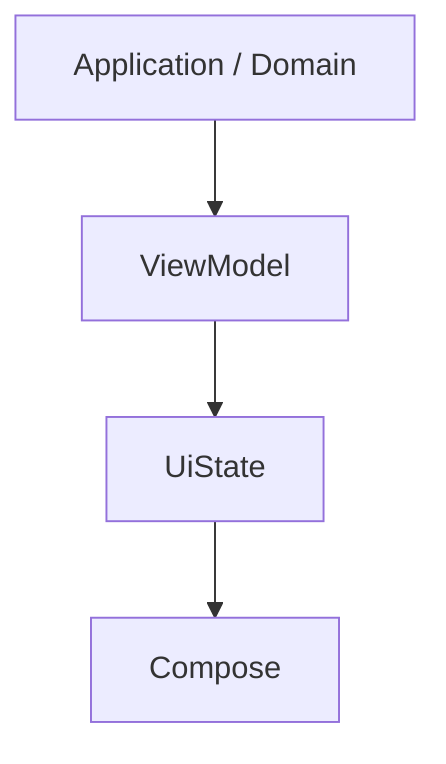
```mermaid
flowchart TD
    D[Application / Domain] --> V[ViewModel]
    V --> S[UiState]
    S --> C[Compose]
```

Princípio:

> **Estado desce; eventos sobem.**

O ViewModel deve:

- receber ações da UI;
- iniciar casos de uso ou ações do coordinator;
- observar estado da sessão;
- produzir `UiState`;
- lidar com lifecycle da apresentação.

O ViewModel não deve:

- implementar regras de validação;
- executar reconhecimento de IA diretamente;
- conversar diretamente com o SDK dos óculos;
- acessar banco de dados diretamente;
- implementar a FSM;
- coordenar a sessão completa.

---

## 24. Por que MVVM + UDF

A escolha é adequada ao Jetpack Compose e ao comportamento assíncrono esperado da aplicação.

Eventos como:

```text
wake word detectada
áudio recebido
frame recebido
IA respondeu
paciente localizado
face validada
prescrição consultada
persistência concluída
falha de conectividade
```

podem resultar em atualizações de estado observáveis pela UI.

MVVM + UDF permite manter a apresentação declarativa sem transformar a UI em responsável pela orquestração do domínio.

---

## 25. Por que não MVC, MVP, MVI puro ou estado global

### MVC

Não é a escolha inicial porque, em Android, pode favorecer concentração excessiva de responsabilidades em Activities, Fragments ou Controllers, especialmente em um fluxo com hardware, IA e processamento assíncrono.

### MVP

O Presenter tradicional é mais orientado a comandar uma View imperativamente. Essa característica agrega menos valor em uma UI declarativa baseada em Compose.

### MVI puro

MVI é tecnicamente viável, mas uma implementação rígida poderia introduzir uma segunda máquina de estados na UI (`Intent -> Reducer -> State -> Effect`) enquanto o domínio já possui uma FSM explícita.

A proposta absorve suas características úteis através de:

- `UiState` imutável;
- ações explícitas;
- fluxo unidirecional;
- `StateFlow` / `Flow`.

### Global Store / Redux

Não há justificativa atual para manter todo o estado da aplicação em um armazenamento global único. Isso poderá ser revisto se surgirem requisitos concretos de estado compartilhado entre múltiplas features.

---

## 26. Por que Clean Architecture e Ports & Adapters como referência

O projeto possui dependências externas com alta probabilidade de mudança:

```text
SDK dos óculos
modelos e provedores de IA
Room / SQLite
API de sincronização
PostgreSQL dedicado / Object Storage externo
APIs Android
```

Ao mesmo tempo, existem conceitos e regras que devem permanecer mais estáveis:

```text
sessão de administração
paciente
prescrição
medicamento
dosagem
validação
FSM
eventos
```

A inversão de dependência permite que o domínio defina o que necessita e a infraestrutura implemente como fornecer.

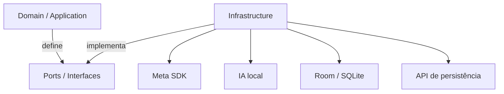
```mermaid
flowchart TD
    DA[Domain / Application] -->|define| P[Ports / Interfaces]
    I[Infrastructure] -->|implementa| P
    I --> M[Meta SDK]
    I --> L[IA local]
    I --> R[Room / SQLite]
    I --> API[API de persistência]
```

Não será utilizada uma versão dogmática de Clean Architecture. O objetivo é preservar fronteiras úteis, não multiplicar classes, DTOs e mappers sem necessidade.

---

## 27. Topologia de execução definida

A topologia de produção concentra no aplicativo Android tudo o que participa do caminho crítico da administração. A infraestrutura remota permanece fora desse caminho e recebe dados por sincronização.

```mermaid
flowchart LR
    subgraph LOCAL["Dispositivo Android"]
        G[Óculos] --> APP[Aplicativo CuidarIA]
        APP --> AI[IA local]
        APP --> DOM[Domínio / FSM]
        DOM --> ROOM[Room]
        ROOM --> SQLITE[(SQLite)]
        SQLITE --> SYNC[Outbox + WorkManager]
    end

    subgraph SERVER["Infraestrutura remota"]
        WAF[WAF]
        RP[Reverse proxy TLS]
        API[API mínima HTTPS]
        ND[NotificationDispatcher]
        PG[(PostgreSQL autogerenciado)]
        WAF --> RP --> API
        API --> PG
        API --> ND
    end

    subgraph OFFSITE["Armazenamento externo"]
        OBJ[(Object Storage S3)]
        BKP[(Backups + WAL)]
    end

    subgraph PUSH["Push externo"]
        FCM[Firebase Cloud Messaging]
        RESP[App do responsável]
        FCM --> RESP
    end

    API --> OBJ
    PG -->|pgBackRest / WAL-G| BKP
    ND --> FCM

    SYNC -->|HTTPS| WAF
    API -->|confirmações e mudanças| SYNC
```

Consequências da decisão:

- a sessão não depende da latência da infraestrutura remota para ser concluída localmente;
- perda de conectividade não impede captura, validação e registro local;
- o histórico central pode apresentar atraso enquanto existirem itens pendentes;
- a API remota permanece pequena e substituível;
- WAF, proxy, API e PostgreSQL compõem a infraestrutura remota, com isolamento de processos e permissões;
- a UI deve tornar visível o estado de sincronização e falhas persistentes;
- ações que dependem de comunicação externa imediata, como alertas remotos de urgência, devem informar claramente quando ainda não foram entregues.

### 27.1 Configuração da infraestrutura remota

```text
Infraestrutura remota
├── WAF
├── reverse proxy / terminação TLS
├── API mínima
├── NotificationDispatcher
├── PostgreSQL
├── volume de dados dedicado
├── agente de backup e arquivamento de WAL
└── agentes de métricas, logs e alertas

Infraestrutura externa
├── Object Storage para imagens de medicamentos
└── Object Storage separado para backups e WAL
```

Diretrizes obrigatórias:

- somente a API HTTPS é exposta à internet; a porta do PostgreSQL permanece bloqueada externamente;
- API e PostgreSQL usam usuários de sistema, processos e credenciais separados;
- o diretório de dados do PostgreSQL usa volume persistente dedicado;
- backups completos/incrementais e WAL contínuo são enviados para armazenamento externo usando `pgBackRest` ou `WAL-G`;
- a política deve definir RPO, RTO, retenção, criptografia e rotação de credenciais;
- restaurações são testadas periodicamente em ambiente isolado;
- monitoração cobre CPU, memória, disco, IOPS, conexões, locks, replication/WAL lag, falhas de backup e expiração de certificados;
- o bucket de imagens é privado e possui criptografia, versionamento/soft delete e lifecycle/retention;
- uploads e downloads usam autorização curta emitida pela API; nenhuma imagem é pública;
- áudio, vídeo e frames faciais intermediários não são enviados ao Object Storage.

Essa topologia aceita inicialmente o risco de indisponibilidade de uma única máquina porque o aplicativo continua registrando localmente durante a falha. Ela não aceita perda silenciosa: dados já sincronizados devem ser recuperáveis pelo backup externo. Quando o SLA exigir alta disponibilidade, deve-se adicionar réplica/standby em outro host e failover; aumentar apenas a capacidade da máquina não elimina o ponto único de falha.

---

## 28. Organização inicial do código Android

O aplicativo inicia com um módulo Android principal e preserva as fronteiras por pacotes. O serviço remoto é um deployment separado e restrito à persistência, sincronização e entrega de notificações.

```text
com.cuidarai.app

├── presentation/
│   ├── administration/
│   ├── history/
│   ├── patient/
│   └── setup/
│
├── application/
│   ├── usecase/
│   └── coordinator/
│
├── domain/
│   ├── model/
│   ├── event/
│   ├── state/
│   ├── validation/
│   └── repository/
│
├── infrastructure/
│   ├── ai/
│   ├── glasses/
│   ├── wakeword/
│   ├── persistence/
│   ├── sync/
│   ├── remote/
│   ├── notification/
│   └── android/
│
└── di/
```

A modularização Gradle poderá ser introduzida quando houver justificativa concreta de ownership, desempenho ou isolamento. O código da API mínima deve permanecer em projeto/módulo de deployment próprio e compartilhar contratos por schema versionado, não por dependência no domínio Android.

---

## 29. Componentes principais previstos

### Presentation

```text
AdministrationScreen
HistoryScreen
PatientScreen
SetupScreen
AdministrationViewModel
HistoryViewModel
```

### Application

```text
AdministrationSessionCoordinator
StartAdministrationSessionUseCase
ProcessSpeechEvidenceUseCase
ProcessMedicationEvidenceUseCase
ResolvePatientUseCase
ValidateAdministrationUseCase
CompleteAdministrationUseCase
RegisterAdministrationUseCase
ReportEmergencyUseCase
AcknowledgeNotificationUseCase
```

### Domain

```text
Patient
Account
Caregiver
Responsible
Medication
Prescription
Dosage
AdministrationSession
AdministrationEvidence
AdministrationAttempt
MedicationAdministration
AdministrationValidator
AdministrationStateMachine
DomainEvent
Emergency
ScheduledDose
Notification
NotificationDelivery
```

### Infrastructure

```text
WakeWordDetector
CaptureDevice
MetaGlassesCaptureDevice
PhoneCaptureDevice
RecordedCaptureDevice
AiGateway
FakeAiAdapter
LocalAiAdapter
PatientRepositoryImpl
PrescriptionRepositoryImpl
AdministrationRepositoryImpl
PersistenceApiClient
LocalDatabase
RoomDatabase
SyncOutbox
SyncWorker
NotificationGateway
FcmNotificationAdapter
DeviceRegistrationRepositoryImpl
NotificationRepositoryImpl
```

---

## 30. Estratégia inicial de prototipação

O primeiro protótipo deve validar a arquitetura antes da integração definitiva com IA ou óculos.

Pode utilizar:

```text
MockWakeWordDetector
RecordedCaptureDevice
FakeAiAdapter
InMemoryPatientRepository
InMemoryPrescriptionRepository
InMemoryAdministrationRepository
```

Fluxo inicial:

```mermaid
flowchart TD
    A["Simular 'Hey CuidarIA'"] --> B[Iniciar sessão]
    B --> C[Injetar áudio e frames gravados]
    C --> D[Fake AI produz observações]
    D --> E[Montar AdministrationEvidence]
    E --> F[Consultar paciente / prescrição fake]
    F --> G[AdministrationValidator]
    G --> H[AdministrationStateMachine]
    H --> I[Resultado]
    I --> J[Persistência em memória]
    J --> K[Histórico na UI]
```

Esse protótipo permite validar:

- contratos;
- correlação de uma sessão;
- estados;
- validação;
- divergências;
- navegação;
- histórico;
- testes unitários;
- substituição dos adapters.

---

## 31. Estratégia de testes

### Domínio

Executado sem Android.

Prioridades:

```text
transições da AdministrationStateMachine
medicamento correto/incorreto
dosagem correta/incorreta
paciente correto/incorreto
face divergente
prescrição inexistente
evidência insuficiente
timeouts e cancelamentos
```

### Application

Testes do coordinator e casos de uso com adapters fake.

### Infrastructure

Testes específicos de:

```text
SDK dos óculos
captura
wake word
IA local
Room e migrations SQLite
outbox e retries idempotentes
contratos e erros da API
integração PostgreSQL
sincronização e resolução de conflitos
```

### UI

Testes de:

```text
renderização de UiState
navegação
sessão em andamento
confirmação
divergência
incerteza
histórico
falhas
```

---

## 32. Stack, dependências e decisões em aberto

### Stack Android inicial

```text
Kotlin
Jetpack Compose
Android ViewModel
Kotlin Coroutines
StateFlow / Flow
Gradle Kotlin DSL
JUnit
Room
SQLite
WorkManager
```

### Persistência e integração definidas

```text
Room sobre SQLite no Android
WorkManager para sincronização persistente
API HTTPS versionada
Infraestrutura remota com WAF, proxy, API mínima e PostgreSQL
PostgreSQL autogerenciado
Object Storage externo para imagens de medicação e backups
pgBackRest ou WAL-G para backup e PITR
Google Play Services obrigatório nos dispositivos de produção
Firebase Cloud Messaging como transporte push único
NotificationGateway para isolamento do provedor
JSON para DTOs e payloads versionados
```

### Dependências tecnológicas ainda a definir

```text
Dependency Injection
cliente HTTP
serialização
provedor e especificação da infraestrutura remota
provedor S3-compatible do Object Storage
```

### Decisões arquiteturais ainda em aberto

1. Contrato definitivo dos óculos.
2. Estrutura definitiva de `AdministrationEvidence`.
3. Critérios de confiança/inconclusividade aceitos como evidência.
4. Forma de resolução do paciente a partir da fala.
5. Modelo final de prescrição e janela de administração.
6. Estratégia de armazenamento e proteção dos embeddings faciais.
7. Política para descarte de frames faciais.
8. Política de retenção da imagem do medicamento.
9. Política de conflitos e retificações após sincronização.
10. SLA, timeout de acknowledgement e canal de escalonamento para alertas críticos.
11. Escolha de Dependency Injection.
12. Especificação do servidor, política de backup/PITR, HA, retenção, observabilidade e auditoria.

---

## 33. Próximos passos de arquitetura

```mermaid
flowchart TD
    S1[1. Refinar AdministrationSession e AdministrationEvidence]
    S2[2. Definir contrato inicial do AiGateway]
    S3[3. Modelar AdministrationValidator]
    S4[4. Modelar AdministrationStateMachine]
    S5[5. Definir Patient / Prescription / Medication / Dosage]
    S6[6. Definir eventos de domínio]
    S7[7. Criar adapters fake]
    S8[8. Implementar AdministrationSessionCoordinator]
    S9[9. Criar ViewModel + UiState]
    S10[10. Criar tela Compose do fluxo]
    S11[11. Implementar Room + SQLite]
    S12[12. Implementar Outbox + WorkManager]
    S13[13. Implementar API mínima + PostgreSQL]
    S14[14. Validar sincronização, idempotência e conflitos]
    S15[15. Implementar notificações FCM + acknowledgement]
    S16[16. Substituir adapters de IA/dispositivo por implementações reais]

    S1 --> S2 --> S3 --> S4 --> S5 --> S6 --> S7 --> S8 --> S9 --> S10 --> S11 --> S12 --> S13 --> S14 --> S15 --> S16
```

---

## 34. Resumo da decisão

A arquitetura concentra o caminho crítico da administração no aplicativo Android e mantém a persistência central fora dele por uma fronteira estreita de sincronização.

```mermaid
flowchart TD
    P[Presentation] --> A[Application]
    A --> D[Domain]
    DA[Device Adapter] --> C[Ports / Contracts]
    AI[AI Adapter] --> C
    RM[Room Adapter] --> C
    SY[Sync Adapter] --> C
    C --> D
```

A **sessão de administração de medicamento** é a unidade funcional central.

A IA produz observações. O domínio correlaciona essas observações com paciente e prescrição e aplica regras determinísticas. Somente após a validação é criado o registro de uma dose administrada.

A aplicação grava primeiro em SQLite por meio do Room. Uma outbox durável e o WorkManager sincronizam os dados por HTTPS através do WAF e do reverse proxy até a API mínima, que persiste no PostgreSQL autogerenciado e no Object Storage externo. A infraestrutura remota não executa a coordenação da sessão, a inferência de IA nem a decisão de domínio.
