# Arquitetura da Aplicação CuidarAI

**Status:** Documento inicial de arquitetura em evolução  
**Versão:** 0.3  
**Plataforma cliente principal:** Android  
**Linguagem:** Kotlin  
**UI:** Jetpack Compose

---

## 1. Objetivo do documento

Este documento descreve a arquitetura inicial da aplicação CuidarAI responsável por apoiar o cuidador durante a administração de medicamentos utilizando captura de áudio e vídeo pelos óculos, processamento por IA, validação determinística das informações e persistência do histórico de doses ministradas.

A solução de IA será tratada pela aplicação como uma **caixa preta**, conhecida por contratos de entrada e saída. A arquitetura não deve depender de como os modelos são implementados nem de onde são executados.

Da mesma forma, a integração com os óculos deve ser abstraída para que o núcleo da aplicação não dependa diretamente de um dispositivo ou SDK específico.

Este documento descreve principalmente **responsabilidades, dependências e contratos lógicos**. Ele não determina antecipadamente a topologia final de implantação.

---

## 2. Fluxo principal de uso

O fluxo funcional principal é uma **sessão de administração de medicamento**.


Durante a sessão, o cuidador informa por voz que está ministrando determinado medicamento e dosagem a um paciente. O medicamento é mostrado à câmera dos óculos para verificação visual. A aplicação consulta a ficha e a prescrição do paciente e, por fim, utiliza reconhecimento facial baseado em embedding para confirmar a identidade do paciente.

Quando as validações necessárias são satisfeitas, a administração é registrada no histórico.

---

## 3. Princípios arquiteturais

A arquitetura parte dos seguintes princípios:

1. **A IA percebe; o domínio decide.**
2. **A unidade funcional central é a sessão de administração, não o modelo de IA.**
3. **Os óculos são uma fonte de entrada e feedback, não o núcleo da aplicação.**
4. **Regras de validação devem ser determinísticas e testáveis sem Android, IA ou hardware.**
5. **A localização de execução da IA não deve contaminar o domínio.**
6. **A UI não deve conter regra de negócio.**
7. **ViewModels não devem funcionar como orquestradores de todo o fluxo.**
8. **Integrações externas devem ficar atrás de contratos.**
9. **A aplicação deve permitir mocks para captura, IA, persistência e backend.**
10. **Dados efêmeros e persistentes devem ser explicitamente diferenciados.**
11. **Divergências, incertezas e tentativas abortadas também são eventos relevantes.**
12. **A estrutura deve privilegiar fronteiras claras sem modularização física prematura.**

---

## 4. Decisão arquitetural principal

A solução será inicialmente modelada como uma **arquitetura em camadas com organização modular**, inspirada em:

- Clean Architecture;
- Ports & Adapters;
- Dependency Inversion;
- MVVM na camada de apresentação;
- Unidirectional Data Flow (UDF) na UI.

A definição adotada neste momento é:

> **Aplicação Kotlin organizada em camadas e por responsabilidades, inspirada em Clean Architecture e Ports & Adapters, utilizando MVVM + UDF na apresentação e contratos explícitos para IA, dispositivos e serviços externos.**

Não será adotado, neste momento, o termo **monólito modular** como definição da solução.

A razão é que ainda não está decidido onde cada componente será executado. Por exemplo, partes da solução de IA poderão futuramente estar:

```text
- no mesmo APK Android;
- em outro APK ou processo local;
- em um serviço executado no próprio dispositivo;
- nos óculos, caso o SDK permita;
- em backend próprio;
- em serviços de IA na cloud.
```

Essas alternativas são decisões de **topologia de execução/deployment**, e não alteram a organização lógica das camadas enquanto os contratos forem preservados.

Os diagramas arquiteturais e de fluxo deste documento utilizam **Mermaid** quando a notação melhora a leitura e facilita manutenção/versionamento no próprio Markdown. Estruturas de diretórios, listas de componentes e exemplos de dados permanecem em blocos de texto quando isso for mais legível.

---

## 5. Camadas da aplicação

A visão lógica principal é:

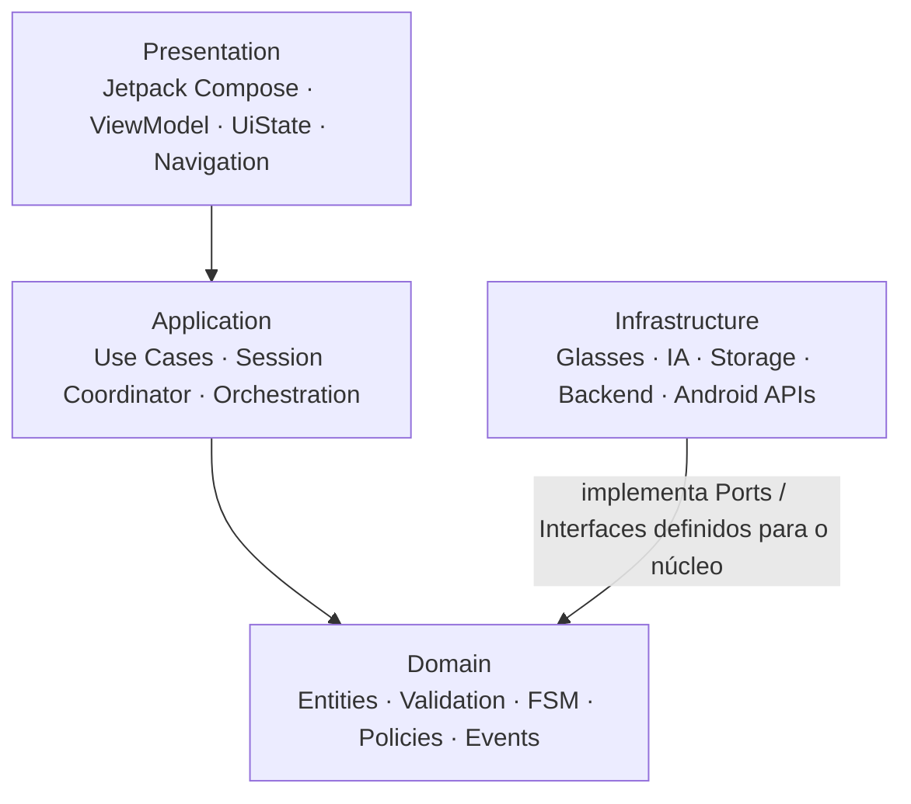

As setas representam dependências lógicas. O domínio não deve conhecer implementações concretas de Android, SDK da Meta, serviços de IA, banco ou APIs remotas.

---

## 6. Arquitetura funcional da sessão de administração

O componente central de orquestração da aplicação será uma sessão de administração.

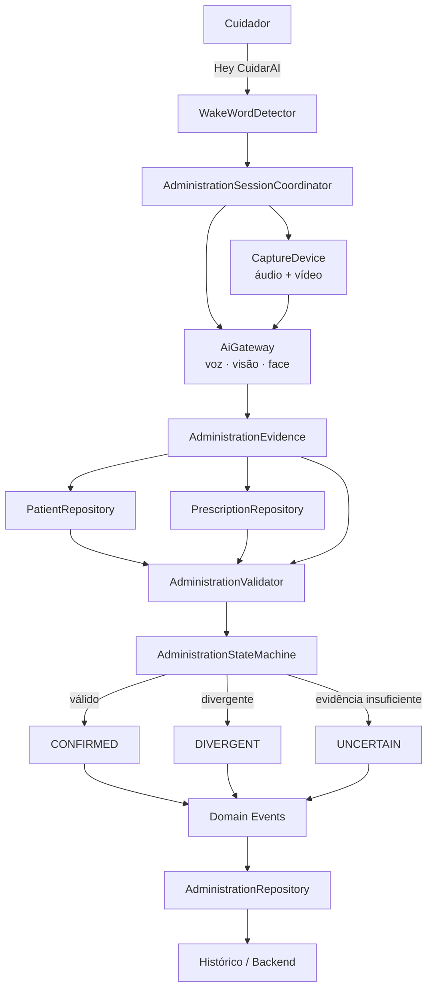

---

## 7. Sessão de administração como unidade central

A sessão representa uma tentativa em andamento.

Exemplo conceitual:

```kotlin
data class AdministrationSession(
    val id: SessionId,
    val startedAt: Instant,
    val status: AdministrationStatus
)
```

Durante alguns segundos, a aplicação acumula evidências relacionadas à mesma tentativa:

```text
t0  Wake word detectada
t1  fala identifica paciente
t2  fala identifica medicamento
t3  fala identifica dosagem
t4  câmera observa medicamento
t5  ficha/prescrição é consultada
t6  face do paciente é verificada
t7  conjunto de evidências é validado
t8  administração é confirmada ou rejeitada
```

Essa correlação deve ser explícita para impedir que observações de sessões diferentes sejam combinadas acidentalmente.

---

## 8. Wake word e início da sessão

O comando **"Hey CuidarAI"** inicia o fluxo.

Será previsto um contrato lógico como:

```kotlin
interface WakeWordDetector {
    fun observeWakeWords(): Flow<WakeWordEvent>
}
```

O detector possui responsabilidade restrita:


Ao receber o evento, a aplicação inicia uma nova `AdministrationSession` e habilita a captura necessária de áudio e vídeo.

O mecanismo concreto de wake word ainda não está definido e pode executar localmente ou depender de algum componente externo.

---

## 9. Aquisição e abstração dos óculos

O núcleo da aplicação não deve conhecer diretamente o SDK dos óculos.

Será utilizada uma abstração conceitual semelhante a:

```kotlin
interface CaptureDevice {
    fun observeAudio(): Flow<AudioChunk>
    fun observeFrames(): Flow<CapturedFrame>
    fun observeEvents(): Flow<DeviceEvent>
    suspend fun sendFeedback(feedback: UserFeedback)
}
```

Possíveis implementações:

```text
MetaGlassesCaptureDevice
PhoneCaptureDevice
RecordedCaptureDevice
MockCaptureDevice
```

Isso permite prototipar a aplicação sem depender da disponibilidade final do SDK dos óculos.

---

## 10. IA como caixa preta

A aplicação conhece apenas contratos da solução de IA.

Uma fachada inicial pode ser representada por:

```kotlin
interface AiGateway {

    suspend fun processSpeech(
        audio: AudioInput
    ): SpeechObservation

    suspend fun recognizeMedication(
        image: ImageInput
    ): MedicationObservation

    suspend fun verifyPatient(
        image: ImageInput,
        reference: PatientFaceReference
    ): PatientVerification
}
```

A implementação concreta pode mudar sem alterar o domínio.

Possibilidades futuras:

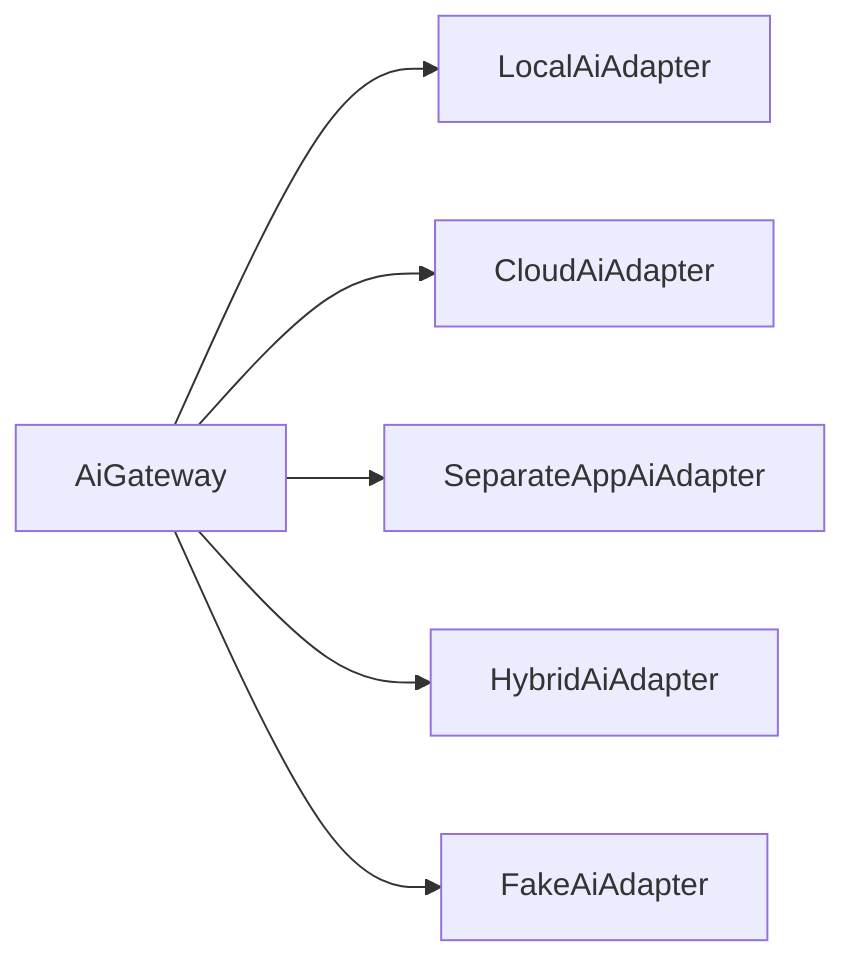

A arquitetura não assume que todas as capacidades de IA serão executadas no mesmo local.

Por exemplo:

```text
Speech        -> local
Medication    -> cloud
Face matching -> local
```

ou qualquer outra distribuição compatível com os contratos.

---

## 11. Limite de responsabilidade da IA

A IA pode produzir observações como:

```text
Paciente citado: João Silva
Medicamento citado: Losartana
Dosagem citada: 50 mg
Medicamento visual: Losartana 50 mg
Face compatível com: João Silva
```

Ela não deve ser responsável pela decisão final:

```text
"A administração está autorizada."
```

Essa decisão pertence ao domínio.

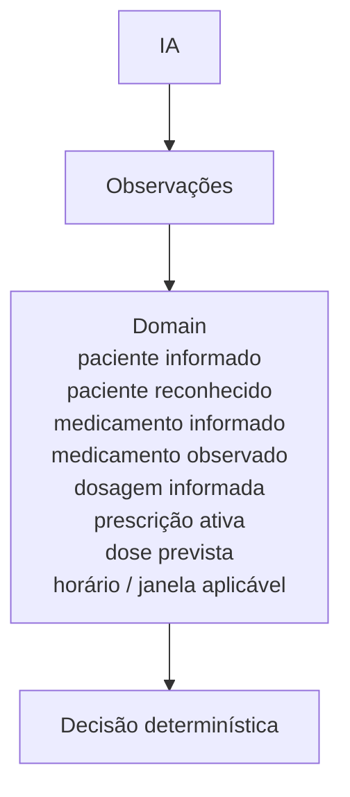

---

## 12. Evidências da sessão

O resultado intermediário da captura e da IA deve ser agregado como **evidência da sessão**, sem necessariamente ser persistido de forma permanente.

Exemplo conceitual:

```kotlin
data class AdministrationEvidence(
    val spokenPatient: PatientCandidate?,
    val spokenMedication: MedicationCandidate?,
    val spokenDosage: Dosage?,
    val visualMedication: MedicationCandidate?,
    val patientVerification: PatientVerification?,
    val medicationImage: MedicationImage?,
    val capturedAt: Instant
)
```

Esse objeto representa dados correlacionados daquela tentativa específica.

---

## 13. Consulta ao paciente e à prescrição

A aplicação deve obter dados do domínio por contratos, e não diretamente de banco ou API.

Exemplo:

```kotlin
interface PatientRepository {
    suspend fun findByCandidate(candidate: PatientCandidate): Patient?
}
```

```kotlin
interface PrescriptionRepository {
    suspend fun getActivePrescriptions(
        patientId: PatientId
    ): List<Prescription>
}
```

Os dados poderão vir de:

```text
cache local
Room
backend remoto
sincronização híbrida
```

sem alterar o uso desses contratos pelo domínio/aplicação.

---

## 14. AdministrationValidator

O `AdministrationValidator` representa uma das principais regras do domínio.

Ele recebe evidências e dados confiáveis da aplicação:

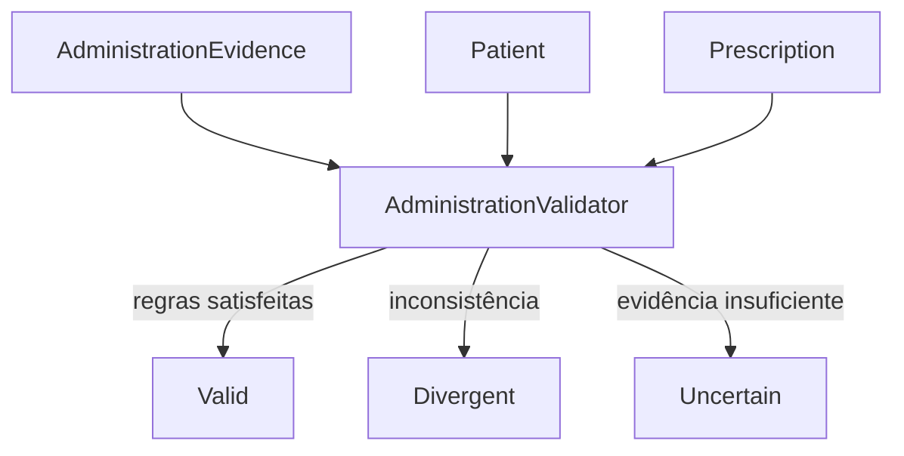

As validações podem incluir:

- paciente falado corresponde ao paciente localizado;
- reconhecimento facial corresponde ao paciente esperado;
- medicamento falado corresponde ao medicamento observado;
- medicamento faz parte da prescrição ativa;
- dosagem informada corresponde à prescrita;
- horário está dentro da regra aplicável;
- evidências possuem qualidade mínima suficiente.

Essas regras devem permanecer em Kotlin puro sempre que possível.

---

## 15. Divergências explícitas

O sistema não deve "resolver" divergências utilizando apenas a maior confiança da IA.

Exemplo de divergência de identidade:

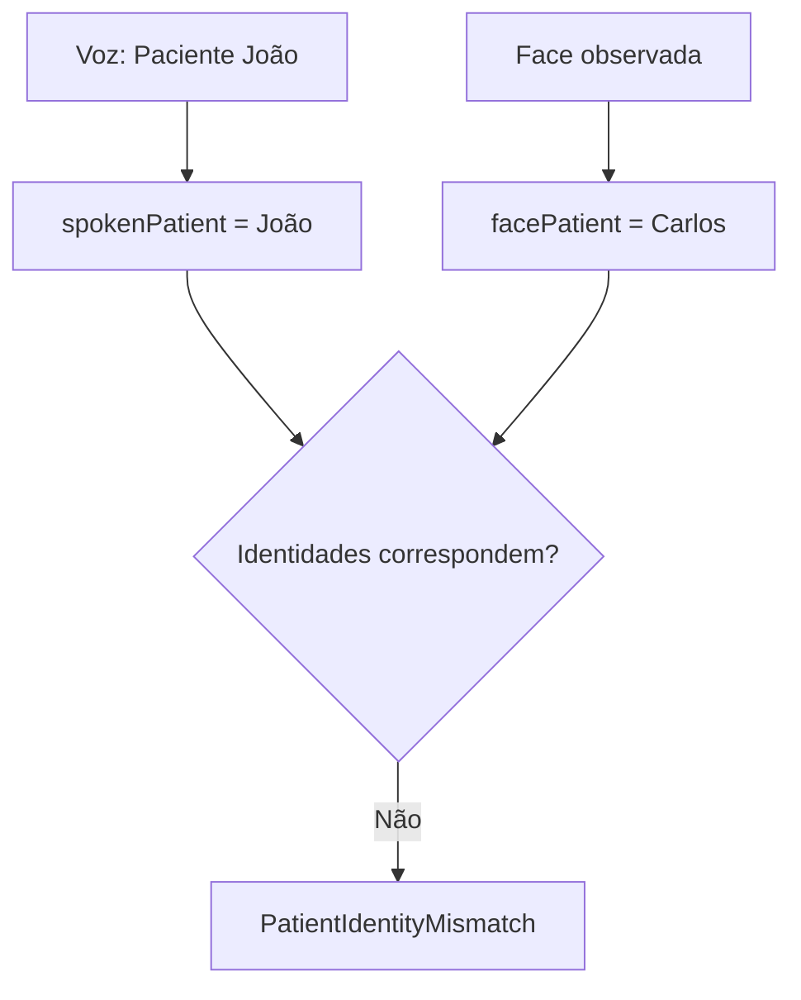

Exemplo de divergência de medicamento:

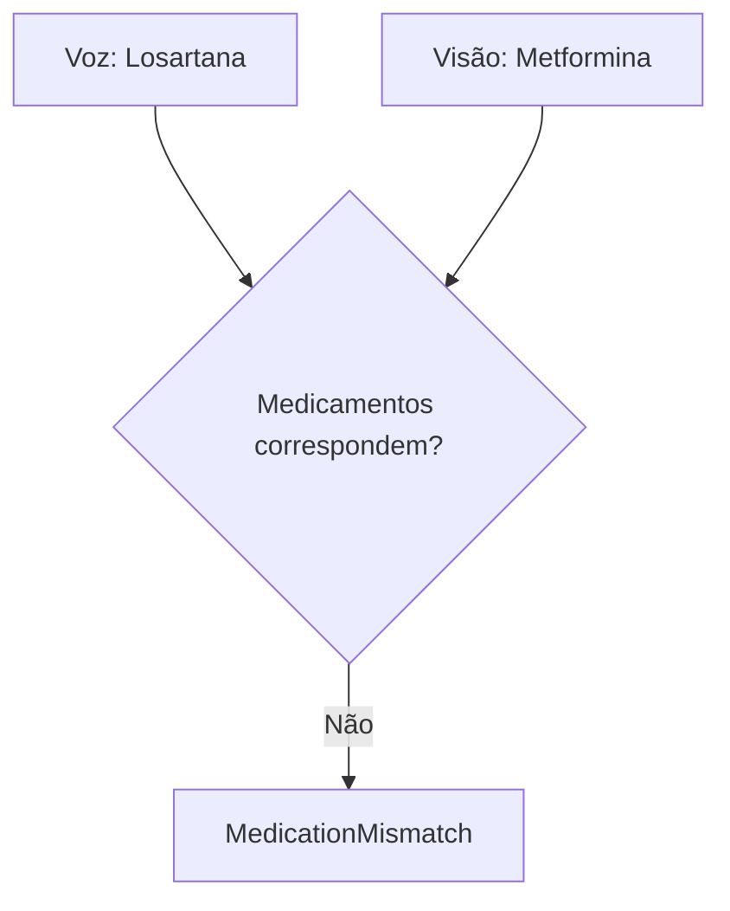

Divergências devem produzir estados e eventos determinísticos do domínio.

---

## 16. Máquina de estados da administração

A sessão deve possuir uma máquina de estados independente da UI.

Modelo inicial:

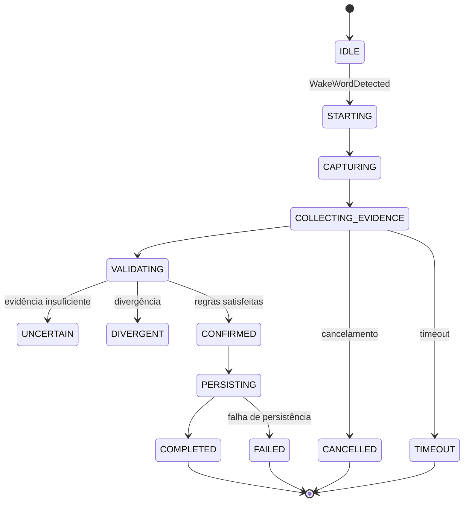

Também devem ser previstos estados/eventos para:

```text
CANCELLED
FAILED
TIMEOUT
```

O desenho definitivo da FSM será refinado durante a implementação.

---

## 17. Coordinator da sessão

O `AdministrationSessionCoordinator` evita que a ViewModel se transforme no cérebro da aplicação.

Responsabilidades previstas:

- iniciar e encerrar uma sessão;
- coordenar captura de áudio e vídeo;
- encaminhar entradas ao `AiGateway`;
- correlacionar as observações à sessão correta;
- consultar paciente e prescrição através de casos de uso/repositórios;
- chamar o validador;
- enviar eventos à máquina de estados;
- solicitar persistência quando apropriado;
- disponibilizar estado observável para a camada de apresentação.

Fluxo resumido:

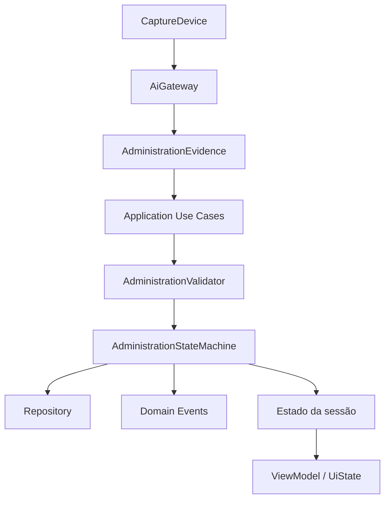

---

## 18. Domínio

O domínio é a parte mais estável da aplicação e deve possuir o mínimo possível de dependências externas.

Principais conceitos previstos:

```text
Patient
PatientId
PatientFaceReference
Medication
MedicationId
Dosage
Prescription
AdministrationSession
AdministrationEvidence
MedicationAdministration
AdministrationAttempt
AdministrationValidation
AdministrationState
DomainEvent
```

Não devem aparecer no domínio tipos como:

```text
Activity
Fragment
Context
Intent
Bitmap
Room
Retrofit
Meta SDK
classes específicas de provedores de IA
```

---

## 19. Administração confirmada x tentativa

É importante distinguir dois conceitos.

### AdministrationSession / AdministrationAttempt

Representa uma tentativa ou sessão em andamento, que pode resultar em:

```text
confirmada
divergente
incerta
cancelada
falha
timeout
```

### MedicationAdministration

Representa o fato confirmado e persistido de que determinada dose foi ministrada.

Exemplo conceitual:

```kotlin
data class MedicationAdministration(
    val id: AdministrationId,
    val patientId: PatientId,
    val medicationId: MedicationId,
    val dosage: Dosage,
    val administeredAt: Instant,
    val caregiverId: CaregiverId,
    val medicationImage: MedicationImage?,
    val verification: VerificationSummary
)
```

Essa separação permite registrar tentativas relevantes sem tratá-las como doses efetivamente administradas.

---

## 20. Persistência e histórico

Após confirmação, a aplicação deve persistir o registro de administração.

O histórico funcional deverá conter, no mínimo, conforme requisitos atuais:

```text
paciente
medicamento
dosagem
horário da administração
imagem do medicamento
resultado/resumo das verificações
```

Outros metadados podem ser adicionados posteriormente, por exemplo:

```text
cuidador responsável
identificador da sessão
origem da captura
versão das regras
status de sincronização
```

O acesso será feito através de contrato:

```kotlin
interface AdministrationRepository {
    suspend fun save(administration: MedicationAdministration)
    suspend fun saveAttempt(attempt: AdministrationAttempt)
    suspend fun getHistory(patientId: PatientId): List<MedicationAdministration>
}
```

A implementação pode utilizar persistência local, backend remoto ou ambas.

---

## 21. Dados efêmeros e dados persistentes

A arquitetura deve distinguir explicitamente dados usados apenas durante a sessão daqueles necessários posteriormente.

### Dados potencialmente efêmeros

```text
chunks de áudio
frames intermediários
imagem facial usada para comparação
resultados intermediários dos modelos
buffers de vídeo
```

### Dados persistentes previstos atualmente

```text
registro da administração
horário
paciente
medicamento
dosagem
imagem do medicamento
status/resumo da validação
```

A imagem facial utilizada para verificação **não precisa ser automaticamente persistida**. Uma estratégia preferível, sujeita à validação dos requisitos do projeto, é:

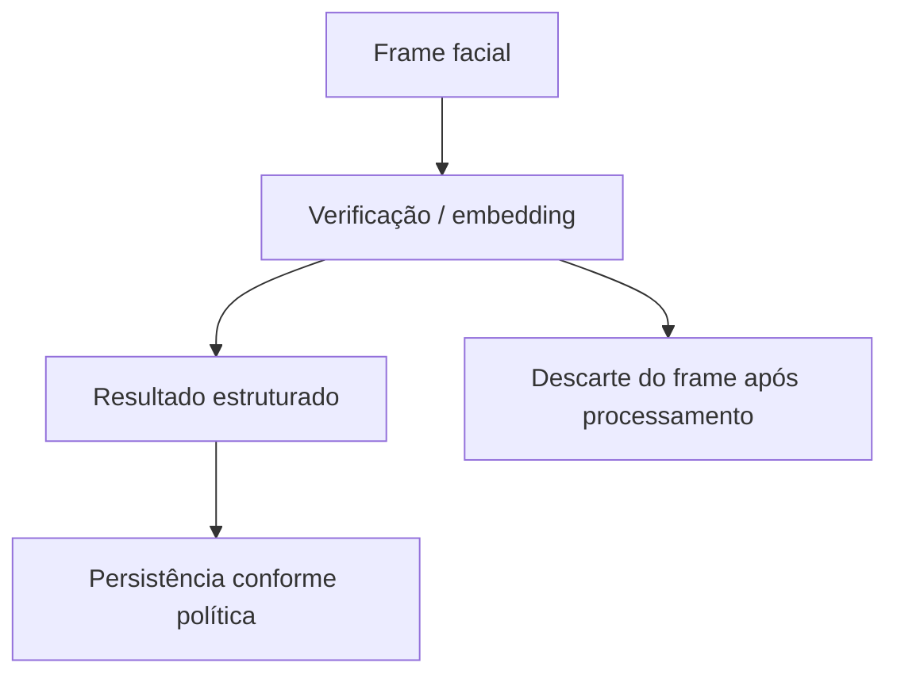

A retenção de embeddings de referência e outros dados biométricos deverá ser tratada como decisão específica de segurança, privacidade e armazenamento.

---

## 22. Eventos de domínio e auditoria

Eventos relevantes devem ser estruturados e rastreáveis.

Exemplos:

```text
AdministrationSessionStarted
SpeechEvidenceCaptured
MedicationObserved
PatientResolved
PatientVerified
PatientIdentityMismatch
MedicationMismatch
DosageMismatch
PrescriptionNotFound
AdministrationConfirmed
AdministrationUncertain
AdministrationCancelled
AdministrationFailed
AdministrationPersisted
```

Esses eventos podem alimentar diferentes consumidores:

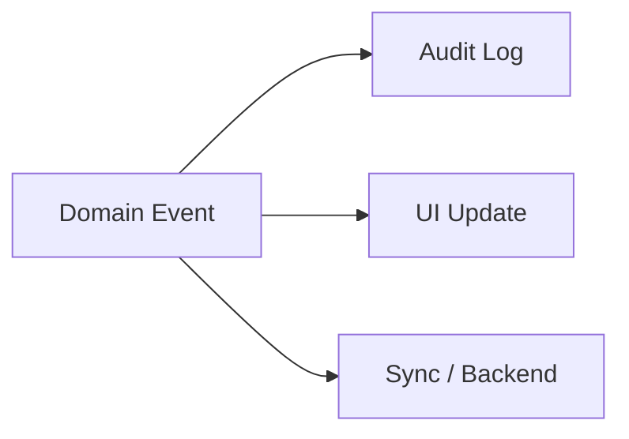

Nem todo evento precisa ser persistido de forma definitiva; isso dependerá da política de auditoria e retenção.

---

## 23. Presentation: MVVM + UDF

MVVM é aplicado somente à camada de apresentação.

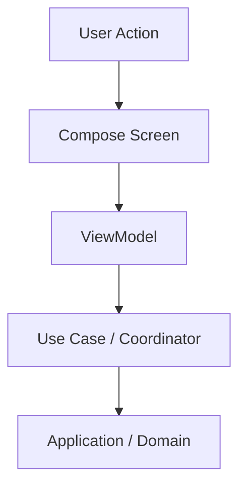

O estado retorna no sentido inverso:

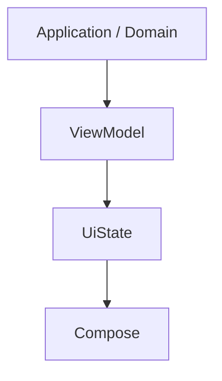

Princípio:

> **Estado desce; eventos sobem.**

O ViewModel deve:

- receber ações da UI;
- iniciar casos de uso ou ações do coordinator;
- observar estado da sessão;
- produzir `UiState`;
- lidar com lifecycle da apresentação.

O ViewModel não deve:

- implementar regras de validação;
- executar reconhecimento de IA diretamente;
- conversar diretamente com o SDK dos óculos;
- acessar banco de dados diretamente;
- implementar a FSM;
- coordenar a sessão completa.

---

## 24. Por que MVVM + UDF

A escolha é adequada ao Jetpack Compose e ao comportamento assíncrono esperado da aplicação.

Eventos como:

```text
wake word detectada
áudio recebido
frame recebido
IA respondeu
paciente localizado
face validada
prescrição consultada
persistência concluída
falha de conectividade
```

podem resultar em atualizações de estado observáveis pela UI.

MVVM + UDF permite manter a apresentação declarativa sem transformar a UI em responsável pela orquestração do domínio.

---

## 25. Por que não MVC, MVP, MVI puro ou estado global

### MVC

Não é a escolha inicial porque, em Android, pode favorecer concentração excessiva de responsabilidades em Activities, Fragments ou Controllers, especialmente em um fluxo com hardware, IA e processamento assíncrono.

### MVP

O Presenter tradicional é mais orientado a comandar uma View imperativamente. Essa característica agrega menos valor em uma UI declarativa baseada em Compose.

### MVI puro

MVI é tecnicamente viável, mas uma implementação rígida poderia introduzir uma segunda máquina de estados na UI (`Intent -> Reducer -> State -> Effect`) enquanto o domínio já possui uma FSM explícita.

A proposta absorve suas características úteis através de:

- `UiState` imutável;
- ações explícitas;
- fluxo unidirecional;
- `StateFlow` / `Flow`.

### Global Store / Redux

Não há justificativa atual para manter todo o estado da aplicação em um armazenamento global único. Isso poderá ser revisto se surgirem requisitos concretos de estado compartilhado entre múltiplas features.

---

## 26. Por que Clean Architecture e Ports & Adapters como referência

O projeto possui dependências externas com alta probabilidade de mudança:

```text
SDK dos óculos
modelos e provedores de IA
topologia local/cloud
backend
persistência
APIs Android
```

Ao mesmo tempo, existem conceitos e regras que devem permanecer mais estáveis:

```text
sessão de administração
paciente
prescrição
medicamento
dosagem
validação
FSM
eventos
```

A inversão de dependência permite que o domínio defina o que necessita e a infraestrutura implemente como fornecer.

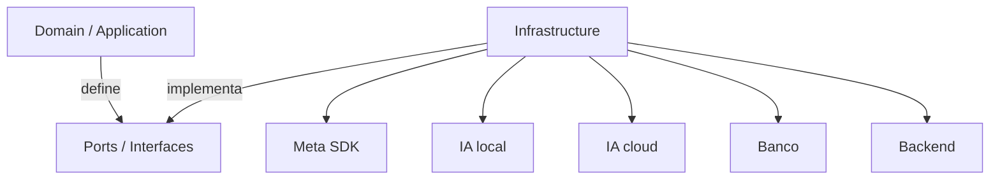

Não será utilizada uma versão dogmática de Clean Architecture. O objetivo é preservar fronteiras úteis, não multiplicar classes, DTOs e mappers sem necessidade.

---

## 27. Topologia de execução ainda em aberto

A arquitetura lógica não determina a topologia física final.

Uma possibilidade é:

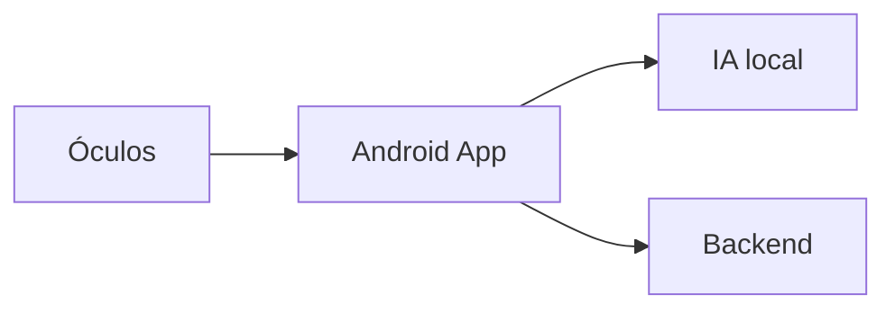

Outra:

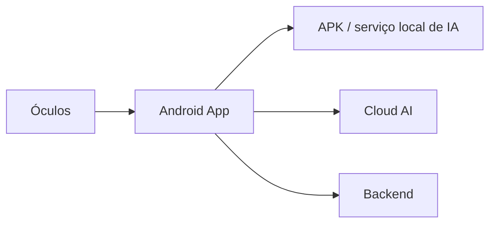

Outra configuração híbrida:

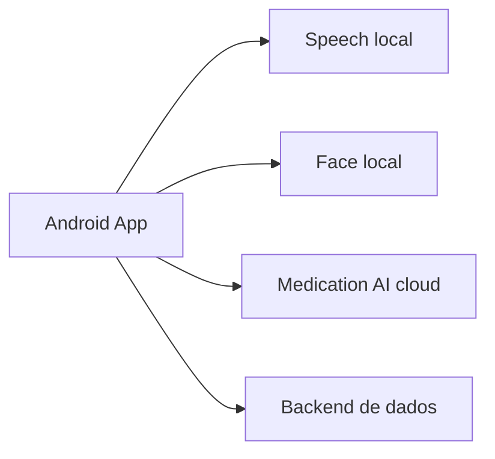

Todas permanecem compatíveis com a mesma arquitetura lógica desde que respeitem os contratos definidos.

Por esse motivo, termos associados à unidade de deployment, como **monólito**, **microsserviços** ou **aplicação distribuída**, não serão utilizados como definição principal nesta fase.

---

## 28. Organização inicial do código Android

Para o protótipo, pode-se iniciar com um módulo Android principal e preservar as fronteiras por pacotes, sem assumir que todos os componentes da solução final estarão no mesmo APK.

```text
com.cuidarai.app

├── presentation/
│   ├── administration/
│   ├── history/
│   ├── patient/
│   └── setup/
│
├── application/
│   ├── usecase/
│   └── coordinator/
│
├── domain/
│   ├── model/
│   ├── event/
│   ├── state/
│   ├── validation/
│   └── repository/
│
├── infrastructure/
│   ├── ai/
│   ├── glasses/
│   ├── wakeword/
│   ├── persistence/
│   ├── backend/
│   └── android/
│
└── di/
```

A modularização Gradle ou separação em outros APKs/processos poderá ser introduzida quando houver justificativa concreta de deployment, ownership, desempenho ou isolamento.

---

## 29. Componentes principais previstos

### Presentation

```text
AdministrationScreen
HistoryScreen
PatientScreen
SetupScreen
AdministrationViewModel
HistoryViewModel
```

### Application

```text
AdministrationSessionCoordinator
StartAdministrationSessionUseCase
ProcessSpeechEvidenceUseCase
ProcessMedicationEvidenceUseCase
ResolvePatientUseCase
ValidateAdministrationUseCase
CompleteAdministrationUseCase
RegisterAdministrationUseCase
```

### Domain

```text
Patient
Medication
Prescription
Dosage
AdministrationSession
AdministrationEvidence
AdministrationAttempt
MedicationAdministration
AdministrationValidator
AdministrationStateMachine
DomainEvent
```

### Infrastructure

```text
WakeWordDetector
CaptureDevice
MetaGlassesCaptureDevice
PhoneCaptureDevice
RecordedCaptureDevice
AiGateway
FakeAiAdapter
LocalAiAdapter
CloudAiAdapter
PatientRepositoryImpl
PrescriptionRepositoryImpl
AdministrationRepositoryImpl
BackendGateway
LocalDatabase
```

---

## 30. Estratégia inicial de prototipação

O primeiro protótipo deve validar a arquitetura antes da integração definitiva com IA ou óculos.

Pode utilizar:

```text
MockWakeWordDetector
RecordedCaptureDevice
FakeAiAdapter
InMemoryPatientRepository
InMemoryPrescriptionRepository
InMemoryAdministrationRepository
```

Fluxo inicial:

```mermaid
flowchart TD
    A[Simular "Hey CuidarAI"] --> B[Iniciar sessão]
    B --> C[Injetar áudio e frames gravados]
    C --> D[Fake AI produz observações]
    D --> E[Montar AdministrationEvidence]
    E --> F[Consultar paciente / prescrição fake]
    F --> G[AdministrationValidator]
    G --> H[AdministrationStateMachine]
    H --> I[Resultado]
    I --> J[Persistência em memória]
    J --> K[Histórico na UI]
```

Esse protótipo permite validar:

- contratos;
- correlação de uma sessão;
- estados;
- validação;
- divergências;
- navegação;
- histórico;
- testes unitários;
- substituição dos adapters.

---

## 31. Estratégia de testes

### Domínio

Executado sem Android.

Prioridades:

```text
transições da AdministrationStateMachine
medicamento correto/incorreto
dosagem correta/incorreta
paciente correto/incorreto
face divergente
prescrição inexistente
evidência insuficiente
timeouts e cancelamentos
```

### Application

Testes do coordinator e casos de uso com adapters fake.

### Infrastructure

Testes específicos de:

```text
SDK dos óculos
captura
wake word
IA local/remota
persistência
rede
backend
```

### UI

Testes de:

```text
renderização de UiState
navegação
sessão em andamento
confirmação
divergência
incerteza
histórico
falhas
```

---

## 32. Stack Android inicial

```text
Kotlin
Jetpack Compose
Android ViewModel
Kotlin Coroutines
StateFlow / Flow
Gradle Kotlin DSL
JUnit
```

Tecnologias ainda a definir:

```text
Dependency Injection
persistência local
cliente HTTP
serialização
SDK dos óculos
mecanismo de wake word
IA local/remota
backend
armazenamento de imagens
observabilidade
```

---

## 33. Decisões em aberto

1. Contratos definitivos de entrada e saída da IA.
2. Distribuição das funções de IA entre local, outro processo/APK e cloud.
3. Contrato definitivo dos óculos.
4. Mecanismo de wake word.
5. Estratégia de início e término da captura contínua.
6. Estrutura definitiva de `AdministrationEvidence`.
7. Estados e eventos finais da `AdministrationStateMachine`.
8. Critérios de confiança/inconclusividade aceitos como evidência.
9. Forma de resolução do paciente a partir da fala.
10. Modelo final de prescrição e janela de administração.
11. Estratégia de armazenamento e proteção dos embeddings faciais.
12. Política para descarte de frames faciais.
13. Retenção da imagem do medicamento.
14. Persistência local e sincronização com backend.
15. Autenticação do cuidador.
16. Funcionamento offline e comportamento em perda de conectividade.
17. Escolha de Dependency Injection.
18. Escolha do cliente HTTP.
19. Observabilidade e auditoria.
20. Modularização Gradle e eventual separação em outros APKs/processos.

---

## 34. Próximos passos de arquitetura

```mermaid
flowchart TD
    S1[1. Refinar AdministrationSession e AdministrationEvidence]
    S2[2. Definir contrato inicial do AiGateway]
    S3[3. Definir CaptureDevice e WakeWordDetector]
    S4[4. Modelar AdministrationValidator]
    S5[5. Modelar AdministrationStateMachine]
    S6[6. Definir Patient / Prescription / Medication / Dosage]
    S7[7. Definir eventos de domínio]
    S8[8. Criar adapters fake]
    S9[9. Implementar AdministrationSessionCoordinator]
    S10[10. Criar ViewModel + UiState]
    S11[11. Criar tela Compose do fluxo]
    S12[12. Criar histórico local fake]
    S13[13. Substituir adapters por implementações reais]

    S1 --> S2 --> S3 --> S4 --> S5 --> S6 --> S7 --> S8 --> S9 --> S10 --> S11 --> S12 --> S13
```

---

## 35. Resumo da decisão

A arquitetura não será definida pela localização da IA nem pela tecnologia dos óculos.

```mermaid
flowchart TD
    P[Presentation] --> A[Application]
    A --> D[Domain]
    DA[Device Adapter] --> C[Ports / Contracts]
    AI[AI Adapter] --> C
    DT[Data Adapter] --> C
    C --> D
```

A **sessão de administração de medicamento** é a unidade funcional central.

A IA produz observações. O domínio correlaciona essas observações com paciente e prescrição e aplica regras determinísticas. Somente após a validação é criado o registro de uma dose administrada.

A topologia de execução permanece deliberadamente aberta: componentes podem futuramente ser executados no mesmo APK, em outro APK/processo, nos óculos, em backend próprio ou na cloud sem alterar o núcleo lógico da solução.
