# Compilado de diagramas — CuidarAI

Este documento reúne os diagramas Mermaid encontrados em [`arquitetura-app-ia.md`](./arquitetura-app-ia.md). Cada diagrama permanece em um bloco independente para facilitar sua revisão e futura exportação para SVG.

## Índice

1. Fluxo principal de uso
2. Camadas da aplicação
3. Arquitetura funcional da sessão
4. Detecção da wake word
5. Implementações do `AiGateway`
6. Limite de responsabilidade da IA
7. Validação da administração
8. Divergência de identidade do paciente
9. Divergência de medicamento
10. Máquina de estados da administração
11. Coordenação da sessão
12. Tratamento de dados faciais
13. Destinos dos eventos de domínio
14. Fluxo de ações da apresentação
15. Fluxo de estado da apresentação
16. Ports & Adapters
17. Topologia de execução — alternativa A
18. Topologia de execução — alternativa B
19. Topologia de execução — alternativa C
20. Estratégia inicial de prototipação
21. Sequência dos próximos passos
22. Resumo da arquitetura
23. Casos de uso do sistema

---

## 1. Fluxo principal de uso

Origem: seção 2, linha 27.


## 2. Camadas da aplicação

Origem: seção 5, linha 109.


## 3. Arquitetura funcional da sessão

Origem: seção 6, linha 129.


## 4. Detecção da wake word

Origem: seção 8, linha 205.


## 5. Implementações do `AiGateway`

Origem: seção 10, linha 273.


## 6. Limite de responsabilidade da IA

Origem: seção 11, linha 316.


## 7. Validação da administração

Origem: seção 14, linha 386.


## 8. Divergência de identidade do paciente

Origem: seção 15, linha 416.


## 9. Divergência de medicamento

Origem: seção 15, linha 427.


## 10. Máquina de estados da administração

Origem: seção 16, linha 444.


## 11. Coordenação da sessão

Origem: seção 17, linha 499.


## 12. Tratamento de dados faciais

Origem: seção 21, linha 660.


## 13. Destinos dos eventos de domínio

Origem: seção 22, linha 697.


## 14. Fluxo de ações da apresentação

Origem: seção 23, linha 712.


## 15. Fluxo de estado da apresentação

Origem: seção 23, linha 722.

## 16. Ports & Adapters

Origem: seção 26, linha 831.


## 17. Topologia de execução — alternativa A

Origem: seção 27, linha 852.


## 18. Topologia de execução — alternativa B

Origem: seção 27, linha 861.


## 19. Topologia de execução — alternativa C

Origem: seção 27, linha 871.


## 20. Estratégia inicial de prototipação

Origem: seção 30, linha 1004.


## 21. Sequência dos próximos passos

Origem: seção 34, linha 1142.


## 22. Resumo da arquitetura

Origem: seção 35, linha 1167.


## 23. Casos de uso do sistema

Origem: rascunho de caso de uso fornecido em 22/08/2026.

### 23.1 Visão do responsável


### 23.2 Visão do cuidador


### Justificativa das relações

| Origem | Relação | Destino | Motivo |
|---|---|---|---|
| Cadastrar prescrição | `«include»` | Consultar prescrição ativa | O sistema precisa consultar o estado atual para criar ou alterar uma prescrição sem gerar sobreposição indevida. O residente já cadastrado é tratado como pré-condição, não como `include`, pois não é recadastrado em toda operação. |
| Receber lembrete de horário | `«include»` | Consultar prescrição ativa | O horário e a dose do lembrete vêm necessariamente de uma prescrição vigente. |
| Administrar medicamento | `«include»` | Identificar residente | A identificação é obrigatória para vincular a dose à pessoa correta. |
| Administrar medicamento | `«include»` | Verificar medicamento e dose | A conferência é obrigatória antes da confirmação da administração. |
| Administrar medicamento | `«include»` | Consultar prescrição ativa | Medicamento, dose e janela de horário precisam ser comparados com a prescrição vigente. |
| Administrar medicamento | `«include»` | Confirmar administração por voz | No fluxo desenhado, a confirmação falada é uma etapa obrigatória da administração. |
| Administrar medicamento | `«include»` | Registrar administração | Uma administração concluída precisa gerar histórico e evidência de auditoria. |
| Administrar medicamento | `«include»` | Iniciar sessão por wake word | Toda administração começa obrigatoriamente nos óculos por meio da wake word. Não existe um fluxo equivalente iniciado pela interface do aplicativo. |
| Monitorar janela de administração | `«include»` | Consultar prescrição ativa | O monitoramento depende dos horários definidos na prescrição. |
| Receber alerta de dose omitida | `«extend»` | Monitorar janela de administração | O alerta só acontece sob a condição de a janela terminar sem uma administração confirmada. |
| Reportar urgência | `«include»` | Receber alerta de urgência | Todo reporte aceito deve notificar o responsável; por isso, o envio/recebimento do alerta faz parte obrigatória do fluxo. |

### Observações de modelagem

- As linhas contínuas representam associações entre atores e casos de uso; não indicam ordem de execução.
- `«include»` representa comportamento obrigatório e reutilizado pelo caso de uso de origem.
- `«extend»` representa comportamento condicional ou opcional apontando para o caso de uso base.
- Os casos “Administrar medicamento”, “Consultar prescrição ativa”, “Monitorar janela de administração” e “Registrar administração” foram acrescentados para explicitar o objetivo principal e evitar dependências ambíguas entre etapas isoladas.
- A interação de administração é orientada pelos óculos. A aplicação oferece apoio e acompanhamento, mas não inicia pela interface o fluxo de administração de medicamento.
- “Alerta: dose omissa” e “Alerta de urgência” foram renomeados como ações observáveis pelo ator: “Receber alerta de dose omitida” e “Receber alerta de urgência”.
- “Cadastrar residente” é pré-condição de “Cadastrar prescrição”. Não foi usado `«include»`, pois `include` significaria executar o cadastro do residente sempre que uma prescrição fosse cadastrada.
