# Compilado de diagramas — CuidarIA

Este documento reúne os diagramas Mermaid encontrados em [`arquitetura-app-ia.md`](./arquitetura-app-ia.md) e os fluxos visuais de [`CuidarIA-secao-A-final.md`](./CuidarIA-secao-A-final.md). Cada diagrama permanece em um bloco independente para facilitar sua revisão e futura exportação para SVG.

## Índice

1. Fluxo principal de uso
2. Camadas da aplicação
3. Arquitetura funcional da sessão
4. Detecção da wake word
5. Implementações do `AiGateway`
6. Limite de responsabilidade da IA
7. Validação da administração
8. Divergência de identidade do paciente
9. Divergência de medicamento
10. Máquina de estados da administração
11. Coordenação da sessão
12. Fluxo local-first e sincronização
13. Entrega de notificações
14. Modelo lógico relacional
15. Modelo lógico de notificações
16. Tratamento de dados faciais
17. Destinos dos eventos de domínio
18. Fluxo de ações da apresentação
19. Fluxo de estado da apresentação
20. Ports & Adapters
21. Topologia de execução definida
22. Estratégia inicial de prototipação
23. Sequência dos próximos passos
24. Resumo da arquitetura
25. Casos de uso do sistema
26. Fluxo end-to-end
27. Pipeline de áudio
28. Pipeline de visão
29. Veredictos e política de override
30. Reconciliador: uma porta, quatro camadas
31. Ciclo de vida do dado
32. Cascata de custo crescente

---

## 1. Fluxo principal de uso

Origem: seção 2, linha 31.

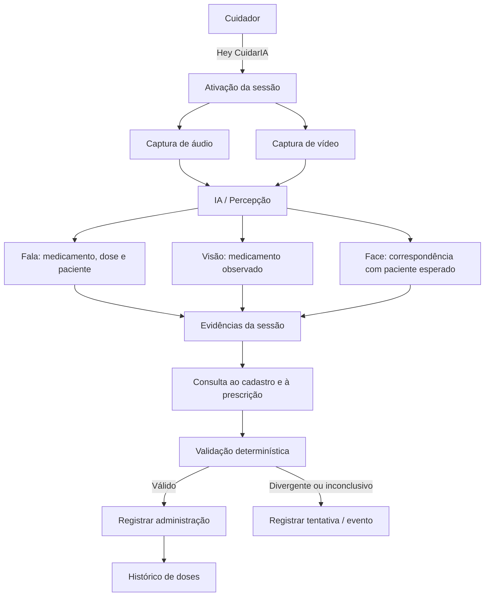
```mermaid
flowchart TD
    A[Cuidador] -->|"Hey CuidarIA"| B[Ativação da sessão]
    B --> C[Captura de áudio]
    B --> D[Captura de vídeo]
    C --> E[IA / Percepção]
    D --> E
    E --> F[Fala: medicamento, dose e paciente]
    E --> G[Visão: medicamento observado]
    E --> H[Face: correspondência com paciente esperado]
    F --> I[Evidências da sessão]
    G --> I
    H --> I
    I --> J[Consulta ao cadastro e à prescrição]
    J --> K[Validação determinística]
    K -->|Válido| L[Registrar administração]
    K -->|Divergente ou inconclusivo| M[Registrar tentativa / evento]
    L --> N[Histórico de doses]
```

## 2. Camadas da aplicação

Origem: seção 5, linha 102.

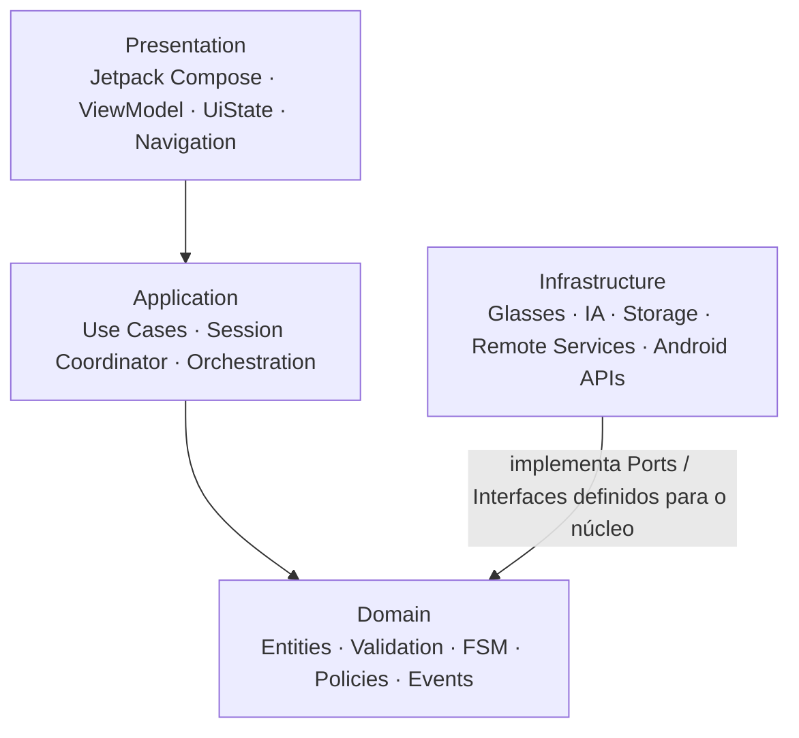
```mermaid
flowchart TD
    P["Presentation<br/>Jetpack Compose · ViewModel · UiState · Navigation"]
    A["Application<br/>Use Cases · Session Coordinator · Orchestration"]
    D["Domain<br/>Entities · Validation · FSM · Policies · Events"]
    I["Infrastructure<br/>Glasses · IA · Storage · Remote Services · Android APIs"]

    P --> A
    A --> D
    I -->|implementa Ports / Interfaces definidos para o núcleo| D
```

## 3. Arquitetura funcional da sessão

Origem: seção 6, linha 122.

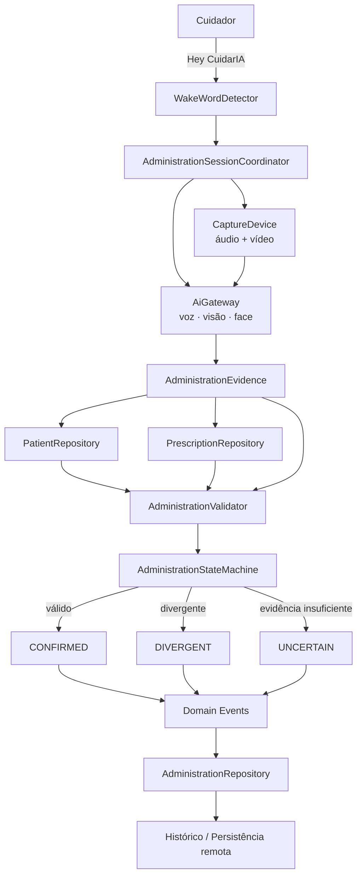
```mermaid
flowchart TD
    C[Cuidador] -->|"Hey CuidarIA"| W[WakeWordDetector]
    W --> S[AdministrationSessionCoordinator]

    S --> CD[CaptureDevice<br/>áudio + vídeo]
    S --> AI[AiGateway<br/>voz · visão · face]
    CD --> AI
    AI --> E[AdministrationEvidence]

    E --> PR[PatientRepository]
    E --> RX[PrescriptionRepository]
    PR --> V[AdministrationValidator]
    RX --> V
    E --> V

    V --> FSM[AdministrationStateMachine]
    FSM -->|válido| OK[CONFIRMED]
    FSM -->|divergente| DG[DIVERGENT]
    FSM -->|evidência insuficiente| UN[UNCERTAIN]

    OK --> EV[Domain Events]
    DG --> EV
    UN --> EV
    EV --> AR[AdministrationRepository]
    AR --> HB[Histórico / Persistência remota]
```

## 4. Detecção da wake word

Origem: seção 8, linha 200.

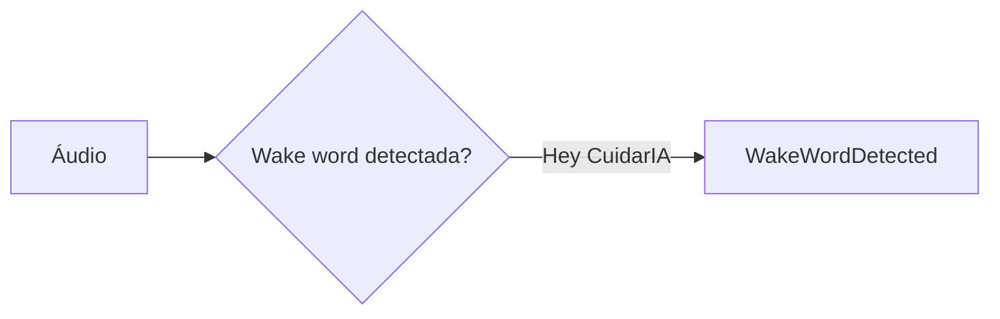
```mermaid
flowchart LR
    A[Áudio] --> B{Wake word detectada?}
    B -->|"Hey CuidarIA"| C[WakeWordDetected]
```

## 5. Implementações do `AiGateway`

Origem: seção 10, linha 266.

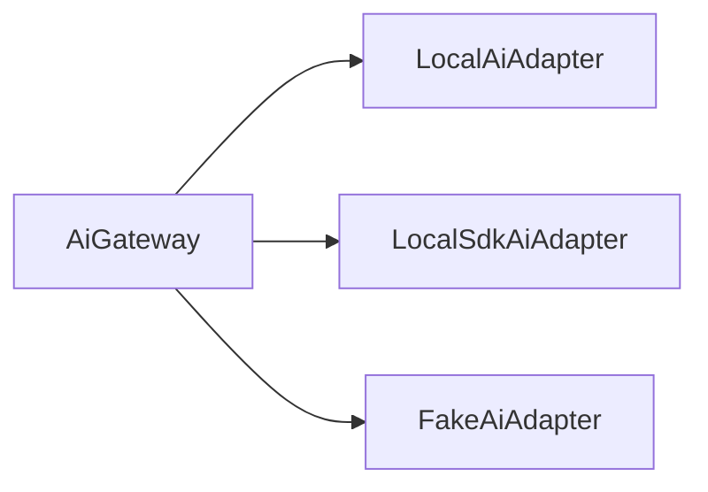
```mermaid
flowchart LR
    G[AiGateway] --> L[LocalAiAdapter]
    G --> S[LocalSdkAiAdapter]
    G --> F[FakeAiAdapter]
```

## 6. Limite de responsabilidade da IA

Origem: seção 11, linha 305.

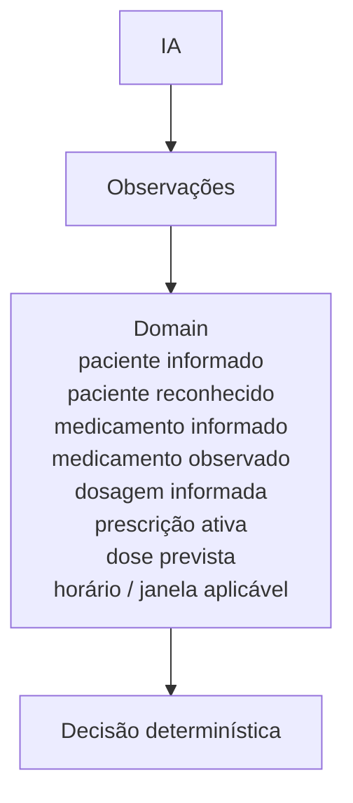
```mermaid
flowchart TD
    AI[IA] --> O[Observações]
    O --> D["Domain<br/>paciente informado<br/>paciente reconhecido<br/>medicamento informado<br/>medicamento observado<br/>dosagem informada<br/>prescrição ativa<br/>dose prevista<br/>horário / janela aplicável"]
    D --> R[Decisão determinística]
```

## 7. Validação da administração

Origem: seção 14, linha 373.

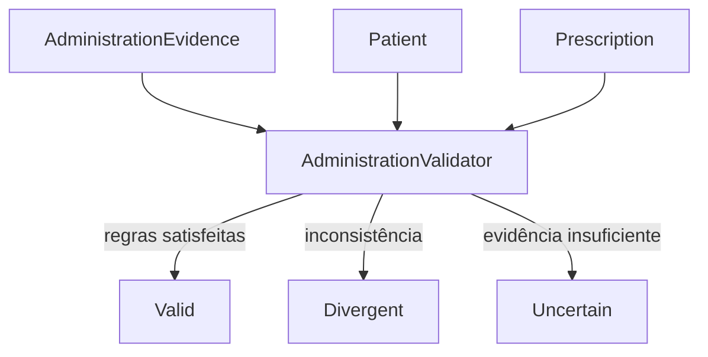
```mermaid
flowchart TD
    E[AdministrationEvidence] --> V[AdministrationValidator]
    P[Patient] --> V
    R[Prescription] --> V
    V -->|regras satisfeitas| OK[Valid]
    V -->|inconsistência| DG[Divergent]
    V -->|evidência insuficiente| UN[Uncertain]
```

## 8. Divergência de identidade do paciente

Origem: seção 15, linha 403.

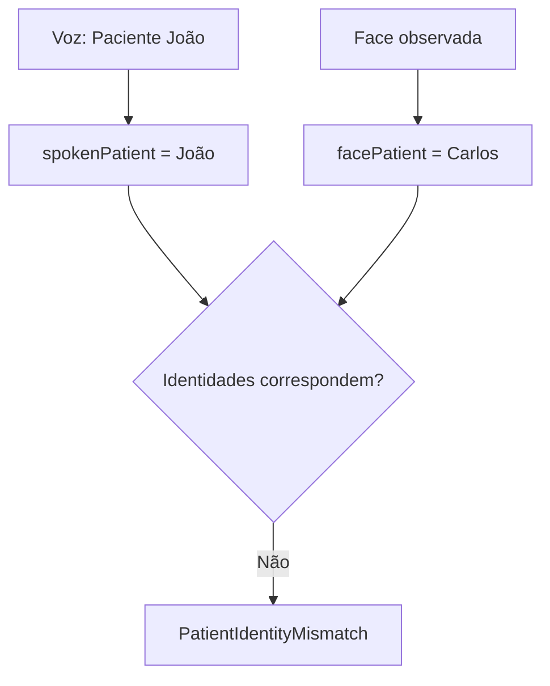
```mermaid
flowchart TD
    V["Voz: Paciente João"] --> S[spokenPatient = João]
    F[Face observada] --> R[facePatient = Carlos]
    S --> M{Identidades correspondem?}
    R --> M
    M -->|Não| E[PatientIdentityMismatch]
```

## 9. Divergência de medicamento

Origem: seção 15, linha 414.

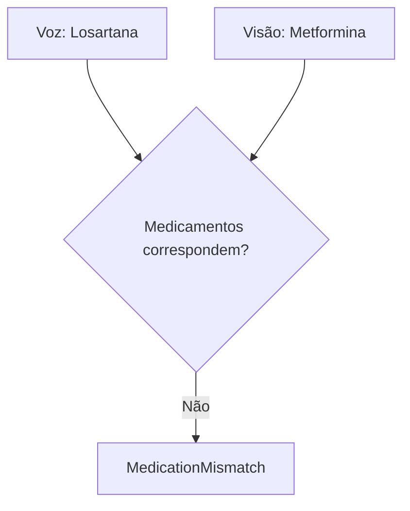
```mermaid
flowchart TD
    V["Voz: Losartana"] --> M{Medicamentos correspondem?}
    I["Visão: Metformina"] --> M
    M -->|Não| E[MedicationMismatch]
```

## 10. Máquina de estados da administração

Origem: seção 16, linha 431.

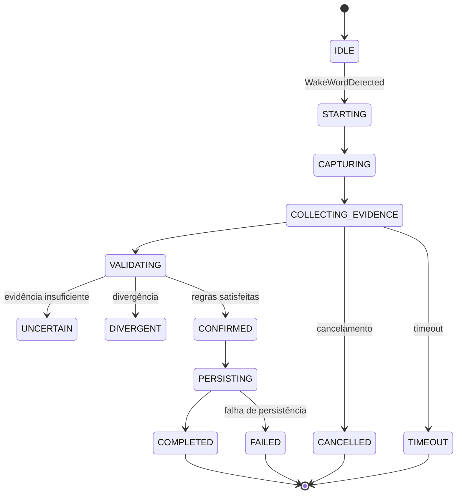
```mermaid
stateDiagram-v2
    [*] --> IDLE
    IDLE --> STARTING: WakeWordDetected
    STARTING --> CAPTURING
    CAPTURING --> COLLECTING_EVIDENCE
    COLLECTING_EVIDENCE --> VALIDATING

    VALIDATING --> UNCERTAIN: evidência insuficiente
    VALIDATING --> DIVERGENT: divergência
    VALIDATING --> CONFIRMED: regras satisfeitas

    CONFIRMED --> PERSISTING
    PERSISTING --> COMPLETED

    COLLECTING_EVIDENCE --> CANCELLED: cancelamento
    COLLECTING_EVIDENCE --> TIMEOUT: timeout
    PERSISTING --> FAILED: falha de persistência

    COMPLETED --> [*]
    CANCELLED --> [*]
    TIMEOUT --> [*]
    FAILED --> [*]
```

## 11. Coordenação da sessão

Origem: seção 17, linha 486.

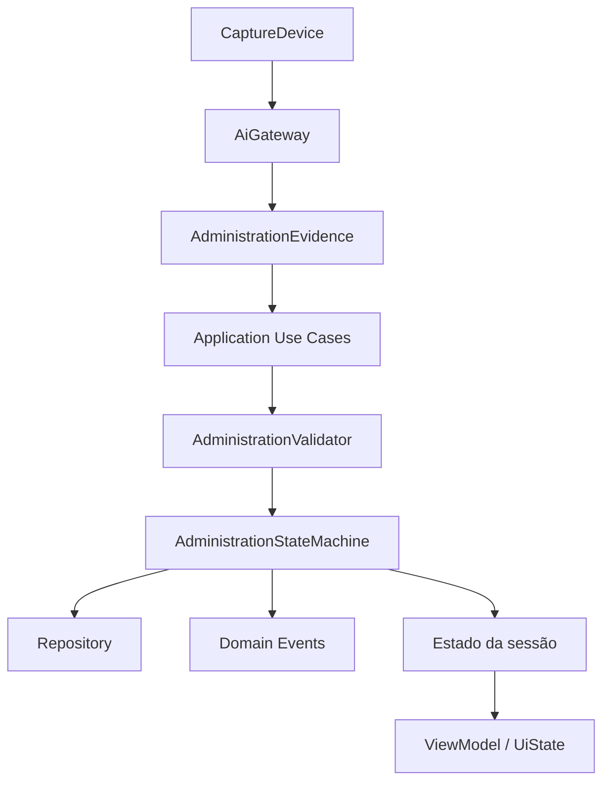
```mermaid
flowchart TD
    C[CaptureDevice] --> AI[AiGateway]
    AI --> E[AdministrationEvidence]
    E --> U[Application Use Cases]
    U --> V[AdministrationValidator]
    V --> F[AdministrationStateMachine]
    F --> R[Repository]
    F --> D[Domain Events]
    F --> S[Estado da sessão]
    S --> VM[ViewModel / UiState]
```

## 12. Fluxo local-first e sincronização

Origem: seção 20.1, linha 638.

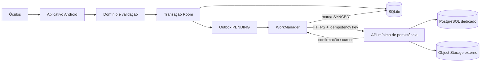
```mermaid
flowchart LR
    G[Óculos] --> APP[Aplicativo Android]
    APP --> DOM[Domínio e validação]
    DOM --> TX[Transação Room]
    TX --> SQL[(SQLite)]
    TX --> OUT[Outbox PENDING]
    OUT --> WM[WorkManager]
    WM -->|HTTPS + idempotency key| API[API mínima de persistência]
    API --> PG[(PostgreSQL dedicado)]
    API --> OBJ[(Object Storage externo)]
    API -->|confirmação / cursor| WM
    WM -->|marca SYNCED| SQL
```

## 13. Entrega de notificações

Origem: seção 20.3, linha 737.

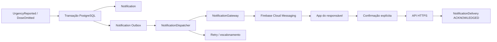
```mermaid
flowchart LR
    EV[UrgencyReported / DoseOmitted] --> NTX[Transação PostgreSQL]
    NTX --> N[Notification]
    NTX --> NO[Notification Outbox]
    NO --> DISP[NotificationDispatcher]
    DISP --> GW[NotificationGateway]
    GW --> FCM[Firebase Cloud Messaging]
    FCM --> APP[App do responsável]
    APP --> ACK[Confirmação explícita]
    ACK --> API[API HTTPS]
    API --> DEL[NotificationDelivery ACKNOWLEDGED]
    DISP --> RETRY[Retry / escalonamento]
```

## 14. Modelo lógico relacional

Origem: seção 20.4, linha 782.

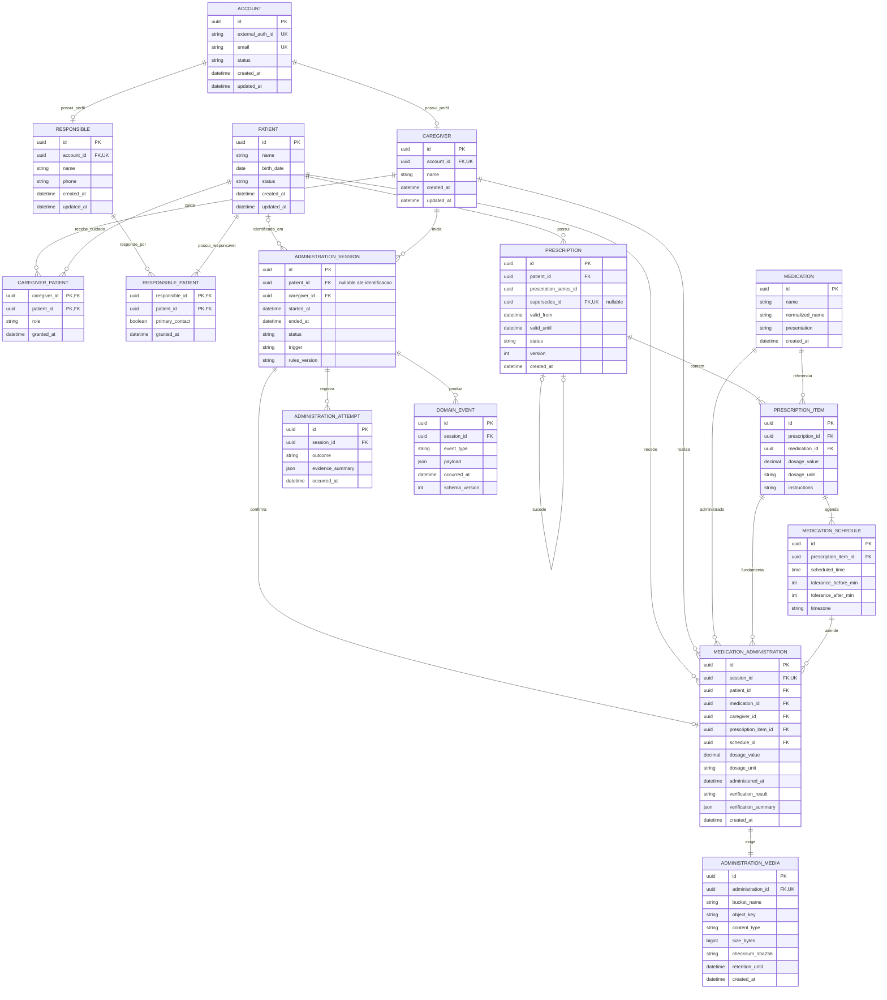
```mermaid
erDiagram
    ACCOUNT ||--o| CAREGIVER : possui_perfil
    ACCOUNT ||--o| RESPONSIBLE : possui_perfil
    CAREGIVER ||--o{ CAREGIVER_PATIENT : cuida
    PATIENT ||--o{ CAREGIVER_PATIENT : recebe_cuidado
    RESPONSIBLE ||--o{ RESPONSIBLE_PATIENT : responde_por
    PATIENT ||--|{ RESPONSIBLE_PATIENT : possui_responsavel
    PATIENT ||--o{ PRESCRIPTION : possui
    PRESCRIPTION o|--o| PRESCRIPTION : sucede
    PRESCRIPTION ||--|{ PRESCRIPTION_ITEM : contem
    MEDICATION ||--o{ PRESCRIPTION_ITEM : referencia
    PRESCRIPTION_ITEM ||--|{ MEDICATION_SCHEDULE : agenda
    PATIENT o|--o{ ADMINISTRATION_SESSION : identificado_em
    CAREGIVER ||--o{ ADMINISTRATION_SESSION : inicia
    ADMINISTRATION_SESSION ||--o{ ADMINISTRATION_ATTEMPT : registra
    ADMINISTRATION_SESSION ||--o| MEDICATION_ADMINISTRATION : confirma
    PATIENT ||--o{ MEDICATION_ADMINISTRATION : recebe
    CAREGIVER ||--o{ MEDICATION_ADMINISTRATION : realiza
    MEDICATION ||--o{ MEDICATION_ADMINISTRATION : administrado
    PRESCRIPTION_ITEM ||--o{ MEDICATION_ADMINISTRATION : fundamenta
    MEDICATION_SCHEDULE ||--o{ MEDICATION_ADMINISTRATION : atende
    ADMINISTRATION_SESSION ||--o{ DOMAIN_EVENT : produz
    MEDICATION_ADMINISTRATION ||--|| ADMINISTRATION_MEDIA : exige

    ACCOUNT {
        uuid id PK
        string external_auth_id UK
        string email UK
        string status
        datetime created_at
        datetime updated_at
    }
    CAREGIVER {
        uuid id PK
        uuid account_id FK,UK
        string name
        datetime created_at
        datetime updated_at
    }
    RESPONSIBLE {
        uuid id PK
        uuid account_id FK,UK
        string name
        string phone
        datetime created_at
        datetime updated_at
    }
    PATIENT {
        uuid id PK
        string name
        date birth_date
        string status
        datetime created_at
        datetime updated_at
    }
    CAREGIVER_PATIENT {
        uuid caregiver_id PK,FK
        uuid patient_id PK,FK
        string role
        datetime granted_at
    }
    RESPONSIBLE_PATIENT {
        uuid responsible_id PK,FK
        uuid patient_id PK,FK
        boolean primary_contact
        datetime granted_at
    }
    MEDICATION {
        uuid id PK
        string name
        string normalized_name
        string presentation
        datetime created_at
    }
    PRESCRIPTION {
        uuid id PK
        uuid patient_id FK
        uuid prescription_series_id
        uuid supersedes_id FK,UK "nullable"
        datetime valid_from
        datetime valid_until
        string status
        int version
        datetime created_at
    }
    PRESCRIPTION_ITEM {
        uuid id PK
        uuid prescription_id FK
        uuid medication_id FK
        decimal dosage_value
        string dosage_unit
        string instructions
    }
    MEDICATION_SCHEDULE {
        uuid id PK
        uuid prescription_item_id FK
        time scheduled_time
        int tolerance_before_min
        int tolerance_after_min
        string timezone
    }
    ADMINISTRATION_SESSION {
        uuid id PK
        uuid patient_id FK "nullable ate identificacao"
        uuid caregiver_id FK
        datetime started_at
        datetime ended_at
        string status
        string trigger
        string rules_version
    }
    ADMINISTRATION_ATTEMPT {
        uuid id PK
        uuid session_id FK
        string outcome
        json evidence_summary
        datetime occurred_at
    }
    MEDICATION_ADMINISTRATION {
        uuid id PK
        uuid session_id FK,UK
        uuid patient_id FK
        uuid medication_id FK
        uuid caregiver_id FK
        uuid prescription_item_id FK
        uuid schedule_id FK
        decimal dosage_value
        string dosage_unit
        datetime administered_at
        string verification_result
        json verification_summary
        datetime created_at
    }
    DOMAIN_EVENT {
        uuid id PK
        uuid session_id FK
        string event_type
        json payload
        datetime occurred_at
        int schema_version
    }
    ADMINISTRATION_MEDIA {
        uuid id PK
        uuid administration_id FK,UK
        string bucket_name
        string object_key
        string content_type
        bigint size_bytes
        string checksum_sha256
        datetime retention_until
        datetime created_at
    }
```

## 15. Modelo lógico de notificações

Origem: seção 20.4, linha 937.

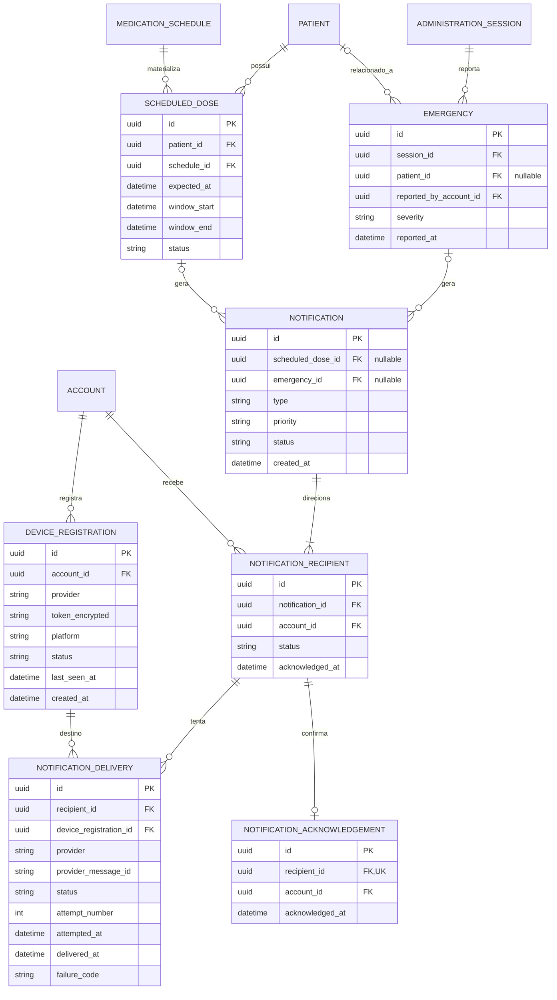
```mermaid
erDiagram
    ACCOUNT ||--o{ DEVICE_REGISTRATION : registra
    PATIENT ||--o{ SCHEDULED_DOSE : possui
    MEDICATION_SCHEDULE ||--o{ SCHEDULED_DOSE : materializa
    ADMINISTRATION_SESSION ||--o{ EMERGENCY : reporta
    PATIENT o|--o{ EMERGENCY : relacionado_a
    SCHEDULED_DOSE o|--o{ NOTIFICATION : gera
    EMERGENCY o|--o{ NOTIFICATION : gera
    NOTIFICATION ||--|{ NOTIFICATION_RECIPIENT : direciona
    ACCOUNT ||--o{ NOTIFICATION_RECIPIENT : recebe
    NOTIFICATION_RECIPIENT ||--o{ NOTIFICATION_DELIVERY : tenta
    DEVICE_REGISTRATION ||--o{ NOTIFICATION_DELIVERY : destino
    NOTIFICATION_RECIPIENT ||--o| NOTIFICATION_ACKNOWLEDGEMENT : confirma

    DEVICE_REGISTRATION {
        uuid id PK
        uuid account_id FK
        string provider
        string token_encrypted
        string platform
        string status
        datetime last_seen_at
        datetime created_at
    }
    SCHEDULED_DOSE {
        uuid id PK
        uuid patient_id FK
        uuid schedule_id FK
        datetime expected_at
        datetime window_start
        datetime window_end
        string status
    }
    EMERGENCY {
        uuid id PK
        uuid session_id FK
        uuid patient_id FK "nullable"
        uuid reported_by_account_id FK
        string severity
        datetime reported_at
    }
    NOTIFICATION {
        uuid id PK
        uuid scheduled_dose_id FK "nullable"
        uuid emergency_id FK "nullable"
        string type
        string priority
        string status
        datetime created_at
    }
    NOTIFICATION_RECIPIENT {
        uuid id PK
        uuid notification_id FK
        uuid account_id FK
        string status
        datetime acknowledged_at
    }
    NOTIFICATION_DELIVERY {
        uuid id PK
        uuid recipient_id FK
        uuid device_registration_id FK
        string provider
        string provider_message_id
        string status
        int attempt_number
        datetime attempted_at
        datetime delivered_at
        string failure_code
    }
    NOTIFICATION_ACKNOWLEDGEMENT {
        uuid id PK
        uuid recipient_id FK,UK
        uuid account_id FK
        datetime acknowledged_at
    }
```

## 16. Tratamento de dados faciais

Origem: seção 21, linha 1087.

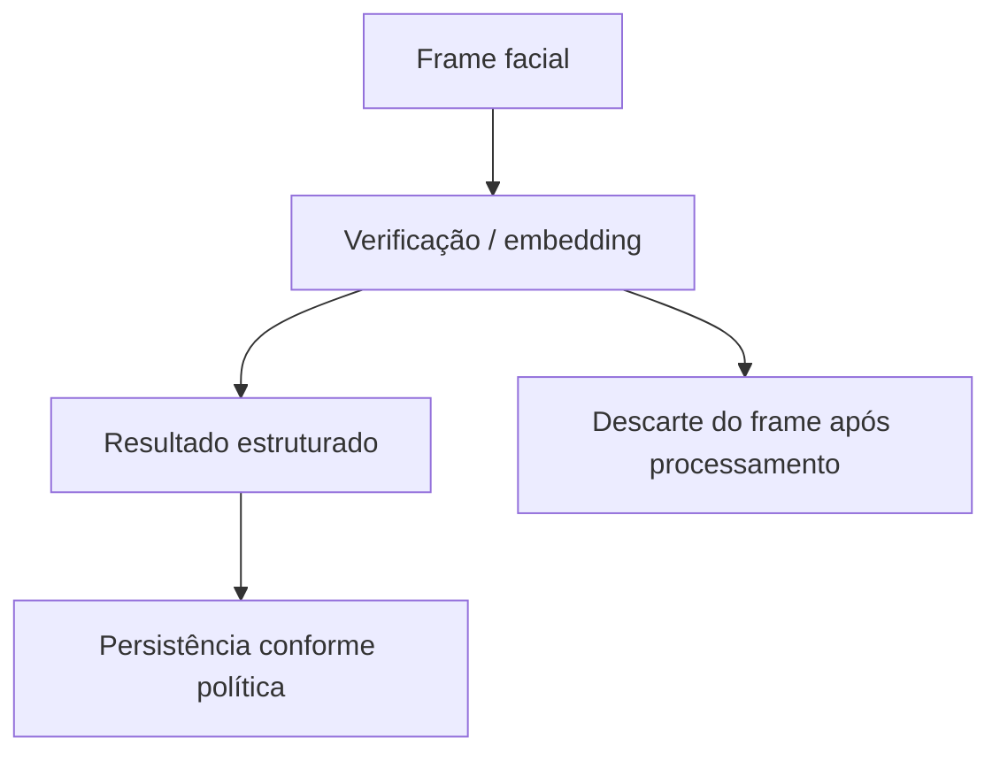
```mermaid
flowchart TD
    F[Frame facial] --> V[Verificação / embedding]
    V --> R[Resultado estruturado]
    R --> P[Persistência conforme política]
    V --> D[Descarte do frame após processamento]
```

## 17. Destinos dos eventos de domínio

Origem: seção 22, linha 1124.

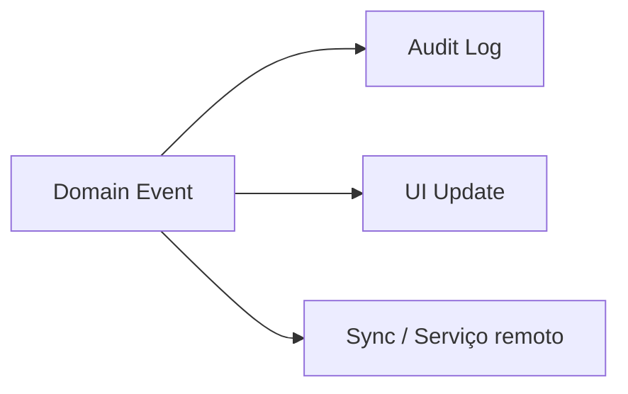
```mermaid
flowchart LR
    E[Domain Event] --> A[Audit Log]
    E --> U[UI Update]
    E --> S[Sync / Serviço remoto]
```

## 18. Fluxo de ações da apresentação

Origem: seção 23, linha 1139.

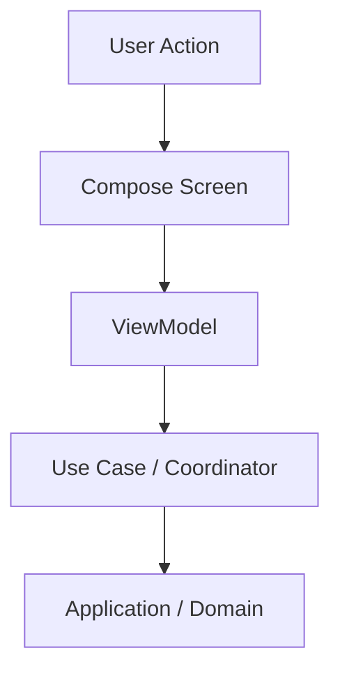
```mermaid
flowchart TD
    U[User Action] --> C[Compose Screen]
    C --> V[ViewModel]
    V --> A[Use Case / Coordinator]
    A --> D[Application / Domain]
```

## 19. Fluxo de estado da apresentação

Origem: seção 23, linha 1149.

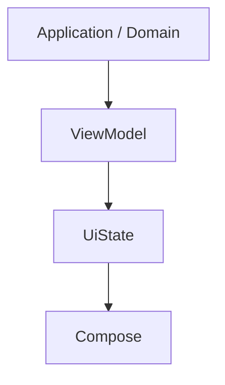
```mermaid
flowchart TD
    D[Application / Domain] --> V[ViewModel]
    V --> S[UiState]
    S --> C[Compose]
```

## 20. Ports & Adapters

Origem: seção 26, linha 1258.

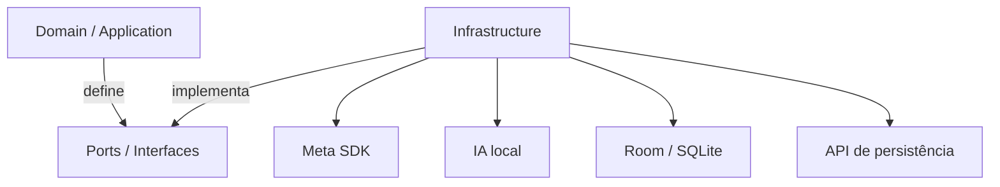
```mermaid
flowchart TD
    DA[Domain / Application] -->|define| P[Ports / Interfaces]
    I[Infrastructure] -->|implementa| P
    I --> M[Meta SDK]
    I --> L[IA local]
    I --> R[Room / SQLite]
    I --> API[API de persistência]
```

## 21. Topologia de execução definida

Origem: seção 27, linha 1276.

```mermaid
flowchart LR
    subgraph LOCAL["Dispositivo Android"]
        G[Óculos] --> APP[Aplicativo CuidarIA]
        APP --> AI[IA local]
        APP --> DOM[Domínio / FSM]
        DOM --> ROOM[Room]
        ROOM --> SQLITE[(SQLite)]
        SQLITE --> SYNC[Outbox + WorkManager]
    end

    subgraph SERVER["Infraestrutura remota"]
        WAF[WAF]
        RP[Reverse proxy TLS]
        API[API mínima HTTPS]
        ND[NotificationDispatcher]
        PG[(PostgreSQL autogerenciado)]
        WAF --> RP --> API
        API --> PG
        API --> ND
    end

    subgraph OFFSITE["Armazenamento externo"]
        OBJ[(Object Storage S3)]
        BKP[(Backups + WAL)]
    end

    subgraph PUSH["Push externo"]
        FCM[Firebase Cloud Messaging]
        RESP[App do responsável]
        FCM --> RESP
    end

    API --> OBJ
    PG -->|pgBackRest / WAL-G| BKP
    ND --> FCM

    SYNC -->|HTTPS| WAF
    API -->|confirmações e mudanças| SYNC
```

## 22. Estratégia inicial de prototipação

Origem: seção 30, linha 1498.

```mermaid
flowchart TD
    A["Simular 'Hey CuidarIA'"] --> B[Iniciar sessão]
    B --> C[Injetar áudio e frames gravados]
    C --> D[Fake AI produz observações]
    D --> E[Montar AdministrationEvidence]
    E --> F[Consultar paciente / prescrição fake]
    F --> G[AdministrationValidator]
    G --> H[AdministrationStateMachine]
    H --> I[Resultado]
    I --> J[Persistência em memória]
    J --> K[Histórico na UI]
```

## 23. Sequência dos próximos passos

Origem: seção 33 de `arquitetura-app-ia-completa.md`.

```mermaid
flowchart TD
    S1[1. Refinar AdministrationSession e AdministrationEvidence]
    S2[2. Definir contrato inicial do AiGateway]
    S3[3. Modelar AdministrationValidator]
    S4[4. Modelar AdministrationStateMachine]
    S5[5. Definir Patient / Prescription / Medication / Dosage]
    S6[6. Definir eventos de domínio]
    S7[7. Criar adapters fake]
    S8[8. Implementar AdministrationSessionCoordinator]
    S9[9. Criar ViewModel + UiState]
    S10[10. Criar tela Compose do fluxo]
    S11[11. Implementar Room + SQLite]
    S12[12. Implementar Outbox + WorkManager]
    S13[13. Implementar API mínima + PostgreSQL]
    S14[14. Validar sincronização, idempotência e conflitos]
    S15[15. Implementar notificações FCM + acknowledgement]
    S16[16. Substituir adapters de IA/dispositivo por implementações reais]

    S1 --> S2 --> S3 --> S4 --> S5 --> S6 --> S7 --> S8 --> S9 --> S10 --> S11 --> S12 --> S13 --> S14 --> S15 --> S16
```

## 24. Resumo da arquitetura

Origem: seção 34 de `arquitetura-app-ia.md`.

```mermaid
flowchart TD
    P[Presentation] --> A[Application]
    A --> D[Domain]
    DA[Device Adapter] --> C[Ports / Contracts]
    AI[AI Adapter] --> C
    RM[Room Adapter] --> C
    SY[Sync Adapter] --> C
    C --> D
```

## 25. Casos de uso do sistema

Origem: rascunho de caso de uso fornecido em 22/08/2026.

### 25.1 Visão do responsável

```mermaid
flowchart LR
    RESPONSAVEL["👤 Responsável"]

    subgraph SISTEMA["Sistema CuidarIA — cadastro e acompanhamento"]
        direction LR
        subgraph PRINCIPAIS["Casos de uso do responsável"]
            direction TB
            UC_CAD_RES([Cadastrar paciente])
            UC_CAD_PRESC([Cadastrar prescrição])
            UC_HIST([Consultar histórico])
            UC_ALERTA_OMISSA([Receber alerta de<br/>dose omitida])
            UC_ALERTA_URG([Receber alerta de urgência])
        end
        subgraph APOIO_RESP["Comportamentos de apoio"]
            direction TB
            UC_MONITORAR([Monitorar janela de<br/>administração])
            UC_CONS_PRESC([Consultar prescrição ativa])
        end
    end

    RESPONSAVEL --- UC_CAD_RES
    RESPONSAVEL --- UC_CAD_PRESC
    RESPONSAVEL --- UC_HIST
    RESPONSAVEL --- UC_ALERTA_OMISSA
    RESPONSAVEL --- UC_ALERTA_URG
    UC_CAD_PRESC -. "«include»" .-> UC_CONS_PRESC
    UC_ALERTA_OMISSA -. "«extend»" .-> UC_MONITORAR
    UC_MONITORAR -. "«include»" .-> UC_CONS_PRESC

    classDef actor fill:#f4f1ea,stroke:#666,color:#444,stroke-width:1px;
    classDef management fill:#eeedff,stroke:#5651b5,color:#403ca0;
    classDef support fill:#fff8df,stroke:#a77a16,color:#70520f;
    class RESPONSAVEL actor;
    class UC_CAD_RES,UC_CAD_PRESC,UC_HIST,UC_ALERTA_OMISSA,UC_ALERTA_URG management;
    class UC_MONITORAR,UC_CONS_PRESC support;
```

### 25.2 Visão do cuidador

```mermaid
flowchart LR
    CUIDADOR["👤 Cuidador"]
    RESPONSAVEL["👤 Responsável"]

    subgraph SISTEMA["Sistema CuidarIA — administração e assistência"]
        direction LR
        subgraph PRINCIPAIS["Casos de uso principais"]
            direction TB
            UC_LEMBRETE([Receber lembrete de horário])
            UC_ADMIN([Administrar medicamento])
            UC_URG([Reportar urgência])
        end
        subgraph ETAPAS["Etapas obrigatórias"]
            direction TB
            UC_WAKE([Iniciar sessão por<br/>wake word])
            UC_IDENT([Identificar paciente])
            UC_VERIF([Verificar medicamento<br/>e dose])
            UC_VOZ([Confirmar administração<br/>por voz])
            UC_REGISTRAR([Registrar administração])
            UC_CONS_PRESC([Consultar prescrição ativa])
            UC_ALERTA_URG([Receber alerta de urgência])
        end
    end

    CUIDADOR --- UC_LEMBRETE
    CUIDADOR --- UC_ADMIN
    CUIDADOR --- UC_URG
    RESPONSAVEL --- UC_ALERTA_URG
    UC_LEMBRETE -. "«include»" .-> UC_CONS_PRESC
    UC_ADMIN -. "«include»" .-> UC_WAKE
    UC_ADMIN -. "«include»" .-> UC_IDENT
    UC_ADMIN -. "«include»" .-> UC_VERIF
    UC_ADMIN -. "«include»" .-> UC_CONS_PRESC
    UC_ADMIN -. "«include»" .-> UC_VOZ
    UC_ADMIN -. "«include»" .-> UC_REGISTRAR
    UC_URG -. "«include»" .-> UC_ALERTA_URG

    classDef actor fill:#f4f1ea,stroke:#666,color:#444,stroke-width:1px;
    classDef care fill:#e1f5ef,stroke:#15806d,color:#126a5b;
    classDef support fill:#fff8df,stroke:#a77a16,color:#70520f;
    class CUIDADOR,RESPONSAVEL actor;
    class UC_LEMBRETE,UC_ADMIN,UC_URG care;
    class UC_WAKE,UC_IDENT,UC_VERIF,UC_VOZ,UC_REGISTRAR,UC_CONS_PRESC,UC_ALERTA_URG support;
```

### Justificativa das relações

| Origem | Relação | Destino | Motivo |
|---|---|---|---|
| Cadastrar prescrição | `«include»` | Consultar prescrição ativa | O sistema precisa consultar o estado atual para criar ou alterar uma prescrição sem gerar sobreposição indevida. O paciente já cadastrado é tratado como pré-condição, não como `include`, pois não é recadastrado em toda operação. |
| Receber lembrete de horário | `«include»` | Consultar prescrição ativa | O horário e a dose do lembrete vêm necessariamente de uma prescrição vigente. |
| Administrar medicamento | `«include»` | Identificar paciente | A identificação é obrigatória para vincular a dose à pessoa correta. |
| Administrar medicamento | `«include»` | Verificar medicamento e dose | A conferência é obrigatória antes da confirmação da administração. |
| Administrar medicamento | `«include»` | Consultar prescrição ativa | Medicamento, dose e janela de horário precisam ser comparados com a prescrição vigente. |
| Administrar medicamento | `«include»` | Confirmar administração por voz | No fluxo desenhado, a confirmação falada é uma etapa obrigatória da administração. |
| Administrar medicamento | `«include»` | Registrar administração | Uma administração concluída precisa gerar histórico e evidência de auditoria. |
| Administrar medicamento | `«include»` | Iniciar sessão por wake word | Toda administração começa obrigatoriamente nos óculos por meio da wake word. Não existe um fluxo equivalente iniciado pela interface do aplicativo. |
| Monitorar janela de administração | `«include»` | Consultar prescrição ativa | O monitoramento depende dos horários definidos na prescrição. |
| Receber alerta de dose omitida | `«extend»` | Monitorar janela de administração | O alerta só acontece sob a condição de a janela terminar sem uma administração confirmada. |
| Reportar urgência | `«include»` | Receber alerta de urgência | Todo reporte aceito deve notificar o responsável; por isso, o envio/recebimento do alerta faz parte obrigatória do fluxo. |

### Observações de modelagem

- As linhas contínuas representam associações entre atores e casos de uso; não indicam ordem de execução.
- `«include»` representa comportamento obrigatório e reutilizado pelo caso de uso de origem.
- `«extend»` representa comportamento condicional ou opcional apontando para o caso de uso base.
- Os casos “Administrar medicamento”, “Consultar prescrição ativa”, “Monitorar janela de administração” e “Registrar administração” foram acrescentados para explicitar o objetivo principal e evitar dependências ambíguas entre etapas isoladas.
- A interação de administração é orientada pelos óculos. A aplicação oferece apoio e acompanhamento, mas não inicia pela interface o fluxo de administração de medicamento.
- “Alerta: dose omissa” e “Alerta de urgência” foram renomeados como ações observáveis pelo ator: “Receber alerta de dose omitida” e “Receber alerta de urgência”.
- “Cadastrar paciente” é pré-condição de “Cadastrar prescrição”. Não foi usado `«include»`, pois `include` significaria executar o cadastro do paciente sempre que uma prescrição fosse cadastrada.

## 26. Fluxo end-to-end

Origem: seção A3, diagrama 1 de `CuidarIA-secao-A-final.md`.

```mermaid
flowchart TB
    A["Ativação<br/>KWS sherpa-onnx"] --> R["Rosto<br/>SCRFD-500MF"]
    A --> F["Fala<br/>declaração do cuidador"]
    A --> E["Embalagem<br/>código de barras · PaddleOCR"]

    R --> EMB["Embedding 512d<br/>MobileFaceNet"]
    EMB --> BD["Busca 1:N<br/>cosseno em memória"]
    BD --> CONF["Confirmação humana<br/>cuidador valida o nome"]
    CONF --> C["Candidatos ativos<br/>prescrições do residente"]

    F --> T["Transcrição<br/>Parakeet TDT int8"]
    E --> N["Nome impresso"]

    C --> RC["Reconciliador"]
    T --> RC
    N --> RC

    RC --> DD["Decisão determinística<br/>janela · LASA · histórico"]
    DD --> LOG["Registro local<br/>persiste antes de falar"]
    LOG --> TTS["Resposta pelo óculos<br/>Piper pré-sintetizado"]
    LOG -. outbox .-> SY["Sincronização<br/>fora do caminho crítico"]
```

## 27. Pipeline de áudio

Origem: seção A3.1, diagrama 2 de `CuidarIA-secao-A-final.md`.

```mermaid
flowchart TB
    M["Microfone dos óculos"] --> V["Silero VAD<br/>descarta silêncio"]
    V --> K["KWS sherpa-onnx<br/>Hey CuidarIA"]
    K --> P["Parakeet TDT v3 pt-BR int8<br/>WER 0,143 em fala espontânea"]
    P --> CD["Casamento determinístico<br/>normalização + sinônimos"]
    CD --> RC["Reconciliador"]
    OCR["Nome impresso<br/>vindo do canal de visão"] --> RC
    RC --> DEC["Decisão determinística<br/>limiar + flag LASA"]
    DEC --> OUT["Validado ou abstenção"]
```

## 28. Pipeline de visão

Origem: seção A3.1, diagrama 3 de `CuidarIA-secao-A-final.md`.

```mermaid
flowchart TB
    CAP["Captura sob demanda<br/>1 a 3 frames"] --> RO["Detecção de rosto<br/>SCRFD-500MF + 5 pontos"]
    CAP --> EM["Embalagem"]

    RO --> AL["Alinhamento 112×112<br/>transformação de similaridade"]
    AL --> VEC["Embedding 512d<br/>MobileFaceNet"]
    VEC --> BUS["Busca 1:N em memória<br/>~800 vetores · abaixo de 1 ms"]
    BUS --> REG["THRESH_MATCH · MIN_HITS · MARGIN"]
    REG --> CONF["Confirmação humana"]

    EM --> V1["V1 · código de barras"]
    V1 -- não legível --> V2["V2 · PaddleOCR PP-OCRv5"]
    V2 -- não legível --> V3["V3 · pergunta verbal"]
    V1 --> NOME["Nome e candidatos"]
    V2 --> NOME
    EM --> IMG["Imagem arquivada<br/>único artefato visual"]
```

## 29. Veredictos e política de override

Origem: seção A4, diagrama 4 de `CuidarIA-secao-A-final.md`.

```mermaid
flowchart TB
    EV["Evidências reunidas<br/>rosto · fala · embalagem"] --> VAL["Validação determinística"]

    VAL -- tudo confere --> OK["CONFIRMED"]
    VAL -- divergência --> DG["DIVERGENT"]
    VAL -- confiança abaixo do limiar --> UN["UNCERTAIN"]

    DG --> Q{"a divergência<br/>é temporal?"}
    Q -- sim --> OVR["Override permitido<br/>registrado com motivo"]
    Q -- não · medicamento ou paciente --> BLQ["Sem override<br/>não existe justificativa"]

    OK --> LOG["Registro no log"]
    OVR --> LOG
    BLQ --> LOG
    UN --> LOG
    LOG --> FAL["Resposta falada<br/>earcon distinto por veredito"]
```

## 30. Reconciliador: uma porta, quatro camadas

Origem: seção A5, diagrama 5 de `CuidarIA-secao-A-final.md`.

```mermaid
flowchart TB
    T["Transcrição<br/>do Parakeet"] --> RC
    N["Nome impresso<br/>do PaddleOCR"] --> RC
    C["Candidatos<br/>do cadastro do residente"] --> RC

    subgraph RC["Reconciliador"]
        direction TB
        L1["1 · Normalização e match exato<br/>dosagem, forma, acentos"]
        L2["2 · Sinônimos e apelidos<br/>marca × genérico, coloquial"]
        L3["3 · Distância fonética<br/>erro de transcrição"]
        L4["4 · Llama 3.2 3B int4<br/>só o resíduo · saída restrita"]
        L1 -- sem match --> L2
        L2 -- sem match --> L3
        L3 -- sem match --> L4
    end

    RC --> VK["Validador Kotlin<br/>fora da lista = UNCERTAIN"]
    VK --> O["Um candidato ou nenhum"]
```

## 31. Ciclo de vida do dado

Origem: seção A7, diagrama 6 de `CuidarIA-secao-A-final.md`.

```mermaid
flowchart LR
    CAP["Captura<br/>áudio · frame facial · vídeo"] --> PROC["Processamento local<br/>transcrição · embedding"]
    PROC --> DESC["Descarte imediato<br/>nunca toca o disco"]
    PROC --> RES["Resultado estruturado<br/>texto · vetor · score"]

    RES --> LOC["Persistência local cifrada<br/>SQLCipher + Android Keystore"]
    LOC --> OBX["Outbox"]
    OBX --> SYN["Sincronização HTTPS<br/>registro · prescrição · imagem"]
```

## 32. Cascata de custo crescente

Origem: seção A7, diagrama 7 de `CuidarIA-secao-A-final.md`.

```mermaid
flowchart LR
    VAD["Silero VAD<br/>contínuo · custo ~0"]
    KWS["KWS<br/>custo baixo"]
    STT["Parakeet int8<br/>~2–4 s de CPU alto"]
    LLM["Llama int4<br/>raro"]

    VAD -- voz detectada --> KWS
    KWS -- palavra-chave --> STT
    STT -- resíduo não resolvido --> LLM

    VAD -- silêncio --> D1["ciclo encerra"]
    KWS -- não é a palavra --> D2["ciclo encerra"]
    STT -- casou na tabela --> D3["encerra sem LLM"]
```
