# Compilado de diagramas — CuidarAI

Este documento reúne os diagramas Mermaid encontrados em [`arquitetura-app-ia.md`](./arquitetura-app-ia.md). Cada diagrama permanece em um bloco independente para facilitar sua revisão e futura exportação para SVG.

## Índice

1. Fluxo principal de uso
2. Camadas da aplicação
3. Arquitetura funcional da sessão
4. Detecção da wake word
5. Implementações do `AiGateway`
6. Limite de responsabilidade da IA
7. Validação da administração
8. Divergência de identidade do paciente
9. Divergência de medicamento
10. Máquina de estados da administração
11. Coordenação da sessão
12. Tratamento de dados faciais
13. Destinos dos eventos de domínio
14. Fluxo de ações da apresentação
15. Fluxo de estado da apresentação
16. Ports & Adapters
17. Topologia de execução — alternativa A
18. Topologia de execução — alternativa B
19. Topologia de execução — alternativa C
20. Estratégia inicial de prototipação
21. Sequência dos próximos passos
22. Resumo da arquitetura

---

## 1. Fluxo principal de uso

Origem: seção 2, linha 27.


## 2. Camadas da aplicação

Origem: seção 5, linha 109.

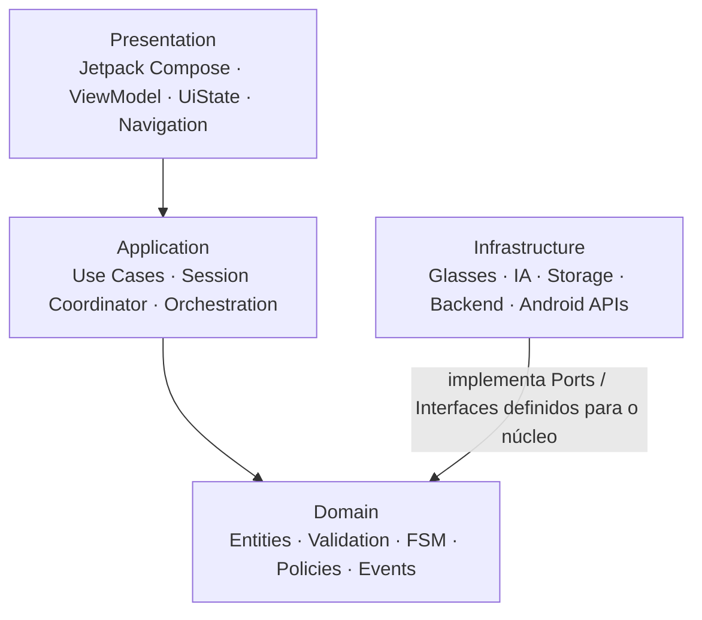

## 3. Arquitetura funcional da sessão

Origem: seção 6, linha 129.

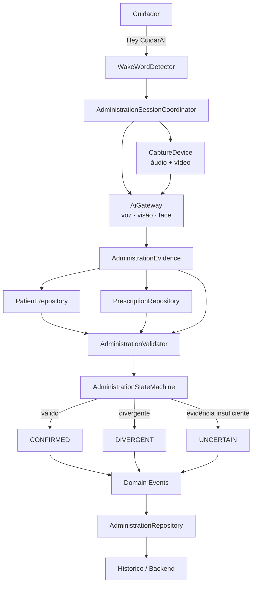

## 4. Detecção da wake word

Origem: seção 8, linha 205.


## 5. Implementações do `AiGateway`

Origem: seção 10, linha 273.

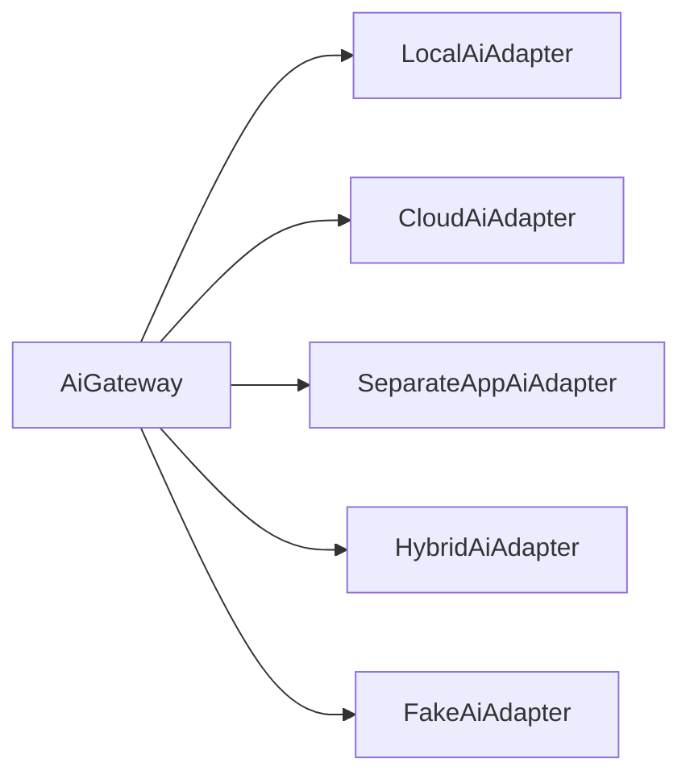

## 6. Limite de responsabilidade da IA

Origem: seção 11, linha 316.

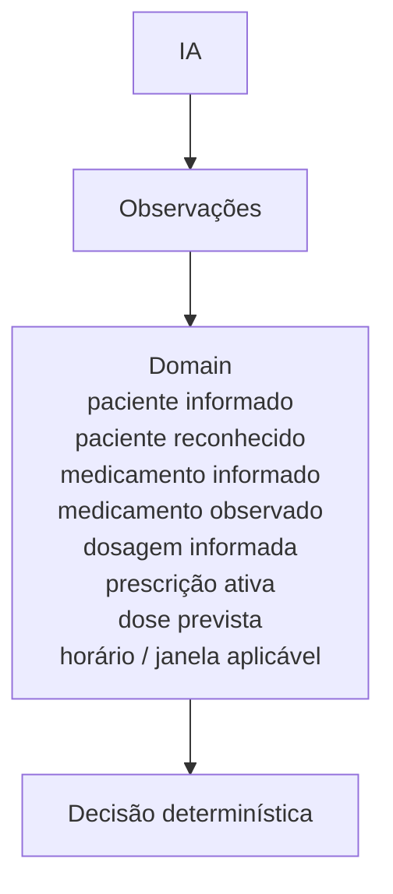

## 7. Validação da administração

Origem: seção 14, linha 386.

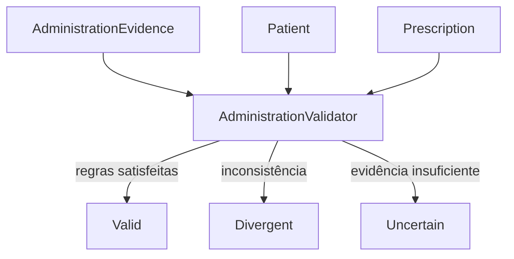

## 8. Divergência de identidade do paciente

Origem: seção 15, linha 416.

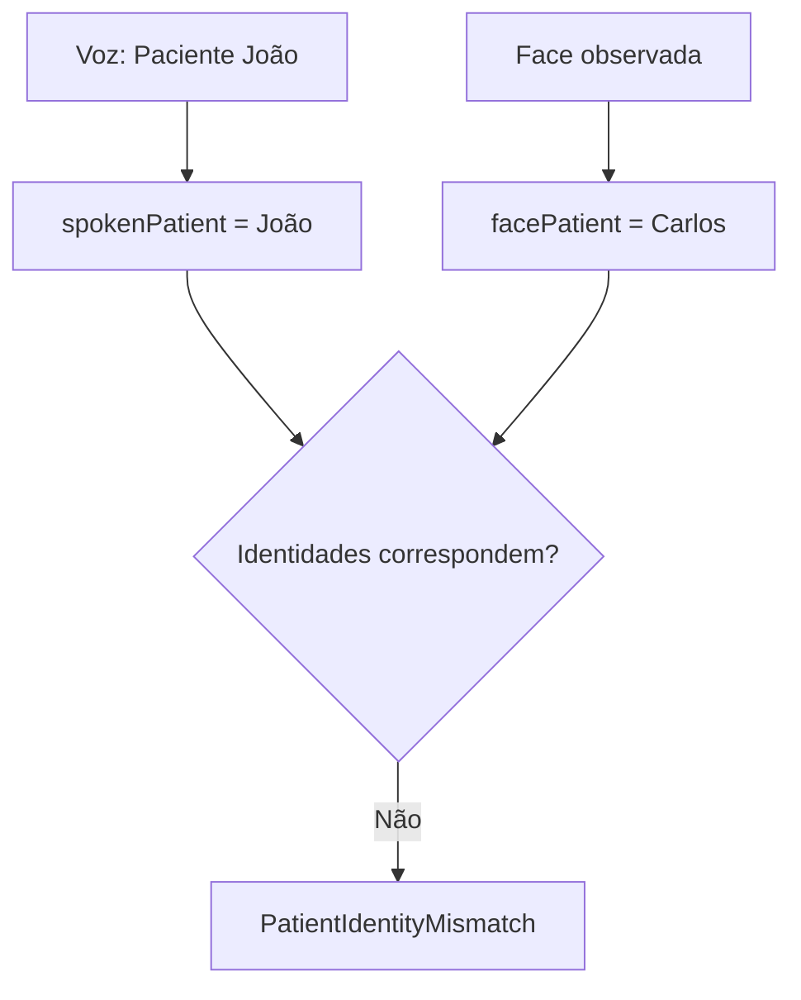

## 9. Divergência de medicamento

Origem: seção 15, linha 427.

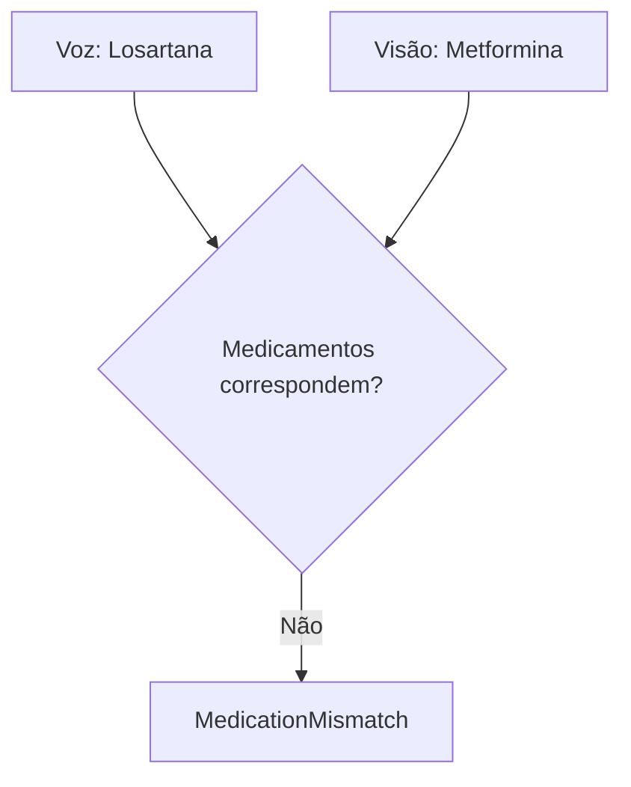

## 10. Máquina de estados da administração

Origem: seção 16, linha 444.

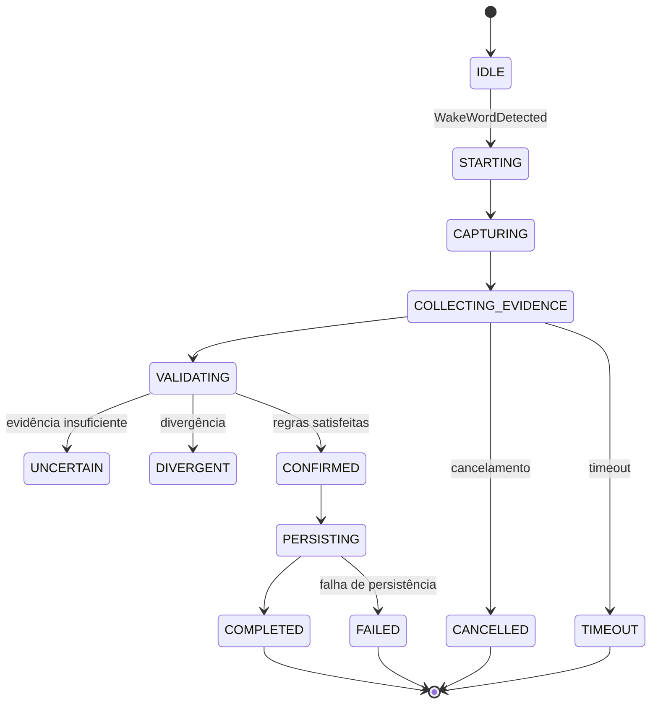

## 11. Coordenação da sessão

Origem: seção 17, linha 499.

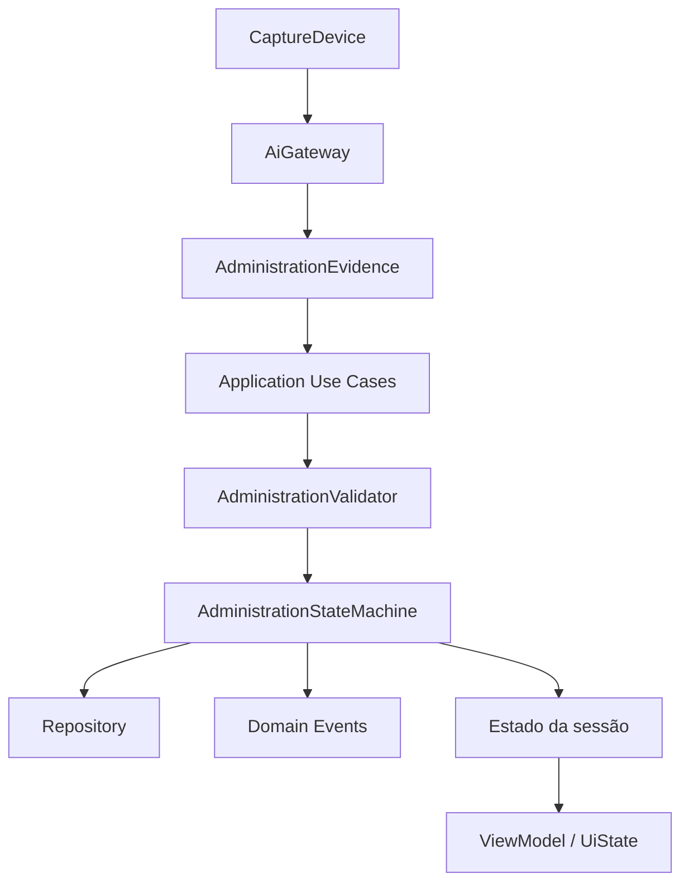

## 12. Tratamento de dados faciais

Origem: seção 21, linha 660.

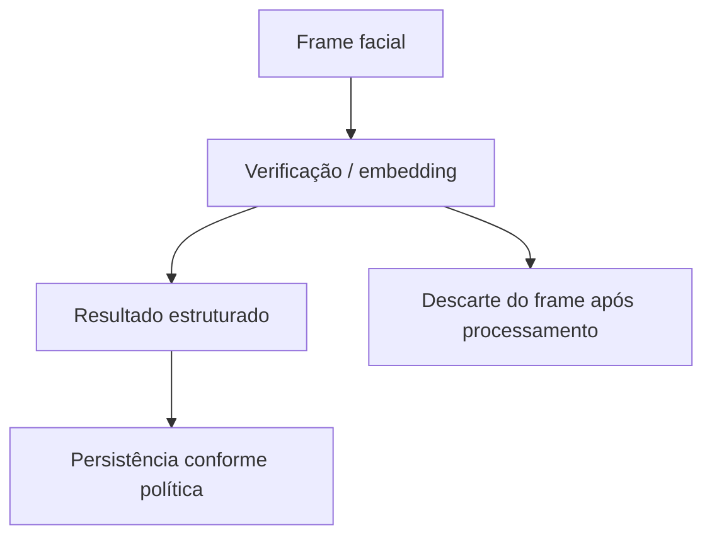

## 13. Destinos dos eventos de domínio

Origem: seção 22, linha 697.

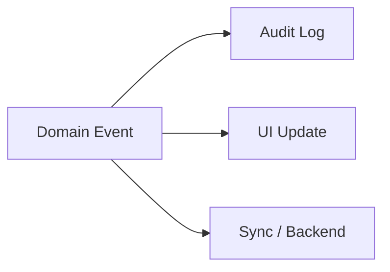

## 14. Fluxo de ações da apresentação

Origem: seção 23, linha 712.

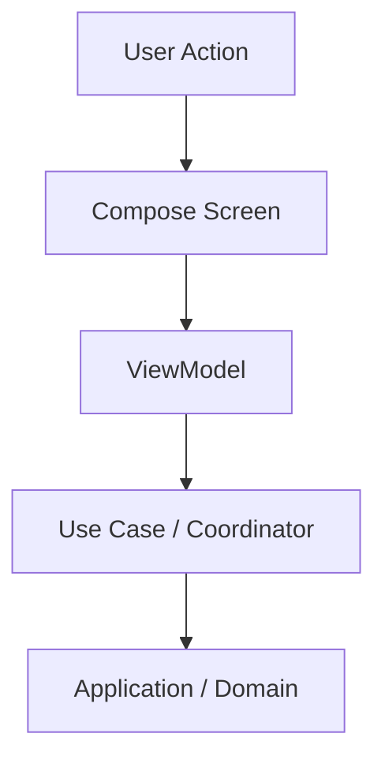

## 15. Fluxo de estado da apresentação

Origem: seção 23, linha 722.

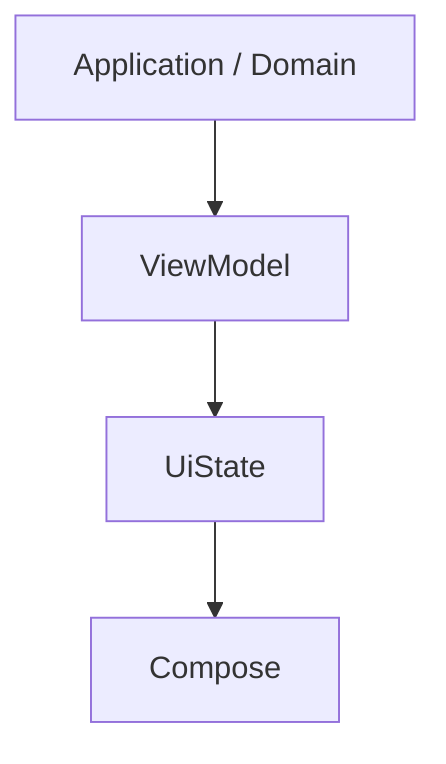

## 16. Ports & Adapters

Origem: seção 26, linha 831.

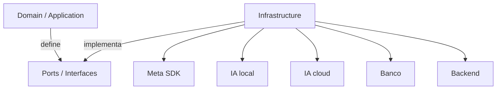

## 17. Topologia de execução — alternativa A

Origem: seção 27, linha 852.

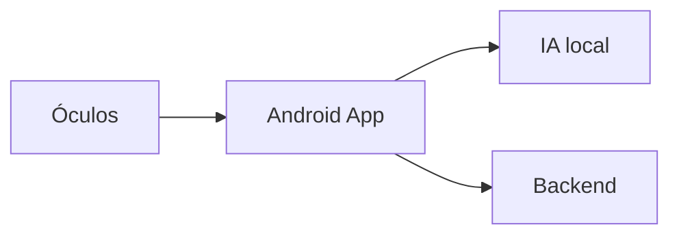

## 18. Topologia de execução — alternativa B

Origem: seção 27, linha 861.

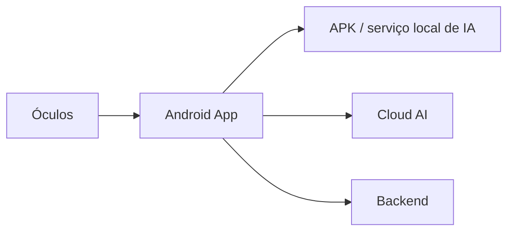

## 19. Topologia de execução — alternativa C

Origem: seção 27, linha 871.

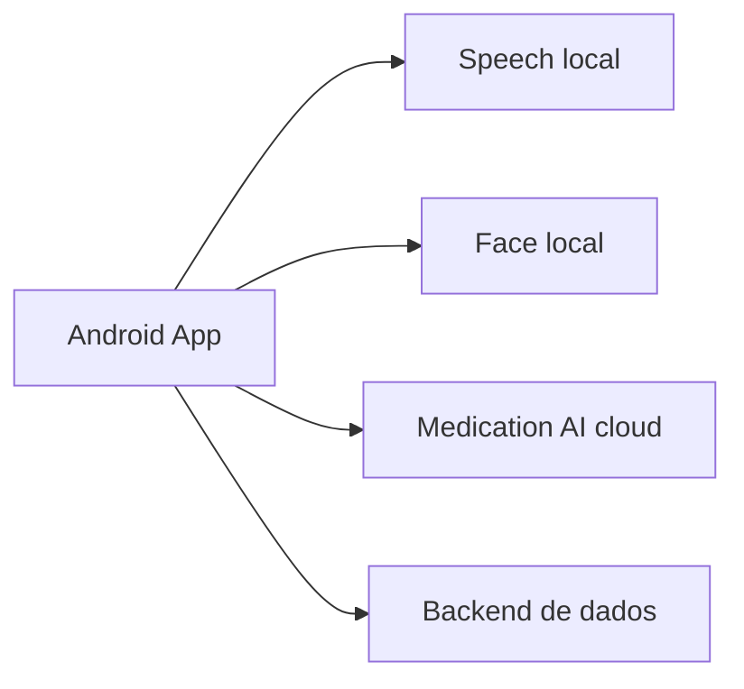

## 20. Estratégia inicial de prototipação

Origem: seção 30, linha 1004.

```mermaid
flowchart TD
    A[Simular "Hey CuidarAI"] --> B[Iniciar sessão]
    B --> C[Injetar áudio e frames gravados]
    C --> D[Fake AI produz observações]
    D --> E[Montar AdministrationEvidence]
    E --> F[Consultar paciente / prescrição fake]
    F --> G[AdministrationValidator]
    G --> H[AdministrationStateMachine]
    H --> I[Resultado]
    I --> J[Persistência em memória]
    J --> K[Histórico na UI]
```

## 21. Sequência dos próximos passos

Origem: seção 34, linha 1142.

```mermaid
flowchart TD
    S1[1. Refinar AdministrationSession e AdministrationEvidence]
    S2[2. Definir contrato inicial do AiGateway]
    S3[3. Definir CaptureDevice e WakeWordDetector]
    S4[4. Modelar AdministrationValidator]
    S5[5. Modelar AdministrationStateMachine]
    S6[6. Definir Patient / Prescription / Medication / Dosage]
    S7[7. Definir eventos de domínio]
    S8[8. Criar adapters fake]
    S9[9. Implementar AdministrationSessionCoordinator]
    S10[10. Criar ViewModel + UiState]
    S11[11. Criar tela Compose do fluxo]
    S12[12. Criar histórico local fake]
    S13[13. Substituir adapters por implementações reais]

    S1 --> S2 --> S3 --> S4 --> S5 --> S6 --> S7 --> S8 --> S9 --> S10 --> S11 --> S12 --> S13
```

## 22. Resumo da arquitetura

Origem: seção 35, linha 1167.

```mermaid
flowchart TD
    P[Presentation] --> A[Application]
    A --> D[Domain]
    DA[Device Adapter] --> C[Ports / Contracts]
    AI[AI Adapter] --> C
    DT[Data Adapter] --> C
    C --> D
```
